# CHƯƠNG 1 TỔNG QUAN VỀ ĐỀ TÀI
## 1.1. Thực trạng và vấn đề tồn tại mà đề tài nhắm đến
Trong kỷ nguyên số hóa giáo dục, khối lượng tài liệu học thuật, giáo trình và bài giảng trực tuyến ngày càng trở nên khổng lồ. Tuy nhiên, sinh viên vẫn gặp rất nhiều khó khăn trong việc tiếp cận và khai thác nguồn tri thức này một cách hiệu quả do những hạn chế cốt lõi của các giải pháp hiện tại:
- **Hệ thống lưu trữ thụ động:** Các website chia sẻ tài liệu phổ biến (như tailieu.vn, 123doc, doc.edu.vn) và các dịch vụ lưu trữ đám mây dùng chung (Google Drive, OneDrive) chỉ dừng lại ở vai trò lưu trữ và tải tệp tin vật lý thuần túy. Chúng hoàn toàn thiếu đi các công cụ tương tác trực tiếp giúp người học xử lý sâu nội dung bên trong tài liệu.
- **Tìm kiếm dựa trên từ khóa đơn thuần (Keyword Matching):** Khi người dùng tìm kiếm tài liệu, các công cụ truyền thống chỉ thực hiện so khớp từ khóa chính xác. Phương pháp này bỏ qua các liên kết ngữ nghĩa, khiến người học khó tiếp cận các tài liệu có nội dung liên quan về mặt bản chất nhưng sử dụng thuật ngữ khác biệt.
- **Quy trình học tập bị "phân mảnh":** Sau khi tải tài liệu về máy, sinh viên phải tự xoay xở bằng cách chuyển đổi qua lại giữa hàng loạt công cụ rời rạc: một phần mềm để đọc file, một ứng dụng để ghi chú hoặc vẽ sơ đồ tư duy, và các chatbot AI độc lập bên ngoài (như ChatGPT, Gemini) để hỏi đáp hoặc dịch thuật. Sự thiếu đồng bộ này làm ngắt quãng luồng tư duy, tốn thời gian và làm giảm đáng kể hiệu suất tiếp thu tri thức.

## 1.2. Tính cấp thiết và lý do chọn đề tài
Sự phát triển vượt bậc của Trí tuệ nhân tạo (AI), đặc biệt là các Mô hình ngôn ngữ lớn (LLM) và kỹ thuật tạo lập nâng cao dựa trên truy xuất ngữ cảnh (RAG - Retrieval-Augmented Generation), đã mở ra cơ hội giải quyết triệt để các rào cản học tập truyền thống. Việc xây dựng một nền tảng tích hợp AI đồng hành cùng người học không còn là một ý tưởng lý thuyết mà đã trở thành nhu cầu cấp thiết trong thực tiễn đào tạo đại học.
Đặc biệt, tại Trường Đại học Thủy lợi (TLU), sinh viên rất cần một cổng tài liệu chuyên biệt, tập trung, nơi học liệu được phân chia khoa học theo từng học phần và được bổ trợ bởi các công cụ AI thông minh. Xuất phát từ nhu cầu đó, đề tài **"Xây dựng hệ thống web tài liệu học tập tích hợp AI"** được lựa chọn nhằm xây dựng ứng dụng **TLU Document**. Hệ thống này hướng đến việc thống nhất toàn bộ chu trình học tập của sinh viên vào một nền tảng duy nhất: từ tìm kiếm thông minh, đọc hiểu, tóm tắt, tự ôn tập bằng câu hỏi trắc nghiệm, trực quan hóa kiến thức bằng sơ đồ tư duy cho đến trao đổi trực tiếp với trợ lý chatbot học thuật bám sát nội dung tài liệu.

## 1.3. Đối tượng sử dụng hệ thống và kết quả nghiên cứu
- **Đối tượng sử dụng hệ thống:**
  - *Sinh viên / Giảng viên (User):* Tác nhân chính sử dụng hệ thống để phục vụ công tác giảng dạy và học tập. Người dùng sau khi đăng nhập có thể tải lên tài liệu học tập mới, tìm kiếm tài liệu nâng cao, viết bình luận và đánh giá tài liệu, trò chuyện với trợ lý học tập AI (Chatbot Tutor), xem/quản lý lịch sử trò chuyện, sử dụng công cụ AI để tóm tắt tài liệu, tạo câu hỏi trắc nghiệm ôn tập (Quiz) và tự động sinh sơ đồ tư duy (Mindmap) cũng như chỉnh sửa sơ đồ tư duy theo ý muốn.
  - *Quản trị viên hệ thống (Admin):* Người chịu trách nhiệm quản lý tài nguyên hệ thống, có quyền kiểm duyệt tài liệu tải lên, quản lý danh sách tài liệu (thêm/xóa/sửa) và kiểm soát, giám sát người dùng trong hệ thống để đảm bảo tính lành mạnh của môi trường học thuật.
  - *Hệ thống tự động (System):* Tác nhân chạy ngầm thực thi các nghiệp vụ tự động hóa bao gồm tính toán MD5 kiểm tra trùng lặp tài liệu, trích xuất văn bản, gọi API tạo Vector Embeddings đồng bộ lên Pinecone và tương tác với Google Drive API để lưu trữ file vật lý.
- **Kết quả nghiên cứu của đề tài:**
  - Xây dựng hoàn chỉnh ứng dụng web học tập TLU Document với giao diện hiện đại, tối ưu trải nghiệm người dùng.
  - Ứng dụng thành công mô hình RAG kết hợp giữa cơ sở dữ liệu Vector Pinecone và Gemini API của Google, cung cấp trợ lý học tập AI có khả năng thấu hiểu ngữ cảnh tài liệu và phản hồi thời gian thực với độ chính xác cao.
  - Thiết lập quy trình tự động hóa chuyển đổi tri thức bao gồm: bộ sinh Quiz trắc nghiệm tự động kèm giải thích đáp án và bộ sinh Sơ đồ tư duy trực quan cho phép chỉnh sửa kéo thả linh hoạt.

## 1.4. Phạm vi và giới hạn đề tài
Đề tài tiến hành khoanh vùng ranh giới nghiên cứu và triển khai thực tế dựa trên ba phương diện chính:
- **Về mặt nội dung nghiên cứu:**
  - Tập trung nghiên cứu, thiết kế và phát triển hệ thống ứng dụng Web TLU Document hỗ trợ quản lý học liệu và tích hợp các công cụ học tập thông minh bằng AI bao gồm: tóm tắt tự động, sinh trắc nghiệm tự động (Quiz), tạo sơ đồ tư duy trực quan (Mindmap), và chatbot hỏi đáp theo ngữ cảnh tài liệu (Chatbot Tutor).
  - Về công nghệ áp dụng: Phát triển hệ thống dựa trên framework Next.js, hệ quản trị cơ sở dữ liệu MySQL, lưu trữ tệp vật lý qua Google Drive API, tìm kiếm ngữ nghĩa qua cơ sở dữ liệu Vector Pinecone, và xử lý trí tuệ nhân tạo thông qua OpenAI API với kiến trúc RAG (Retrieval-Augmented Generation).
  - Giới hạn về mặt kỹ thuật và dữ liệu: Đề tài tập trung ứng dụng các mô hình ngôn ngữ lớn (LLM) sẵn có qua API dịch vụ để giải quyết bài toán nghiệp vụ, không đi sâu vào việc huấn luyện mới hay tinh chỉnh (fine-tuning) các mô hình nền tảng. Tài liệu đầu vào để xử lý AI giới hạn ở các định dạng văn bản có cấu trúc phổ biến như PDF và DOCX (chưa hỗ trợ xử lý sâu tài liệu dạng quét ảnh kém chất lượng), đồng thời dung lượng tệp tin và độ dài ngữ cảnh hội thoại được giới hạn theo chính sách của các API liên kết nhằm đảm bảo hiệu năng tối ưu.
- **Về mặt không gian nghiên cứu:**
  - Đề tài tập trung khảo sát, thử nghiệm thực tế và đánh giá chất lượng trải nghiệm người dùng trong phạm vi nội bộ Trường Đại học Thủy lợi (TLU), hướng tới đối tượng người dùng chính là cán bộ giảng viên và sinh viên tại trường.
- **Về mặt thời gian nghiên cứu:**
  - Nghiên cứu được thực hiện, lập trình phát triển và hoàn thiện thực nghiệm trong khuôn khổ thời gian làm đồ án tốt nghiệp học kỳ 2 năm học 2025 - 2026 (dự kiến kéo dài từ tháng 01/2026 đến tháng 06/2026).

## 1.5. Mục tiêu cụ thể mà đồ án hướng đến
Đồ án hướng tới hoàn thành các mục tiêu cụ thể sau:
- **Thiết kế và xây dựng ứng dụng Web TLU Document:** Đảm bảo hệ thống vận hành ổn định, giao diện responsive mượt mà và trực quan, phân quyền chặt chẽ giữa Guest, User và Admin.
- **Phát triển bộ công cụ hỗ trợ học tập thông minh tích hợp AI:**
  - *Chatbot Tutor:* Hỏi đáp thông minh bám sát nội dung tài liệu, hiển thị nguồn tham khảo chính xác và hỗ trợ phản hồi dạng luồng (streaming response).
  - *Quiz Generator:* Tự động sinh câu hỏi trắc nghiệm đa lựa chọn từ tài liệu giúp sinh viên tự ôn tập và kiểm tra kiến thức tại chỗ.
  - *Mindmap Generator:* Tự động tạo sơ đồ tư duy dạng cây phân cấp giúp trực quan hóa kiến thức cốt lõi và cho phép người dùng tùy ý thêm, sửa, xóa các nhánh.
  - *Document Summarizer:* Tóm tắt nhanh tài liệu theo hai chế độ đoạn văn ngắn hoặc gạch đầu dòng ý chính.

# CHƯƠNG 2: CƠ SỞ LÝ THUYẾT VÀ CÔNG NGHỆ SỬ DỤNG

Chương này tập trung trình bày danh mục các giải pháp công nghệ, mô hình kiến trúc hệ thống liên quan và các nền tảng lý thuyết, thuật toán cốt lõi được nghiên cứu, áp dụng xuyên suốt quá trình thiết kế và phát triển hệ thống TLU Document.

## 2.1. Các công nghệ và nền tảng kỹ thuật sử dụng
Dưới đây là bảng tổng hợp các công nghệ, thư viện chính cấu thành nên hệ thống TLU Document:

| Thành phần | Công nghệ / Thư viện | Vai trò trong hệ thống |
| :--- | :--- | :--- |
| **Frontend (FE)** | Next.js (React 19) & TypeScript | Xây dựng giao diện ứng dụng phía client, quản lý định tuyến trang (App Router) và kết xuất tối ưu (Server Components). |
| **Backend (BE)** | Next.js Route Handlers & TypeScript | Triển khai các API Endpoint độc lập, xử lý nghiệp vụ, điều phối cơ sở dữ liệu và gọi API AI. |
| **Styling & UI** | Tailwind CSS & Radix UI | Thiết kế giao diện Responsive, hiệu ứng chuyển động mượt mà, hỗ trợ Dark/Light mode. |
| **Relational DB** | MySQL (Railway) | Cơ sở dữ liệu quan hệ quản lý người dùng, môn học, metadata tài liệu, bình luận và lịch sử trò chuyện. |
| **Vector DB** | Pinecone | Cơ sở dữ liệu Vector lưu trữ các phân mảnh văn bản (chunks) và tọa độ vector nhúng phục vụ tìm kiếm ngữ nghĩa. |
| **AI Orchestrator**| Pollinations AI | Cổng kết nối AI hợp nhất (Unified AI Hub) điều hướng các yêu cầu sinh văn bản thông qua API bảo mật. |
| **Embeddings** | Hugging Face Inference | Sử dụng model chuyên dụng `sentence-transformers/all-MiniLM-L6-v2` chuyển hóa văn bản thành vector 384 chiều. |
| **File Parsers** | Mammoth & PDF-Parse | Trích xuất nội dung văn bản thô (Text Extraction) từ các tệp `.docx` và `.pdf`. |
| **Cloud Storage** | Google Drive API | Lưu trữ tài liệu gốc, hỗ trợ đồng bộ tự động thông qua API `googleapis`. |

Dưới đây là tổng quan vai trò và lý do lựa chọn của các công nghệ cốt lõi cấu thành nên hệ thống:
- **Phát triển ứng dụng Web:** Framework **Next.js (React 19)** kết hợp ngôn ngữ **TypeScript** và **Tailwind CSS / Radix UI** tạo nên một hạ tầng phát triển web an toàn dữ liệu, tối ưu hóa tốc độ tải trang (Server Components) và hỗ trợ xây dựng giao diện responsive, trực quan và dễ tiếp cận. Các API endpoint (Next.js Route Handlers) chạy trên Node.js xử lý nghiệp vụ mượt mà và hỗ trợ stream dữ liệu thời gian thực.
- **Quản trị dữ liệu:** Hệ thống kết hợp cơ sở dữ liệu quan hệ **MySQL** để quản lý thông tin cấu trúc (tài khoản, môn học, metadata tài liệu, bình luận) và cơ sở dữ liệu vector **Pinecone** phục vụ truy xuất ngữ nghĩa (Cosine Similarity). Các tệp tài liệu vật lý được lưu trữ thông qua **Google Drive API** nhằm giảm dung lượng lưu trữ trên máy chủ chính.
- **Xử lý trí tuệ nhân tạo (AI):** Dịch vụ **Hugging Face Inference API** (mô hình `all-MiniLM-L6-v2`) được sử dụng để sinh vector embeddings 384 chiều tối ưu hiệu năng; trong khi **Pollinations AI** (mô hình `GPT-OSS 20B Reasoning LLM`) đóng vai trò là "bộ não" xử lý ngôn ngữ tự nhiên để trả lời tin nhắn chatbot RAG, sinh tóm tắt, Quiz trắc nghiệm và sơ đồ tư duy. Các thư viện parser (**Mammoth** và **PDF-Parse**) giúp trích xuất văn bản thô từ tệp DOCX và PDF trước khi đưa vào mô hình AI.

## 2.2. Các mô hình kiến trúc hệ thống liên quan
Hệ thống TLU Document được xây dựng trên sự kế thừa và kết hợp các mô hình kiến trúc phát triển phần mềm chuẩn hóa:
- **Mô hình Client - Server:**
  Hệ thống vận hành dựa trên cơ chế tương tác hai phía:
  - *Phía Client (Máy khách):* Nhận nhiệm vụ thu thập tương tác từ người dùng (tìm kiếm tài liệu, gửi tin nhắn chat, gửi yêu cầu sinh tóm tắt/Quiz/Mindmap), thực hiện gửi các HTTP Request đến máy chủ backend và render giao diện động. Client được viết bằng thư viện React 19 chạy trực tiếp trên trình duyệt của người dùng.
  - *Phía Server (Máy chủ):* Vận hành trên môi trường Node.js runtime của Next.js Route Handlers. Server đóng vai trò trung tâm tiếp nhận yêu cầu, xử lý bóc tách file thô, giao tiếp với các cơ sở dữ liệu và kết nối tới các dịch vụ trí tuệ nhân tạo từ xa, sau đó trả về dữ liệu cấu trúc (JSON) hoặc luồng phản hồi thời gian thực (Streaming responses).
- **Mô hình Kiến trúc Phân lớp (Layered Architecture Pattern):**
  Được thiết kế để phân tách các tầng trách nhiệm rõ ràng, nâng cao độ bảo mật và khả năng bảo trì:
  - *Tầng Giao diện (Presentation Layer - UI):* Xây dựng bằng Next.js Client/Server Components để nhận diện thao tác và hiển thị dữ liệu.
  - *Tầng Xử lý Nghiệp vụ (Business/API Layer):* Thực thi logic điều phối dữ liệu qua Next.js Route Handlers bảo mật.
  - *Tầng Trừu tượng hóa Cơ sở dữ liệu (Repository Layer):* Đóng vai trò làm lớp đệm trung gian quản lý các hàm truy vấn SQL nhằm tách biệt hoàn toàn logic nghiệp vụ ra khỏi các truy vấn cơ sở dữ liệu trực tiếp.
  - *Tầng Lưu trữ (Persistence/Database Layer):* Do hệ quản trị cơ sở dữ liệu MySQL và cơ sở dữ liệu vector Pinecone đảm nhiệm để lưu trữ dữ liệu có cấu trúc và không cấu trúc.

## 2.3. Các phương pháp, thuật toán và lý thuyết bổ trợ
Để hiện thực hóa các tính năng thông minh tích hợp AI, hệ thống TLU Document ứng dụng các phương pháp lý thuyết và thuật toán xử lý dữ liệu nâng cao:
- **Kiến trúc tạo lập nâng cao dựa trên truy xuất ngữ cảnh (Retrieval-Augmented Generation - RAG):**
  RAG là phương pháp tích hợp tri thức động ngoài dữ liệu huấn luyện cố định của mô hình ngôn ngữ lớn (LLM). Quy trình RAG trong hệ thống gồm ba bước:
  1. *Truy xuất (Retrieval):* Khi người dùng gửi câu hỏi về một tài liệu, hệ thống tự động tìm kiếm các đoạn văn bản chứa nội dung liên quan nhất trong cơ sở dữ liệu Vector.
  2. *Làm giàu ngữ cảnh (Augmentation):* Đóng gói nội dung các đoạn văn bản liên quan đó thành một đoạn ngữ cảnh (context) làm nền tảng.
  3. *Tạo lập phản hồi (Generation):* Gửi kèm ngữ cảnh và câu hỏi gốc tới OpenAI LLM để sinh ra câu trả lời chính xác, tránh hiện tượng ảo tưởng thông tin (hallucination) và đính kèm được nguồn tham khảo cụ thể.
- **Mô hình nhúng văn bản (Vector Embeddings):**
  Là phương pháp chuyển hóa các ký tự văn bản thô thành một chuỗi các số thực (mảng số thực đa chiều) biểu diễn các đặc trưng ngữ nghĩa trong không gian vector. Đồ án sử dụng mô hình `all-MiniLM-L6-v2` để mã hóa các đoạn văn bản thành vector 384 chiều. Nhờ đó, các đoạn văn bản có nghĩa tương đương sẽ được biểu diễn bởi các vector nằm gần nhau trong không gian đa chiều này.
- **Thuật toán tính độ tương đồng Cosine (Cosine Similarity):**
  Được hệ thống sử dụng làm thước đo toán học để tính góc lệch giữa vector câu hỏi truy vấn của người học với vector của các đoạn tài liệu học tập, từ đó đánh giá mức độ tương đồng về mặt ngữ nghĩa:
  
  $$\text{Cosine Similarity}(A, B) = \frac{A \cdot B}{\|A\| \|B\|} = \frac{\sum_{i=1}^{n} A_i B_i}{\sqrt{\sum_{i=1}^{n} A_i^2} \sqrt{\sum_{i=1}^{n} B_i^2}}$$
  
  Kết quả của phép đo nằm trong khoảng từ -1 đến 1. Giá trị càng gần 1 chứng tỏ hai đoạn văn bản càng có độ tương đồng ngữ nghĩa cao.
- **Phương pháp bóc tách và phân đoạn văn bản (Text Extraction & Chunking):**
  Tài liệu học tập thường rất dài và vượt quá giới hạn xử lý (context window) của các LLM. Do đó, hệ thống thực hiện trích xuất toàn bộ chuỗi text sạch thông qua các parser, sau đó chia nhỏ văn bản thành các phân đoạn ngắn (chunks) có kích thước cố định khoảng 1000 ký tự kèm theo 200 ký tự gối đầu (overlap). Việc giữ lại phần gối đầu giúp bảo toàn tính liền mạch của ngữ cảnh tại các vị trí phân cắt ranh giới phân đoạn.

# CHƯƠNG 3 PHÂN TÍCH VÀ THIẾT KẾ HỆ THỐNG

Sau khi đã tìm hiểu về cơ sở lý thuyết và công nghệ sử dụng ở Chương 2, chương này sẽ tập trung vào việc phân tích chi tiết các yêu cầu nghiệp vụ và thiết kế cấu trúc kỹ thuật cho hệ thống TLU Document nhằm đảm bảo tính khả thi và khoa học khi triển khai.

## 3.1. Phân tích yêu cầu hệ thống
Việc phân tích yêu cầu đóng vai trò làm nền tảng, giúp xác định rõ các tính năng cần thiết để giải quyết bài toán quản lý tài liệu học tập và hỗ trợ học tập thông minh bằng AI.

### 3.1.1. Xác định các tác nhân
Dựa trên cấu trúc vận hành thực tế của nền tảng TLU Document, hệ thống phân tách rõ ràng quyền hạn và phạm vi tiếp cận dữ liệu thành các nhóm tác nhân sau:
•	Sinh viên / Người dùng (User):
o	Là tác nhân chính sử dụng hệ thống để phục vụ mục đích học tập.
o	Được quyền thực hiện các chức năng cơ bản sau khi đăng nhập: tải lên tài liệu học tập mới, tìm kiếm tài liệu nâng cao, viết bình luận và đánh giá tài liệu (1-5 sao), trò chuyện với trợ lý học tập AI (Chatbot Tutor), xem/quản lý lịch sử trò chuyện, sử dụng công cụ AI để tóm tắt tài liệu, tạo câu hỏi trắc nghiệm ôn tập (Quiz) và tự động sinh sơ đồ tư duy (Mindmap) cũng như chỉnh sửa sơ đồ tư duy theo ý muốn.
•	Khách truy cập (Guest):
o	Người dùng chưa thực hiện đăng nhập vào hệ thống.
o	Chỉ có quyền thực hiện các thao tác thụ động như: tìm kiếm tài liệu nâng cao, xem chi tiết tài liệu và xem các đánh giá từ người dùng khác. Không thể thực hiện tải tài liệu lên, trò chuyện với chatbot AI hay sử dụng các công cụ tạo Quiz, Mindmap, tóm tắt và đánh giá tài liệu.
•	Quản trị viên hệ thống (Admin):
o	Là người quản lý tài nguyên hệ thống.
o	Có quyền quản lý tài liệu (thêm, sửa, xóa, phê duyệt tài liệu) và quản lý thông tin các tài khoản người dùng trên hệ thống.
•	Hệ thống tự động (System):
o	Tác nhân chạy ngầm thực thi các nghiệp vụ tự động hóa.
o	Thực hiện tính toán mã băm MD5 của tệp tin để kiểm tra trùng lặp (Duplicate Check) khi tải lên, trích xuất văn bản từ tài liệu, gọi API tạo Vector Embeddings và đồng bộ hóa lên cơ sở dữ liệu Vector Pinecone, đồng thời tương tác với Google Drive API để lưu trữ tệp vật lý.

### 3.1.2. Yêu cầu người dùng
Các yêu cầu từ phía người dùng được tổng hợp dựa trên nhu cầu tìm kiếm tài liệu học tập thông minh và nhu cầu học tập tích hợp AI trên một nền tảng duy nhất.
- Yêu cầu về Quản lý & Tìm kiếm tài liệu:
Bảng 3.1 Yêu cầu của người dùng về tài liệu & tìm kiếm

| UR ID | Tác nhân | Mô tả yêu cầu |
|---|---|---|
| UR-01 | User | Có thể đăng ký, đăng nhập tài khoản bằng email cá nhân hoặc tài khoản Google. |
| UR-02 | User | Có thể upload tài liệu cá nhân lên hệ thống (lưu trữ Google Drive). |
| UR-03 | User, Guest | Tìm kiếm tài liệu nâng cao theo từ khóa kết hợp bộ lọc (ngành học, môn học, thể loại, đánh giá, thời gian). |
| UR-04 | User | Có thể viết bình luận và chấm điểm (1-5 sao) cho tài liệu. |

- Yêu cầu về các tính năng hỗ trợ học tập AI:
Bảng 3.2 Yêu cầu của người dùng về các tính năng AI

| UR ID | Nhóm User | Mô tả yêu cầu |
|---|---|---|
| UR-05 | User | Sử dụng chatbot AI (Chatbot Tutor) hỏi đáp trực tiếp theo ngữ cảnh của tài liệu học tập. |
| UR-06 | User | Xem lại, khôi phục hoặc xóa các phiên trò chuyện cũ với chatbot AI. |
| UR-07 | User | Sử dụng AI để tóm tắt tài liệu tải lên thành dạng đoạn văn hoặc gạch đầu dòng theo cấu hình. |
| UR-08 | User | Sử dụng AI để tự động tạo Quiz trắc nghiệm ôn tập từ tài liệu, làm bài và xem giải thích chi tiết. |
| UR-09 | User | Sử dụng AI để sinh sơ đồ tư duy (Mindmap) trực quan từ tài liệu và tải xuống dưới dạng ảnh/PDF. |
| UR-10 | User | Chỉnh sửa trực tiếp nội dung các node trên sơ đồ tư duy do AI tạo ra. |

- Yêu cầu về Quản trị & Hệ thống:
Bảng 3.3 Yêu cầu của người dùng về quản trị và hệ thống

| UR ID | Nhóm User | Mô tả yêu cầu |
|---|---|---|
| UR-11 | Admin | Đăng nhập tài khoản quản trị để quản lý tài liệu (phê duyệt, thêm, sửa, xóa tài liệu). |
| UR-12 | Admin | Quản lý thông tin tài khoản của các người dùng trong hệ thống (xem danh sách, khóa/mở khóa tài khoản). |
| UR-13 | System | Tự động tính toán mã băm để chặn tải lên các tài liệu trùng lặp hoàn toàn nội dung. |
| UR-14 | System | Tự động trích xuất nội dung tài liệu và đồng bộ hóa Vector lên cơ sở dữ liệu Pinecone. |

### 3.1.3. Yêu cầu chức năng
Từ những mong muốn của người dùng, hệ thống được cụ thể hóa thành các chức năng kỹ thuật chi tiết để hiện thực hóa bằng mã nguồn:
Bảng 3.4 Mô tả chức năng của hệ thống TLU Document

| FR ID | Tên chức năng | Tác nhân | Mô tả chức năng |
|---|---|---|---|
| FR-01 | Quản lý Tài khoản | User, Admin | Hệ thống cho phép người dùng đăng ký, đăng nhập (qua Email/Password hoặc Google) và cập nhật thông tin cá nhân. |
| FR-02 | Tải tài liệu lên (Upload) | User | Cho phép tải lên tài liệu (PDF, DOCX). Hệ thống gọi API lưu trữ tệp lên Google Drive của Admin, lưu metadata vào MySQL, đồng thời tự động kích hoạt tiến trình kiểm tra trùng lặp và Vector hóa ngầm. |
| FR-03 | Kiểm tra trùng lặp | System | Tính toán mã băm MD5 từ file buffer khi tải lên, truy vấn đối chiếu MySQL để phát hiện file trùng lặp và trả lỗi 409 Conflict ngăn chặn lưu trữ trùng. |
| FR-04 | Tìm kiếm nâng cao | User, Guest | Tìm kiếm kết hợp từ khóa, môn học, ngành học, đánh giá sao, thời gian và hiển thị danh sách tài liệu dưới dạng thẻ tài liệu (Document Cards). |
| FR-05 | Đánh giá tài liệu | User | Hệ thống mở Popup Dialog cho chọn số sao (1-5) và nhập bình luận, lưu vào MySQL và tự động làm nổi bật (highlight) đánh giá vừa gửi khi tải lại trang. |
| FR-06 | Trợ lý học tập AI (Chatbot) | User | Trò chuyện hỏi đáp tri thức dựa trên ngữ cảnh tài liệu (sử dụng RAG với Pinecone và OpenAI API), trả về câu trả lời dạng Streaming kèm theo danh sách tài liệu tham khảo để preview/tải xuống. |
| FR-07 | Lịch sử Chatbot AI | User | Xem danh sách lịch sử hội thoại, khôi phục lại toàn bộ tin nhắn của phiên chat cũ hoặc xóa phiên chat khỏi cơ sở dữ liệu. |
| FR-08 | Tóm tắt tài liệu AI | User | Trích xuất văn bản tài liệu ở client, gửi lên server kèm cấu hình (độ dài, ngôn ngữ, định dạng) để OpenAI API tóm tắt và hiển thị kết quả, hỗ trợ sao chép. |
| FR-09 | Tạo Quiz trắc nghiệm | User | Phân tích văn bản tài liệu và gọi API AI để sinh ra cấu trúc câu hỏi JSON. Người dùng làm bài trực tiếp trên giao diện tương tác, xem đáp án đúng/sai, điểm số và phần giải thích chi tiết. |
| FR-10 | Tạo Sơ đồ tư duy (Mindmap) | User | Gọi AI phân tích dàn ý để xây dựng cây sơ đồ tư duy trực quan (JSON Node). Hỗ trợ kéo thả, phóng to/thu nhỏ, chỉnh sửa trực tiếp nội dung node (đồng bộ API) và xuất sơ đồ thành file PNG/PDF. |
| FR-11 | Quản trị tài liệu | Admin | Cho phép admin phê duyệt tài liệu mới tải lên, hoặc trực tiếp thêm, sửa, xóa các tài liệu trên hệ thống. |
| FR-12 | Quản lý người dùng | Admin | Cung cấp giao diện quản lý danh sách người dùng và khóa/mở khóa tài khoản khi phát hiện vi phạm. |

### 3.1.4. Yêu cầu phi chức năng
Bên cạnh các yêu cầu chức năng, hệ thống TLU Document phải đảm bảo các tiêu chuẩn kỹ thuật vận hành ổn định sau:
- **Yêu cầu về hiệu năng (Performance):** Thời gian phản hồi các thao tác chuyển trang và lọc dữ liệu dưới 1 giây. Thời gian tìm kiếm ngữ nghĩa kết hợp với Pinecone không quá 500ms. Thời gian nhận phản hồi đầu tiên (First Token) từ chatbot AI RAG dưới 2 giây.
- **Yêu cầu về bảo mật (Security):** Mật khẩu tài khoản phải được mã hóa một chiều bằng thuật toán an toàn (bcrypt). Các API key của hệ thống phải được lưu ở môi trường máy chủ bảo mật. Việc truy cập dữ liệu và thực hiện chức năng phải được phân quyền rõ ràng theo các nhóm tác nhân (Guest, User, Admin).
- **Yêu cầu về tính khả dụng và tương thích (Usability & Compatibility):** Giao diện phải được thiết kế responsive hoạt động mượt mà trên cả máy tính để bàn (desktop) và thiết bị di động (mobile). Hỗ trợ đầy đủ hai chủ đề sáng và tối (Dark/Light mode).
- **Yêu cầu về tính sẵn sàng (Availability):** Hệ thống hoạt động trực tuyến liên tục 24/7, có cơ chế xử lý lỗi tự động thử lại khi kết nối dịch vụ AI bị gián đoạn.

## 3.2. Sơ đồ phân rã chức năng và Sơ đồ Use Case
### 3.2.1. Sơ đồ phân rã chức năng (Functional Decomposition Diagram - FDD)
Dưới chất lượng phân tích nghiệp vụ, các tính năng của hệ thống TLU Document được cấu trúc phân cấp trực quan như sơ đồ dưới đây:

```mermaid
graph TD
    %% Styling
    classDef root fill:#4F46E5,stroke:#3730A3,stroke-width:2px,color:#FFF,font-weight:bold;
    classDef module fill:#0EA5E9,stroke:#0369A1,stroke-width:2px,color:#FFF,font-weight:bold;
    classDef func fill:#F0FDF4,stroke:#16A34A,stroke-width:1px,color:#14532D;

    %% Nodes
    Root["Hệ thống TLU Document"]:::root

    %% Modules (Level 1)
    M1["1. Quản lý tài khoản"]:::module
    M2["2. Quản lý tài liệu"]:::module
    M3["3. Tìm kiếm tài liệu"]:::module
    M4["4. Trợ lý học tập AI"]:::module
    M5["5. Công cụ học tập AI"]:::module

    Root --> M1
    Root --> M2
    Root --> M3
    Root --> M4
    Root --> M5

    %% Sub-functions for M1
    F11["Đăng ký"]:::func
    F12["Đăng nhập"]:::func
    F13["Cập nhật thông tin cá nhân"]:::func
    M1 --> F11
    M1 --> F12
    M1 --> F13

    %% Sub-functions for M2
    F21["Tải lên tài liệu (Google Drive)"]:::func
    F22["Kiểm tra trùng lặp (MD5 hash)"]:::func
    F23["Đánh giá & Bình luận (1-5 sao)"]:::func
    F24["Xem / Sửa / Xóa tài liệu"]:::func
    M2 --> F21
    M2 --> F22
    M2 --> F23
    M2 --> F24

    %% Sub-functions for M3
    F31["Tìm kiếm nâng cao (lọc đa điều kiện)"]:::func
    F32["Tìm kiếm theo tên tài liệu"]:::func
    M3 --> F31
    M3 --> F32

    %% Sub-functions for M4
    F41["Hỏi đáp kiến thức với AI"]:::func
    F42["Quản lý lịch sử cuộc trò chuyện"]:::func
    M4 --> F41
    M4 --> F42

    %% Sub-functions for M5
    F51["Tóm tắt tài liệu"]:::func
    F52["Tạo bài kiểm tra trắc nghiệm (Quiz)"]:::func
    F53["Tạo sơ đồ tư duy (Mindmap)"]:::func
    F54["Chỉnh sửa sơ đồ tư duy"]:::func
    M5 --> F51
    M5 --> F52
    M5 --> F53
    M5 --> F54
```

### 3.2.2. Sơ đồ Use Case tổng quát
Sơ đồ Use Case dưới đây mô tả cách các tác nhân (Sinh viên/Giảng viên, Quản trị viên, Hệ thống) tương tác trực tiếp với các chức năng của hệ thống TLU Document:

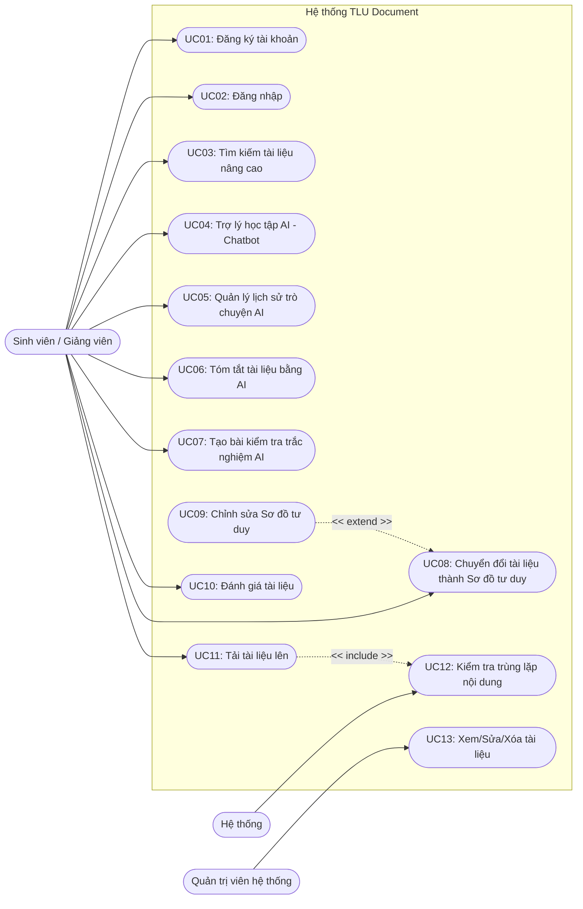

## 3.3. Sơ đồ hoạt động (Activity Diagram)
Dưới đây là sơ đồ hoạt động mô tả dòng xử lý chi tiết của hai chức năng nghiệp vụ phức tạp nhất trong hệ thống:

**Quy trình tải lên tài liệu và Vector hóa dữ liệu (Document Upload & Vectorization Flow):**
Sơ đồ mô tả các bước từ khi người dùng tải lên một tài liệu học tập, hệ thống kiểm tra trùng lặp nội dung, tải lưu trữ tệp lên Google Drive và thực thi tiến trình vector hóa văn bản bất đồng bộ:

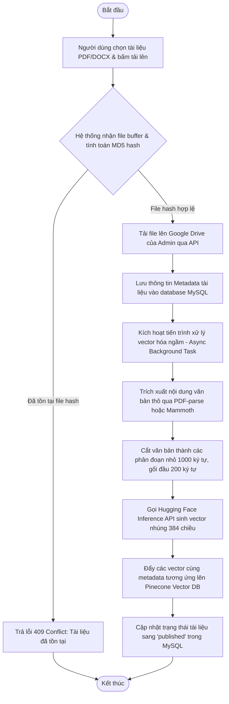

**Quy trình hỏi đáp kiến thức với Trợ lý AI (RAG Chatbot Tutor Flow):**
Sơ đồ mô tả quy trình tiếp nhận câu hỏi của người học, tính toán ngữ cảnh ngữ nghĩa từ tài liệu đã vector hóa trên Pinecone để xây dựng Prompt đầy đủ gửi lên OpenAI API và trả phản hồi dạng luồng (realtime streaming) về phía máy khách:

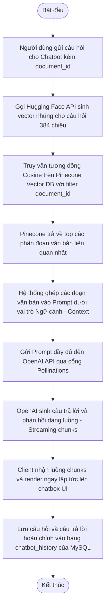

## 3.4. Sơ đồ lớp (Class Diagram)
Sơ đồ lớp dưới đây mô tả cấu trúc đối tượng dữ liệu logic và các phương thức hoạt động tương ứng của các thành phần trong hệ thống TLU Document:

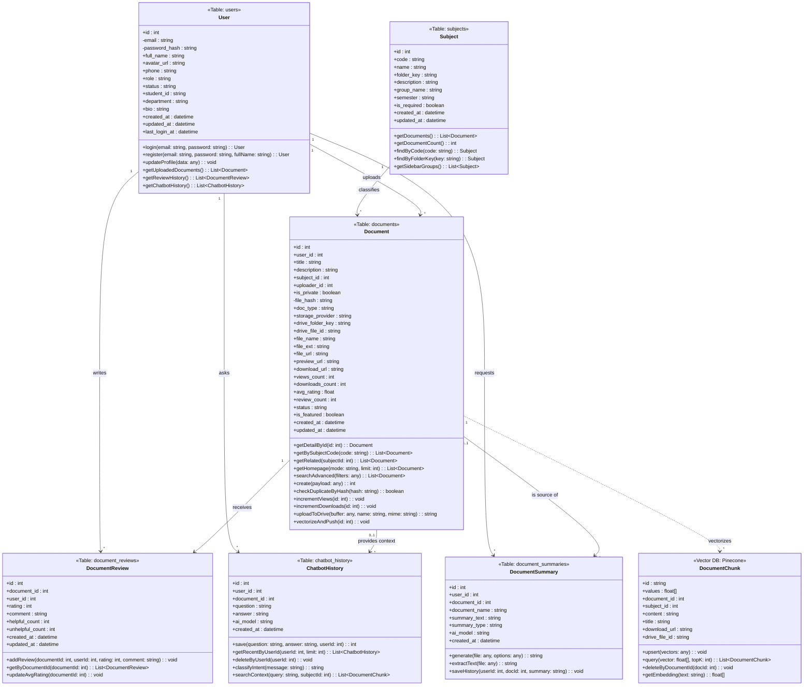
Hình 3.4 trình bày sơ đồ lớp của hệ thống TLU Document, mô tả cấu trúc các lớp chính và mối liên hệ giữa các thực thể nhằm quản lý người dùng, tài liệu học tập và các chức năng hỗ trợ học tập bằng trí tuệ nhân tạo (AI):

*   **User (Người dùng)**: Là thực thể trung tâm, liên kết thông tin người dùng với tất cả hoạt động nghiệp vụ (tải tài liệu, đánh giá, tóm tắt và hội thoại AI).
*   **Nhóm quản lý tài liệu (Subject, Document, DocumentReview)**: Phân loại tài liệu theo từng học phần (`Subject`), lưu trữ siêu dữ liệu học tập và đường dẫn Drive (`Document`), đồng thời tiếp nhận nhận xét và tính toán điểm đánh giá trung bình cộng đồng (`DocumentReview`).
*   **Nhóm hỗ trợ AI (DocumentSummary, ChatbotHistory, DocumentChunk)**: Lưu trữ lịch sử tóm tắt tài liệu (`DocumentSummary`), lịch sử câu hỏi/trả lời chatbot (`ChatbotHistory`), và quản lý các phân đoạn văn bản đã được vector hóa trong CSDL Vector Pinecone (`DocumentChunk`) để phục vụ tìm kiếm ngữ nghĩa và hỏi đáp RAG.

Các thực thể được liên kết chủ yếu thông qua quan hệ một-nhiều (1:N), đảm bảo tính nhất quán dữ liệu, phân tách rõ ràng trách nhiệm giữa các thành phần và giúp hệ thống dễ dàng bảo trì, mở rộng trong tương lai.

## 3.5. Sơ đồ ERD (Entity Relationship Diagram) và thiết kế cơ sở dữ liệu
Sơ đồ thực thể liên kết (ERD) dưới đây mô tả cấu trúc quan hệ logic giữa các thực thể và thuộc tính tương ứng được thiết kế và lưu trữ trên cơ sở dữ liệu quan hệ MySQL của hệ thống:

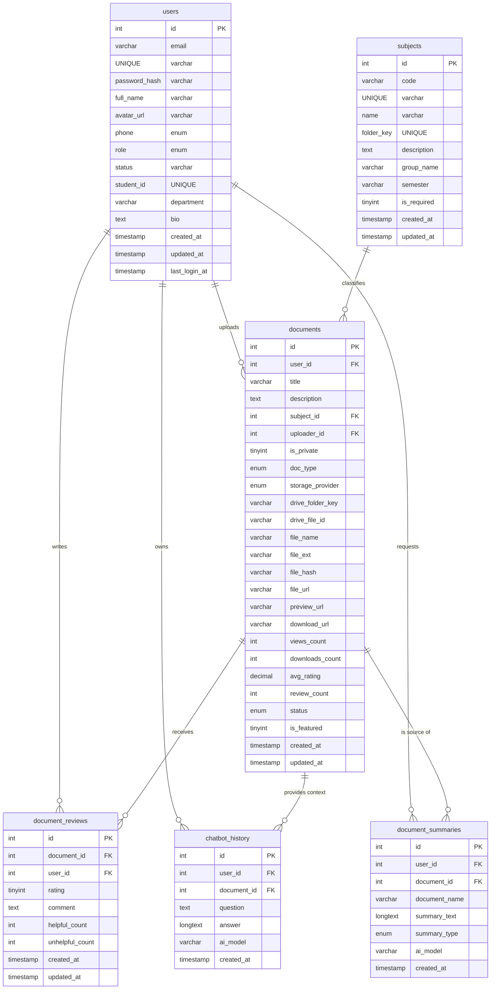
Hình 3.5 trình bày sơ đồ thực thể liên kết (Entity Relationship Diagram - ERD) của hệ thống TLU Document, mô tả cấu trúc lưu trữ và mối quan hệ ràng buộc giữa các bảng dữ liệu trong hệ thống.

Trong thiết kế cơ sở dữ liệu, bảng `users` đóng vai trò là thực thể trung tâm lưu trữ thông tin tài khoản người dùng, liên kết một-nhiều (1:N) với các bảng ghi nhận lịch sử hoạt động. Hệ thống quản lý tài liệu thông qua bảng `documents` (lưu trữ thông tin tài liệu, các chỉ số tương tác và liên kết lưu trữ) nhận liên kết từ `users` và `subjects` (danh mục môn học). Nhóm các bảng phụ trợ và hỗ trợ trí tuệ nhân tạo bao gồm `document_reviews`, `document_summaries` và `chatbot_history` lưu trữ chi tiết đánh giá, lịch sử tóm tắt tự động và lịch sử hội thoại hỏi đáp của người dùng trên hệ thống.


## 3.6. Sơ đồ tuần tự (Sequence Diagram)
Dưới đây là các sơ đồ tuần tự chi tiết mô tả sự tương tác giữa tác nhân, giao diện người dùng, máy chủ API, cơ sở dữ liệu và các API tích hợp (Google Drive, Pinecone, OpenAI, Hugging Face) cho 13 usecase trong hệ thống theo mô hình thiết kế nghiệp vụ BCE (Boundary - Control - Entity):

### Sơ đồ tuần tự 1: UC01 – Đăng ký tài khoản
Mô tả luồng người dùng đăng ký tài khoản mới trên hệ thống.

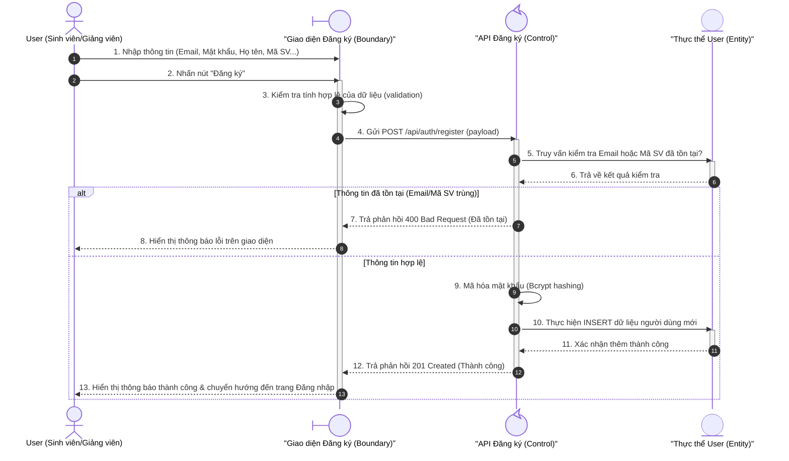

---

### Sơ đồ tuần tự 2: UC02 – Đăng nhập
Mô tả luồng xác thực thông tin đăng nhập của người dùng để cấp quyền truy cập hệ thống.

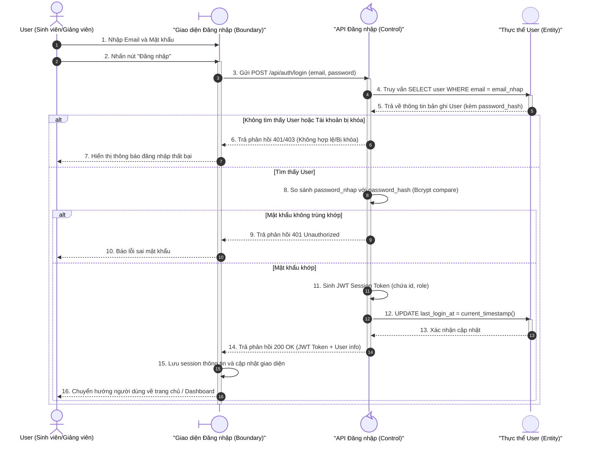

---

### Sơ đồ tuần tự 3: UC03 – Tìm kiếm tài liệu nâng cao
Mô tả luồng người dùng tìm kiếm tài liệu kết hợp giữa từ khóa ngữ nghĩa và các bộ lọc môn học, học phần.

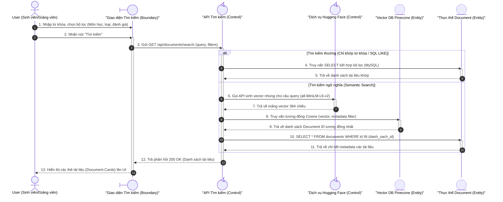

---

### Sơ đồ tuần tự 4: UC04 – Trợ lý học tập AI (Chatbot Tutor)
Mô tả luồng hỏi đáp ngữ cảnh dựa trên tài liệu sử dụng kỹ thuật RAG và stream phản hồi từ OpenAI LLM.

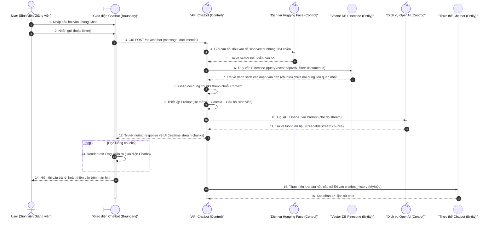

---

### Sơ đồ tuần tự 5: UC05 – Quản lý lịch sử trò chuyện AI
Mô tả luồng người dùng truy xuất, xem lại hoặc xóa các phiên hội thoại cũ với trợ lý AI.

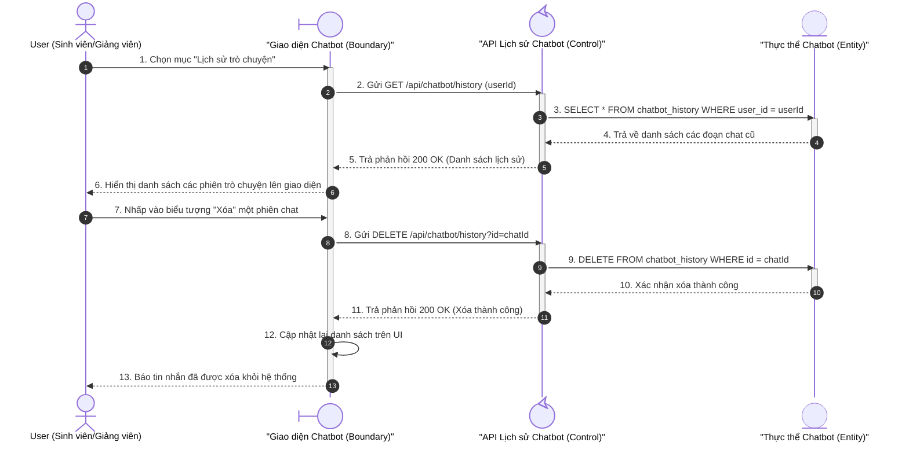

---

### Sơ đồ tuần tự 6: UC06 – Tóm tắt tài liệu bằng AI
Mô tả luồng hệ thống gọi mô hình AI tóm tắt tài liệu tự động theo cấu hình người dùng.

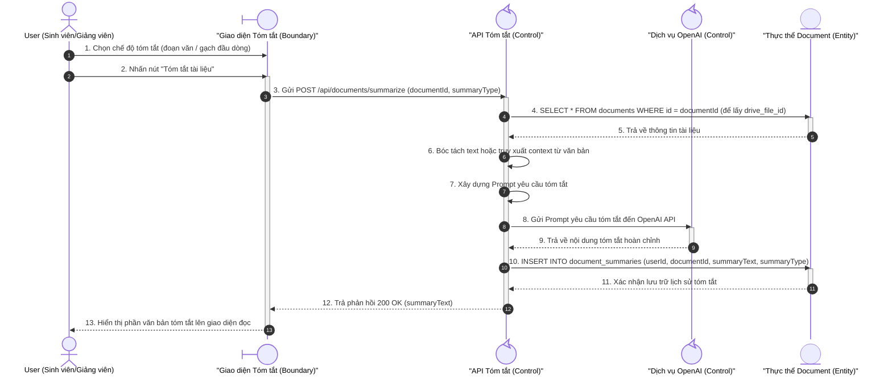

---

### Sơ đồ tuần tự 7: UC07 – Tạo bài kiểm tra trắc nghiệm (AI Quiz Generator)
Mô tả luồng hệ thống gọi AI phân tích văn bản để thiết kế câu hỏi trắc nghiệm tương tác cho sinh viên.

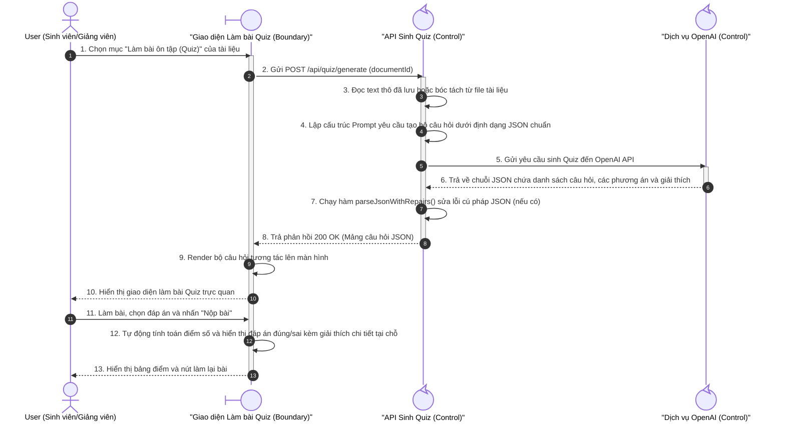

---

### Sơ đồ tuần tự 8: UC08 – Chuyển đổi tài liệu thành Sơ đồ tư duy (Mindmap Generator)
Mô tả luồng hệ thống gọi AI chuyển đổi dàn ý tài liệu thành cây sơ đồ tư duy phân cấp.

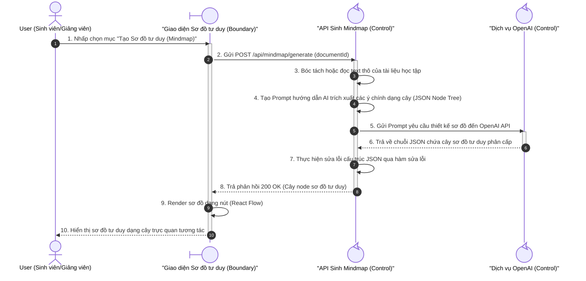

---

### Sơ đồ tuần tự 9: UC09 – Chỉnh sửa Sơ đồ tư duy (Edit Mindmap)
Mô tả luồng người dùng thao tác chỉnh sửa trực tiếp các node trên sơ đồ tư duy (tự động lưu trạng thái mới lên máy chủ).

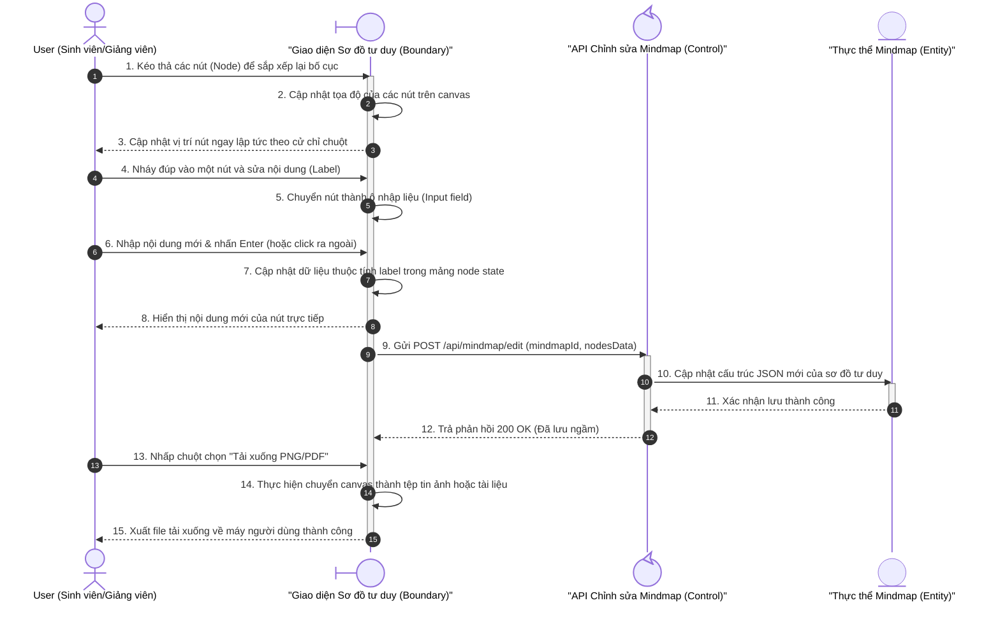

---

### Sơ đồ tuần tự 10: UC10 – Đánh giá tài liệu (Review Document)
Mô tả luồng người dùng chấm điểm sao và gửi nhận xét đánh giá chất lượng tài liệu học tập.

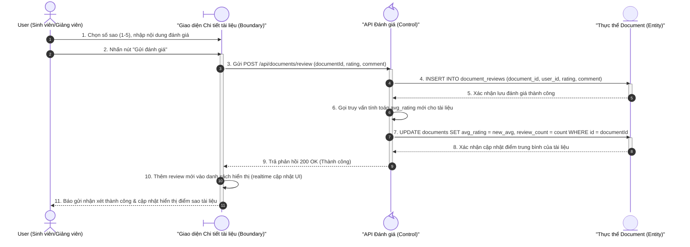

---

### Sơ đồ tuần tự 11: UC11 – Tải tài liệu lên (Upload Document)
Mô tả luồng tải tệp tin lên hệ thống, đồng bộ Google Drive và đưa vào hàng đợi xử lý Vector hóa.

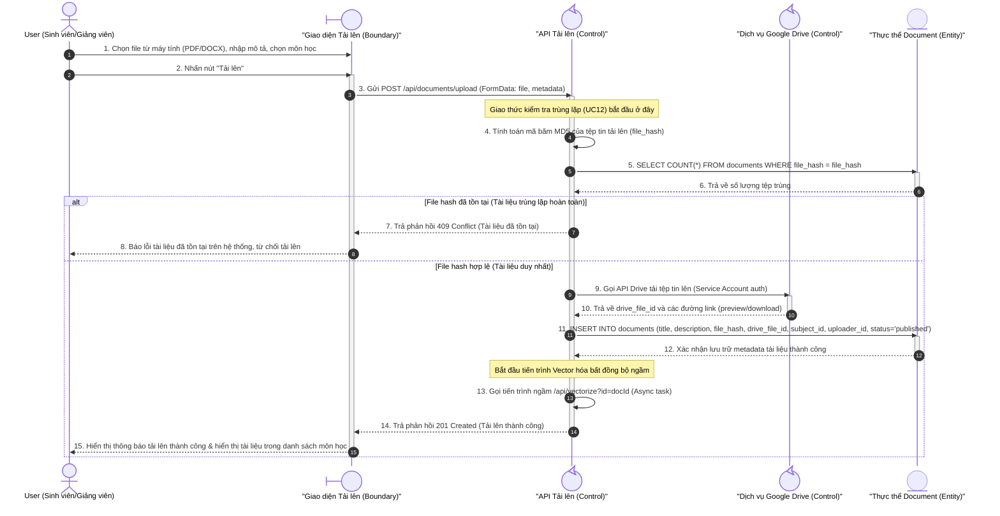

---

### Sơ đồ tuần tự 12: UC12 – Kiểm tra trùng lặp nội dung (Duplicate Check)
Mô tả quy trình kiểm tra trùng lặp độc lập ở phía backend phục vụ cho quá trình tải tài liệu lên.

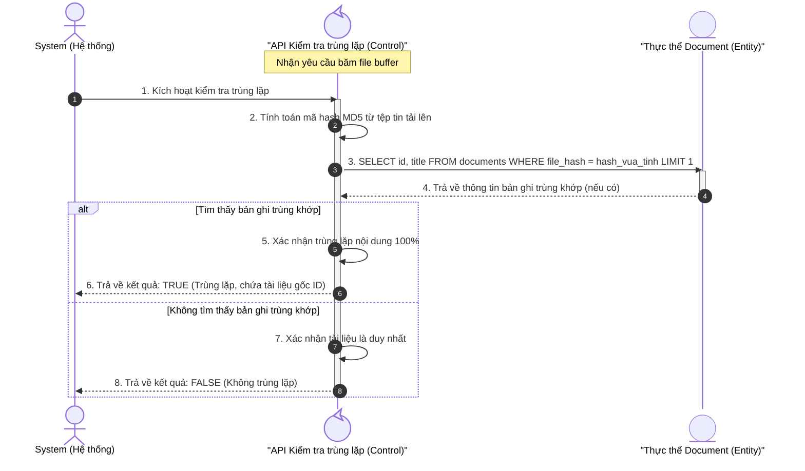

---

### Sơ đồ tuần tự 13: UC13 – Xem/Sửa/Xóa tài liệu (dành cho Admin)
Mô tả quy trình quản trị tài liệu học tập dành riêng cho Quản trị viên (Admin).

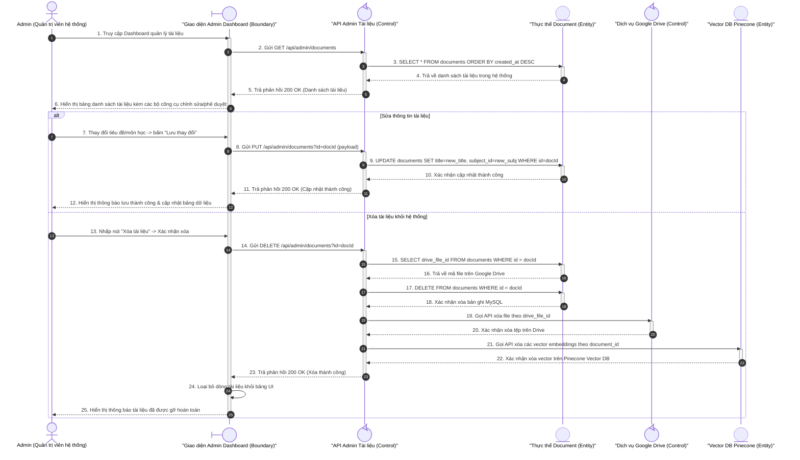

# CHƯƠNG 4: THIẾT KẾ CHI TIẾT HỆ THỐNG VÀ CƠ SỞ DỮ LIỆU

Sau khi phân tích xong nghiệp vụ và các yêu cầu chức năng, chương này tập trung trình bày thiết kế chi tiết của hệ thống TLU Document, thể hiện qua mô hình kiến trúc phần mềm, cấu trúc thư mục tổ chức dự án, thiết kế cơ sở dữ liệu quan hệ và vector, danh sách giao tiếp API RESTful và thiết kế bố cục giao diện người dùng.

## 4.1. Kiến trúc phần mềm (Software Architecture)
Hệ thống TLU Document được xây dựng theo mô hình **Kiến trúc 3 lớp (3-Tier/Layered Architecture)** kết hợp mô hình tương tác **Client-Server**. Sự phân tách rõ ràng này giúp giảm thiểu sự phụ thuộc giữa các tầng, tăng độ tin cậy, tăng cường bảo mật và giúp hệ thống dễ dàng tích hợp các API trí tuệ nhân tạo (AI).

Sơ đồ mô tả kiến trúc tổng quát của hệ thống:

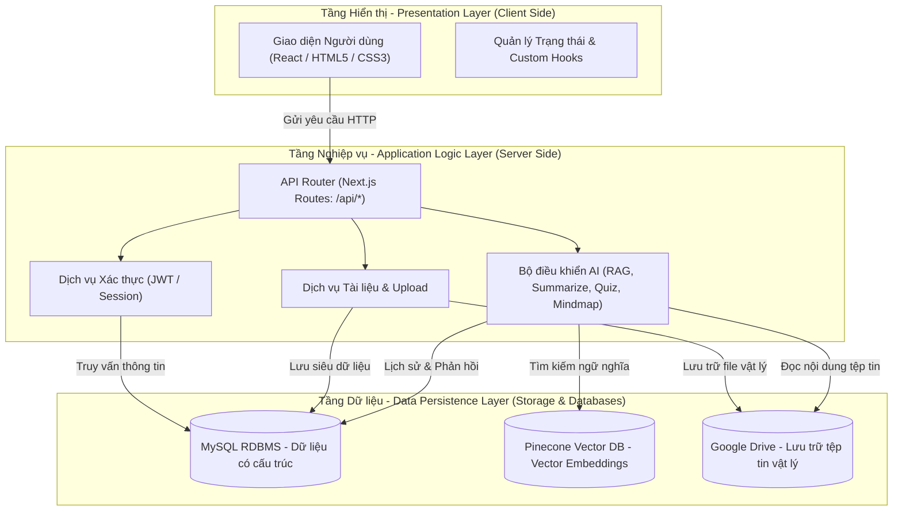

### Các tầng trong kiến trúc:
1. **Presentation Layer (Tầng hiển thị):**
   - Được triển khai bằng **Next.js (React)** ở phía Client.
   - Nhận trách nhiệm render giao diện ứng dụng, bắt các sự kiện tương tác của người dùng, thực hiện kiểm tra dữ liệu đầu vào cơ bản (validation) và gọi các API bất đồng bộ (async fetch).
2. **Application Logic Layer (Tầng nghiệp vụ):**
   - Triển khai thông qua **Next.js API Routes** (chạy trên môi trường Node.js Server).
   - Tiếp nhận các yêu cầu HTTP, xử lý xác thực quyền hạn (Authentication/Authorization), thực hiện nghiệp vụ chính như băm file kiểm tra trùng lặp, xây dựng prompt gửi tới các mô hình ngôn ngữ lớn (LLM), và kết nối với các thư viện xử lý trung gian (PDF parser, drive client).
3. **Data Persistence Layer (Tầng lưu trữ dữ liệu):**
   - **MySQL Database**: Lưu trữ dữ liệu quan hệ có tính nhất quán cao như thông tin cá nhân của người dùng, danh mục môn học, siêu dữ liệu tài liệu, đánh giá sao, và lịch sử câu hỏi chatbot.
   - **Pinecone Vector Database**: Lưu trữ các vector nhúng (embeddings) mật độ cao của tài liệu học tập cùng siêu dữ liệu liên quan để phục vụ giải thuật tìm kiếm ngữ nghĩa nâng cao và truy xuất ngữ cảnh cho Chatbot AI (RAG).
   - **Google Drive Storage**: Lưu trữ vật lý các file tài liệu dưới định dạng gốc (PDF, DOCX, PPTX), giảm tải lưu trữ cục bộ trên máy chủ.

---

## 4.2. Cấu trúc thư mục trong Project (Project Folder Structure)
Dự án được tổ chức cấu trúc mã nguồn theo mô hình chuẩn của **Next.js App Router (TypeScript)**, phân tách các thành phần giao diện, các API endpoint xử lý nghiệp vụ và các dịch vụ kết nối dữ liệu dùng chung.

```text
DATN_TLUDOCUMENT/
├── app/                        # Thư mục trang giao diện và API Routes (Next.js App Router)
│   ├── api/                    # Chứa các API Endpoint xử lý logic phía Server
│   │   ├── auth/               # API xử lý Đăng ký, Đăng nhập và phiên người dùng
│   │   ├── chatbot/            # API Chatbot AI vấn đáp tài liệu và lịch sử chat
│   │   ├── documents/          # API CRUD tài liệu, quản lý đánh giá, lượt xem, lượt tải
│   │   ├── mindmap/            # API tự động tạo và lưu trữ Sơ đồ tư duy bằng AI
│   │   ├── quiz/               # API tự động tạo câu hỏi trắc nghiệm ôn tập
│   │   ├── search/             # API tìm kiếm lai kết hợp (Hybrid Search)
│   │   ├── subjects/           # API quản lý danh mục môn học, học phần giảng dạy
│   │   ├── summarize/          # API tự động tóm tắt văn bản tài liệu bằng AI
│   │   └── upload/             # API upload file lên Google Drive và kiểm tra trùng lặp
│   ├── auth/                   # Trang giao diện Đăng nhập, Đăng ký thành viên
│   ├── chatbot/                # Giao diện tương tác với Trợ lý học tập AI (Chatbot Tutor)
│   ├── document/               # Trang hiển thị chi tiết tài liệu và Iframe xem trực tuyến
│   ├── mindmap/                # Giao diện hiển thị và chỉnh sửa Sơ đồ tư duy dạng Graph
│   ├── quiz/                   # Giao diện làm bài tập trắc nghiệm và xem đáp án giải thích
│   ├── upload/                 # Giao diện kéo thả tải tài liệu lên hệ thống
│   ├── layout.tsx              # Bố cục giao diện toàn cục (Header, Sidebar, Navigation)
│   └── page.tsx                # Trang chủ cổng thông tin (Dashboard) tài liệu nổi bật
├── components/                 # Các React Component tái sử dụng (Button, Card, Modal, Input...)
├── hooks/                      # Các Custom React Hooks phục vụ quản lý trạng thái tại client
├── lib/                        # Thư viện dùng chung, dịch vụ database và tích hợp bên ngoài
│   ├── advanced-search.ts      # Giải thuật tìm kiếm nâng cao (kết hợp MySQL & Pinecone)
│   ├── chatbot-db-services.ts  # Các hàm CRUD cơ sở dữ liệu cho lịch sử hội thoại
│   ├── chatbot-intent.ts       # Logic phân tích ý định câu hỏi và thiết lập Prompt RAG
│   ├── client-pdf-parser.ts    # Hỗ trợ đọc nội dung văn bản PDF từ client
│   ├── drive.ts                # Dịch vụ kết nối và thao tác với Google Drive API
│   ├── hf-embedder.ts          # Dịch vụ sinh Vector Embeddings từ Hugging Face API
│   ├── mindmap.ts              # Xử lý sinh prompt, định cấu trúc JSON cho Sơ đồ tư duy
│   ├── mysql.ts                # Khởi tạo kết nối và quản lý Connection Pool MySQL
│   ├── pinecone.ts             # Khởi tạo kết nối cơ sở dữ liệu Vector Pinecone
│   ├── quiz.ts                 # Cấu trúc hóa prompt sinh trắc nghiệm và chuẩn hóa đáp án
│   ├── repositories.ts         # Triển khai Repository Pattern tối ưu hóa truy vấn MySQL
│   └── summarize.ts            # Tách nhỏ văn bản và gọi AI tóm tắt (Map-Reduce/Refine)
├── public/                     # Thư mục chứa tài nguyên tĩnh (Hình ảnh, Logo, Icons)
├── package.json                # Định nghĩa các thư viện phụ thuộc và kịch bản khởi chạy dự án
└── tsconfig.json               # Cấu hình dự án TypeScript
```

---

## 4.3. Cấu trúc Cơ sở dữ liệu (Database Schema Design)
Hệ thống sử dụng cơ sở dữ liệu MySQL làm kho lưu trữ thông tin có cấu trúc, đồng thời kết hợp cơ sở dữ liệu Pinecone để lưu trữ và truy hồi dữ liệu vector phục vụ các chức năng trí tuệ nhân tạo.

### 4.3.1. Thiết kế các bảng dữ liệu MySQL
Dưới đây là thiết kế chi tiết cấu trúc trường, kiểu dữ liệu và ràng buộc của các bảng:

#### 1. Bảng `users` (Quản lý thông tin tài khoản người dùng)
Bảng lưu trữ thông tin nhận dạng cá nhân, thông tin đăng nhập và phân quyền của người dùng.
| Thuộc Tính | Kiểu Dữ Liệu | Ràng Buộc | Mô Tả |
| :--- | :--- | :--- | :--- |
| **id** | int(11) | PK, Auto Increment, NOT NULL | Mã ID duy nhất tự động tăng |
| **email** | varchar(255) | UNIQUE, NOT NULL | Địa chỉ email đăng nhập hệ thống |
| **password_hash**| varchar(255) | NOT NULL | Mật khẩu đã được mã hóa an toàn |
| **full_name** | varchar(255) | NOT NULL | Họ và tên đầy đủ |
| **avatar_url** | varchar(500) | DEFAULT NULL | Liên kết ảnh đại diện người dùng |
| **phone** | varchar(20) | DEFAULT NULL | Số điện thoại liên lạc |
| **role** | enum('student','teacher','admin') | DEFAULT 'student' | Vai trò của tài khoản trong hệ thống |
| **status** | enum('active','inactive','suspended')| DEFAULT 'active' | Trạng thái hoạt động của tài khoản |
| **student_id** | varchar(50) | UNIQUE, DEFAULT NULL | Mã số sinh viên của người dùng |
| **department** | varchar(100) | DEFAULT NULL | Khoa / Viện / Chuyên ngành |
| **bio** | text | DEFAULT NULL | Giới thiệu ngắn về bản thân |
| **created_at** | timestamp | DEFAULT CURRENT_TIMESTAMP | Thời điểm đăng ký tài khoản |
| **updated_at** | timestamp | DEFAULT CURRENT_TIMESTAMP ON UPDATE | Thời điểm cập nhật thông tin gần nhất |
| **last_login_at**| timestamp | DEFAULT NULL | Ghi nhận lần đăng nhập cuối cùng |

#### 2. Bảng `subjects` (Quản lý danh mục môn học/học phần)
Bảng lưu trữ danh mục môn học phục vụ phân loại và tổ chức cây thư mục tài liệu.
| Thuộc Tính | Kiểu Dữ Liệu | Ràng Buộc | Mô Tả |
| :--- | :--- | :--- | :--- |
| **id** | int(11) | PK, Auto Increment, NOT NULL | Mã ID duy nhất của môn học |
| **code** | varchar(50) | UNIQUE, NOT NULL | Mã học phần môn học (VD: CSE484) |
| **name** | varchar(255) | NOT NULL | Tên hiển thị đầy đủ của môn học |
| **folder_key** | varchar(100) | UNIQUE, NOT NULL | Định danh thư mục đồng bộ trên Google Drive |
| **description** | text | DEFAULT NULL | Mô tả tóm tắt nội dung môn học |
| **group_name** | varchar(100) | DEFAULT NULL | Nhóm kiến thức của môn học |
| **semester** | varchar(20) | DEFAULT NULL | Học kỳ giảng dạy tiêu chuẩn |
| **is_required** | tinyint(1) | DEFAULT 0 | Học phần bắt buộc (1) hay tự chọn (0) |
| **created_at** | timestamp | DEFAULT CURRENT_TIMESTAMP | Thời điểm tạo bản ghi môn học |
| **updated_at** | timestamp | DEFAULT CURRENT_TIMESTAMP ON UPDATE | Thời điểm cập nhật bản ghi gần nhất |

#### 3. Bảng `documents` (Thông tin siêu dữ liệu tài liệu học tập)
Bảng trung tâm lưu trữ thông tin chi tiết và trạng thái liên kết tệp tin vật lý của tài liệu học tập.
| Thuộc Tính | Kiểu Dữ Liệu | Ràng Buộc | Mô Tả |
| :--- | :--- | :--- | :--- |
| **id** | int(11) | PK, Auto Increment, NOT NULL | Mã tài liệu duy nhất tự sinh |
| **user_id** | int(11) | FK (users.id), NULL | ID người tải lên (nếu là tài liệu cá nhân) |
| **title** | varchar(500) | FULLTEXT INDEX, NOT NULL | Tiêu đề hoặc tên tài liệu học tập |
| **description** | text | FULLTEXT INDEX, DEFAULT NULL | Mô tả chi tiết nội dung tài liệu |
| **subject_id** | int(11) | FK (subjects.id), NULL | Thuộc môn học nào (có thể NULL) |
| **uploader_id** | int(11) | FK (users.id), NOT NULL | ID quản trị viên phê duyệt đăng tài liệu |
| **is_private** | tinyint(1) | DEFAULT 0 | 0: Công khai toàn hệ thống, 1: Cá nhân riêng tư |
| **doc_type** | enum('exam','lecture','slides','assignment','research','other') | DEFAULT 'other' | Phân loại tệp (Đề thi, slides, bài giảng...) |
| **storage_provider** | enum('gdrive','other') | DEFAULT 'gdrive' | Nhà cung cấp dịch vụ Cloud chứa file |
| **drive_folder_key**| varchar(100) | NOT NULL | Thư mục cha chứa tệp tin trên Google Drive |
| **drive_file_id** | varchar(255) | NOT NULL | ID độc quyền của tệp tin do Google Drive cấp |
| **file_name** | varchar(255) | DEFAULT NULL | Tên tệp tin gốc khi tải lên |
| **file_ext** | varchar(20) | DEFAULT NULL | Đuôi mở rộng của tệp tin (pdf, docx...) |
| **file_hash** | varchar(64) | DEFAULT NULL | Mã băm MD5 của nội dung tệp tin để chống trùng |
| **file_url** | varchar(1000) | DEFAULT NULL | Liên kết chia sẻ trực tiếp của Google Drive |
| **preview_url** | varchar(1000) | DEFAULT NULL | Liên kết nhúng Iframe xem trước trực tuyến |
| **download_url** | varchar(1000) | DEFAULT NULL | Liên kết tải tệp tin trực tiếp từ API |
| **views_count** | int(11) | DEFAULT 0 | Tổng số lượt mở xem tài liệu |
| **downloads_count**| int(11) | DEFAULT 0 | Tổng số lượt tải tài liệu về máy |
| **favorites_count**| int(11) | DEFAULT 0 | Tổng số lượt lưu tài liệu yêu thích |
| **avg_rating** | decimal(3,2) | DEFAULT 0.00 | Điểm đánh giá trung bình từ 1.00 đến 5.00 |
| **review_count** | int(11) | DEFAULT 0 | Đếm số lượng bình luận đánh giá |
| **status** | enum('draft','published','archived','removed') | DEFAULT 'draft' | Trạng thái phê duyệt tài liệu |
| **is_featured** | tinyint(1) | DEFAULT 0 | Đánh dấu hiển thị ưu tiên tại trang chủ |
| **created_at** | timestamp | DEFAULT CURRENT_TIMESTAMP | Thời điểm tài liệu được tạo trên hệ thống |
| **updated_at** | timestamp | DEFAULT CURRENT_TIMESTAMP ON UPDATE | Thời điểm tài liệu được chỉnh sửa |

#### 4. Bảng `document_reviews` (Quản lý đánh giá và nhận xét tài liệu)
Bảng lưu trữ ý kiến phản hồi chất lượng và điểm số sao của người dùng dành cho tài liệu.
| Thuộc Tính | Kiểu Dữ Liệu | Ràng Buộc | Mô Tả |
| :--- | :--- | :--- | :--- |
| **id** | int(11) | PK, Auto Increment, NOT NULL | Mã ID duy nhất của nhận xét |
| **document_id** | int(11) | FK (documents.id), NOT NULL | Tài liệu tiếp nhận đánh giá |
| **user_id** | int(11) | FK (users.id), NOT NULL | Người dùng thực hiện đánh giá |
| **rating** | tinyint(3) UNSIGNED | NOT NULL | Thang điểm đánh giá bằng số sao (1-5) |
| **comment** | text | DEFAULT NULL | Nội dung lời bình luận nhận xét |
| **helpful_count**| int(11) | DEFAULT 0 | Số lượt người dùng khác bình chọn hữu ích |
| **unhelpful_count**| int(11) | DEFAULT 0 | Số lượt người dùng khác bình chọn không hữu ích |
| **created_at** | timestamp | DEFAULT CURRENT_TIMESTAMP | Thời điểm đăng đánh giá |
| **updated_at** | timestamp | DEFAULT CURRENT_TIMESTAMP ON UPDATE | Thời điểm sửa đổi đánh giá gần nhất |

*Ghi chú ràng buộc*: Thiết lập khóa UNIQUE phức hợp cho bộ đôi `(document_id, user_id)` đảm bảo mỗi tài khoản chỉ có thể thực hiện đánh giá tối đa một lần cho mỗi tài liệu.

#### 5. Bảng `document_summaries` (Lịch sử tóm tắt tài liệu bằng AI)
Lưu lại các bản tóm tắt tài liệu đã sinh bằng AI của từng người dùng để truy xuất lại nhanh chóng.
| Thuộc Tính | Kiểu Dữ Liệu | Ràng Buộc | Mô Tả |
| :--- | :--- | :--- | :--- |
| **id** | int(11) | PK, Auto Increment, NOT NULL | Mã bản ghi tóm tắt |
| **user_id** | int(11) | FK (users.id), NOT NULL | Người dùng yêu cầu tạo tóm tắt |
| **document_id** | int(11) | FK (documents.id), NULL | Tài liệu nguồn (để NULL nếu tải file tự do) |
| **document_name**| varchar(255) | NOT NULL | Tên tệp tin hiển thị làm tiêu đề bản tóm tắt |
| **summary_text** | longtext | NOT NULL | Nội dung tóm tắt dạng văn bản thuần sinh từ AI |
| **summary_type** | enum('paragraph','bullets') | DEFAULT 'paragraph' | Kiểu định dạng hiển thị kết quả |
| **ai_model** | varchar(100) | DEFAULT NULL | Tên phiên bản mô hình AI thực hiện xử lý |
| **created_at** | timestamp | DEFAULT CURRENT_TIMESTAMP | Thời gian lưu bản tóm tắt |

#### 6. Bảng `chatbot_history` (Quản lý lịch sử hội thoại hỏi đáp AI)
Bảng lưu trữ lịch sử các phiên tương tác trực tiếp với Trợ lý học tập AI dựa trên ngữ cảnh tài liệu.
| Thuộc Tính | Kiểu Dữ Liệu | Ràng Buộc | Mô Tả |
| :--- | :--- | :--- | :--- |
| **id** | int(11) | PK, Auto Increment, NOT NULL | Mã bản ghi vấn đáp duy nhất |
| **user_id** | int(11) | FK (users.id), NOT NULL | ID người dùng đưa ra câu hỏi |
| **document_id** | int(11) | FK (documents.id), DEFAULT NULL | Tài liệu nguồn dùng làm ngữ cảnh hỏi đáp |
| **question** | text | NOT NULL | Nội dung câu hỏi dạng văn bản của người dùng |
| **answer** | longtext | NOT NULL | Nội dung câu trả lời phản hồi từ AI |
| **ai_model** | varchar(100) | DEFAULT NULL | Tên phiên bản mô hình ngôn ngữ (LLM) |
| **created_at** | timestamp | DEFAULT CURRENT_TIMESTAMP | Thời điểm thực hiện cuộc trò chuyện |

---

### 4.3.2. Cơ sở dữ liệu Vector (Pinecone Vector Schema)
Để phục vụ tìm kiếm ngữ nghĩa (Semantic Search) cho Chatbot RAG, dữ liệu tài liệu dạng văn bản thô không lưu trong MySQL mà được chia tách thành các phân đoạn độc lập và lưu trữ dưới dạng vector nhúng đa chiều trên **Pinecone**.

Cấu trúc mỗi bản ghi vector lưu trữ trên Pinecone bao gồm:
- **id** (String): Định danh duy nhất cho đoạn dữ liệu (định dạng `doc_[document_id]_chunk_[chunk_index]`).
- **values** (Float Array): Mảng vector gồm 384 hoặc 768 chiều (tùy thuộc vào mô hình sinh nhúng sử dụng như Hugging Face `all-MiniLM-L6-v2` hoặc OpenAI `text-embedding-3-small`).
- **metadata** (JSON Object): Lưu siêu dữ liệu để bộ lọc AI truy xuất ngữ cảnh và cung cấp nguồn dẫn nguồn trực quan cho người học:
  ```json
  {
    "content": "Đoạn nội dung văn bản học thuật gốc đã được tách ra để phục vụ đối chiếu...",
    "document_id": 12,
    "subject_id": 4,
    "title": "Giáo trình Mạng máy tính TLU",
    "download_url": "/api/documents/download/12",
    "drive_file_id": "1vX9O...drive_file_id"
  }
  ```

---

## 4.4. Thiết kế các API RESTful (RESTful API Design)
Hệ thống sử dụng các API RESTful nhằm cung cấp phương thức trao đổi dữ liệu bất đồng bộ giữa Client (Next.js) và các dịch vụ phía Server, trao đổi dữ liệu chủ yếu thông qua định dạng JSON.

### 4.4.1. Nhóm API Xác thực (`/api/auth`)
| HTTP Method | Endpoint | Yêu cầu Đầu vào (Payload) | Trả về Đầu ra (JSON) | Mô Tả |
| :--- | :--- | :--- | :--- | :--- |
| **POST** | `/api/auth/register` | `{email, password, full_name, role, student_id}` | `{success: true, message: "Đăng ký thành công", user: {...}}` | Đăng ký tài khoản sinh viên/giảng viên mới |
| **POST** | `/api/auth/login` | `{email, password}` | `{success: true, token: "jwt_token", user: {...}}` | Đăng nhập hệ thống, thiết lập cookie session |

### 4.4.2. Nhóm API Quản lý và Tìm kiếm Tài liệu (`/api/documents`, `/api/upload`, `/api/search`)
| HTTP Method | Endpoint | Yêu cầu Đầu vào (Payload / Query / URL Params) | Trả về Đầu ra (JSON) | Mô Tả |
| :--- | :--- | :--- | :--- | :--- |
| **POST** | `/api/documents/upload` | Form-data: `file: File, title: String, description: String, subject: String, category: String, uploader_id: Int` | `{success: true, document_id: 15, url: "..."}` | Tải tài liệu lên Google Drive, kiểm tra mã băm MD5 chống trùng và lưu vào CSDL MySQL |
| **POST** | `/api/documents/vectorize` | `{document_id: 15}` | `{success: true, message: "..."}` | Đọc nội dung file PDF từ Drive, chia nhỏ văn bản, tạo vector nhúng (Embeddings) và lưu vào Pinecone |
| **GET** | `/api/documents/counts` | Không có | `{counts: { "CSE484": 12, ... }}` | Lấy tổng số lượng tài liệu đã công khai phân chia theo mã môn học |
| **POST** | `/api/documents/[id]/download`| Không có | `{success: true}` | Tăng lượt đếm tải về (downloads_count) cho tài liệu tương ứng |
| **POST** | `/api/documents/[id]/review` | `{rating: 5, comment: "Nội dung chất lượng", userId: 1}` | `{success: true}` | Lưu đánh giá chất lượng tài liệu và cập nhật điểm trung bình của tài liệu |
| **GET** | `/api/search/advanced` | Tham số query: `?q=từ_khóa&groupName=Nhóm&subjectCode=CSE484&docTypes=exam,slides&minRating=4&updatedWithin=month` | `{items: [{id, title, date, views, downloads, rating, image, downloadUrl, fileExt, subjectCode, subjectName, uploaderName}, ...]}` | Tìm kiếm tài liệu nâng cao kết hợp nhiều bộ lọc và sắp xếp kết quả |
| **GET** | `/api/subjects/groups` | Không có | `{groups: [{group_name: "...", subjects: [...]}, ...]}` | Lấy thông tin nhóm học phần và môn học phục vụ cho menu Sidebar |
| **POST** | `/api/upload` | Form-data: `file: File` | `{url: "/uploads/filename.png"}` | Tải tệp tin ảnh/avatar lên thư mục public của Server |

### 4.4.3. Nhóm API Học tập Trí tuệ Nhân tạo (`/api/chatbot`, `/api/summarize`, `/api/quiz`, `/api/mindmap`)
| HTTP Method | Endpoint | Yêu cầu Đầu vào (Payload / Query) | Trả về Đầu ra (JSON) | Mô Tả |
| :--- | :--- | :--- | :--- | :--- |
| **POST** | `/api/chatbot` | `{document_id: 15, question: "..."}` | `{answer: "...", citations: [...]}` | Trò chuyện với trợ lý học tập AI theo ngữ cảnh tài liệu (RAG) |
| **GET** | `/api/chatbot/history` | Tham số query: `?userId=1` | `{history: [{id, question, answer, created_at, document_id}, ...]}` | Lấy lịch sử 50 câu hỏi trò chuyện gần đây của người dùng |
| **POST** | `/api/chatbot/history` | `{userId, question, answer, documentId}` | `{message: "...", id: 10}` | Lưu một cặp câu hỏi - câu trả lời mới vào lịch sử hội thoại |
| **DELETE** | `/api/chatbot/history` | Tham số query: `?userId=1&id=10` (id tùy chọn) | `{message: "..."}` | Xóa một câu hội thoại theo ID hoặc xóa toàn bộ lịch sử chat của người dùng |
| **POST** | `/api/summarize` | `{document_id: 15, summary_type: "bullets"}` | `{summary_text: "...", ai_model: "..."}` | Yêu cầu AI đọc tệp và tóm tắt theo gạch đầu dòng hoặc đoạn văn |
| **POST** | `/api/quiz/generate` | `{document_id: 15, num_questions: 5}` | `{quizzes: [{question, options, answer}, ...]}` | Trích xuất nội dung văn bản học thuật để sinh câu hỏi trắc nghiệm tự động |
| **POST** | `/api/mindmap/generate` | `{fileName, text, maxChunkChars, maxChunks}` | `{mindmap: "...", simpleTree: {...}}` | Sinh sơ đồ tư duy dạng JSON từ nội dung văn bản học tập |
| **POST** | `/api/mindmap/extract` | Form-data: `file: File` | `{text: "..."}` | Trích xuất văn bản thô từ tệp (.txt, .pdf, .docx) để làm đầu vào cho AI |
| **POST** | `/api/mindmap/preview` | Form-data: `file: File` | File HTML raw preview | Chuyển đổi tệp .docx thành mã HTML xem trước trực tuyến |
| **POST** | `/api/mindmap/edit` | `{mindmap: {...}}` | `{success: true, updatedAt: "..."}` | Ghi nhận và lưu trạng thái vị trí mới của các nút sơ đồ tư duy |

---

## 4.5. Thiết kế Giao diện Người dùng (User Interface Design)
Dưới đây là sơ đồ bố cục (Wireframe/Mockups) mô tả các trang chức năng cốt lõi của hệ thống TLU Document:

### 4.5.1. Bố cục Trang chủ Dashboard (Dashboard Interface)
Trang chủ đóng vai trò cổng thông tin tìm kiếm và hiển thị tài liệu học tập nổi bật theo các môn học:
```text
+-----------------------------------------------------------------------------+
| [TLU Document Logo]     [Tìm kiếm môn học, tài liệu...]     [Avatar / Login] |
+-----------------------------------------------------------------------------+
|                                                                             |
|      XÂY DỰNG TRI THỨC - KẾT NỐI HỌC THUẬT VỚI TRÍ TUỆ NHÂN TẠO AI           |
|      +---------------------------------------------------------------+      |
|      |  Nhập tên môn học, tài liệu hoặc câu hỏi nghiên cứu của bạn...  | [Tìm] |
|      +---------------------------------------------------------------+      |
|                                                                             |
|   [Bộ lọc môn học]: [Mạng máy tính] [Lập trình web] [Trí tuệ nhân tạo]...    |
+-----------------------------------------------------------------------------+
|  TÀI LIỆU NỔI BẬT (FEATURED)                                                 |
|  +------------------+  +------------------+  +------------------+           |
|  | Đề thi KTLT 2025 |  | Slide AI - TLU   |  | Bài giảng CSDL   |  [ Xem thêm] |
|  | Đánh giá: 4.8/5  |  | Đánh giá: 4.9/5  |  | Đánh giá: 4.6/5  |           |
|  +------------------+  +------------------+  +------------------+           |
+-----------------------------------------------------------------------------+
|  TÀI LIỆU MỚI CẬP NHẬT                                                      |
|  +------------------+  +------------------+  +------------------+           |
|  | Lab 1 Mạng Máy T |  | Đề cương Triết   |  | Báo cáo Python   |  [ Xem thêm] |
|  | Người tải: SV01  |  | Người tải: GV02  |  | Người tải: SV03  |           |
|  +------------------+  +------------------+  +------------------+           |
+-----------------------------------------------------------------------------+
```

### 4.5.2. Bố cục Giao diện Học tập Tích hợp AI (Split View Workspace)
Giao diện không gian học tập thông minh chia hai màn hình (Split View): bên trái cho phép hiển thị nội dung đọc trực tuyến, bên phải chứa các công cụ tương tác AI (Tóm tắt, sinh trắc nghiệm và khung Chatbot RAG).
```text
+-----------------------------------------------------------------------------+
| [Quay lại Dashboard]  Đề cương học tập Trí tuệ Nhân tạo.pdf   [Tải xuống file]|
+------------------------------------+----------------------------------------+
|                                    | HỌC TẬP THÔNG MINH CÙNG AI TUTOR       |
|  [ KHUNG HIỂN THỊ TÀI LIỆU - PDF ]  | [Tóm tắt tài liệu]  [Tạo Trắc nghiệm]  |
|                                    | +--------------------------------------+
|  +------------------------------+  | AI: Xin chào! Bạn cần tôi hỗ trợ tìm   |
|  | Trí tuệ Nhân tạo (AI) là ... |  | hiểu nội dung nào trong tài liệu này?  |
|  |                              |  |                                        |
|  | - Khái niệm tác nhân thông   |  | User: Thuật toán Minimax hoạt động thế |
|  |   minh hoạt động trong môi   |  | nào trong sơ đồ này?                   |
|  |   trường...                  |  |                                        |
|  |                              |  | AI: Thuật toán Minimax hoạt động theo  |
|  | [ Trang 1 / 15 ]              |  | 4 bước sau: (Đọc từ nguồn Trang 3):... |
|  +------------------------------+  | [Nguồn tham khảo: Trang 3, Dòng 12-25] |
|                                    | +--------------------------------------+
|  ĐÁNH GIÁ CỦA CỘNG ĐỒNG            | | Nhập câu hỏi của bạn tại đây...  [Gửi] |
|  [Sao]: 5/5 | [Nhận xét]: Rất tốt  | +--------------------------------------+
+------------------------------------+----------------------------------------+
```

### 4.5.3. Bố cục Sơ đồ tư duy dạng Đồ thị Kéo thả (AI Mindmap Interactive Board)
Giao diện Sơ đồ tư duy tự động sinh bằng AI được hiển thị dưới dạng mạng các nút nút thắt liên kết mạng tương tác (Interactive Graph Layout):
- Trọng tâm sơ đồ hiển thị từ khóa chính của tài liệu học tập.
- Các nút nhánh cấp 1, cấp 2 tỏa ra xung quanh, cho phép người dùng kéo thả để sắp xếp, phóng to/thu nhỏ (zoom/pan), và nhấn đúp vào mỗi nút để chỉnh sửa hoặc hiển thị mô tả giải thích chi tiết.
- Cột bên cạnh chứa thanh công cụ lưu trữ vị trí sơ đồ, tải về dưới định dạng hình ảnh (PNG/SVG) hoặc xuất file văn bản.

### 4.5.4. Bố cục Làm bài tập trắc nghiệm thông minh (Interactive Quiz Panel)
Giao diện làm bài tập trắc nghiệm hiển thị các câu hỏi tuần tự kèm theo đồng hồ đếm ngược thời gian và thanh tiến trình. Khi người học hoàn thành bài thi và nộp bài, hệ thống hiển thị bảng điểm, câu đúng/sai kèm theo hộp giải thích chi tiết đáp án đúng có trích dẫn rõ câu nói, số trang dữ liệu lấy ra từ tài liệu gốc giúp học sinh ôn tập chủ động.

# CHƯƠNG 5. CÀI ĐẶT, KIỂM THỬ VÀ TRIỂN KHAI HỆ THỐNG

Chương này tập trung trình bày chi tiết về môi trường phát triển, cấu trúc công nghệ sử dụng, quy trình thiết lập, cấu hình dịch vụ bên ngoài và triển khai ứng dụng TLU Document lên môi trường thực tế. Đồng thời, chương này cũng đưa ra quy trình kiểm thử hệ thống với các kịch bản kiểm thử (Test Cases) chi tiết và đánh giá toàn diện kết quả đạt được cùng những hạn chế cần khắc phục.

---

## 5.1. Môi trường triển khai hệ thống

### 5.1.1. Môi trường máy chủ triển khai
Hệ thống TLU Document được phát triển cục bộ dựa trên các công nghệ Next.js 15, React 19 và TypeScript chạy trên môi trường Node.js. Khi đưa vào hoạt động thực tế, hệ thống được phân phối triển khai trên các hạ tầng điện toán đám mây (Cloud) nhằm đảm bảo khả năng mở rộng và tính ổn định tối đa:

*   **Vercel Cloud (Ứng dụng Web & Serverless API)**: Đóng vai trò máy chủ ứng dụng chính, chịu trách nhiệm lưu trữ mã nguồn, tự động build mã nguồn TypeScript và phân phối các assets giao diện tĩnh qua mạng lưới CDN toàn cầu của Vercel. Các API Endpoint nằm trong thư mục `app/api/` cũng được đóng gói thành các Serverless Functions chạy độc lập trên hạ tầng đám mây này, giúp tối ưu hóa thời gian phản hồi và khả năng chịu tải.
*   **Railway Cloud (MySQL Database)**: Máy chủ cơ sở dữ liệu MySQL được khởi tạo và vận hành trên nền tảng đám mây Railway. Railway cung cấp hạ tầng kết nối tốc độ cao, hỗ trợ tự động sao lưu dữ liệu (backup) định kỳ và thiết lập Connection Pool dung lượng lớn để đáp ứng các truy vấn dữ liệu đồng thời từ Vercel Serverless Functions.
*   **Pinecone Cloud (Vector Database)**: Cơ sở dữ liệu Vector thế hệ mới chạy serverless trên nền tảng Pinecone. Pinecone đóng vai trò lưu trữ toàn bộ các vector nhúng (embeddings) mật độ cao biểu diễn ngữ nghĩa cho từng đoạn văn bản trích xuất từ tài liệu học tập, hỗ trợ đắc lực cho giải thuật tìm kiếm tương đồng ngữ nghĩa.
*   **Google Drive Storage (Lưu trữ tệp tin)**: Hệ thống sử dụng phân vùng lưu trữ đám mây Google Drive liên kết với tài khoản nhà phát triển. Toàn bộ tệp tin học tập (PDF, DOCX, PPTX) được tải lên sẽ được lưu trữ vật lý tại đây, giúp tiết kiệm băng thông máy chủ chính và tận dụng được tính năng hiển thị trực tiếp (iframe preview) của Google.

### 5.1.2. Cấu hình các dịch vụ bên ngoài
Hệ thống kết nối và khai thác tài nguyên từ các dịch vụ bên ngoài thông qua các bước thiết lập và cấu hình khóa bảo mật chuyên biệt:

1.  **Cấu hình Google Drive API (OAuth2 Credentials):**
    - **Bước 1 (Khởi tạo dự án):** Truy cập vào cổng quản trị Google Cloud Console (`https://console.cloud.google.com/`), đăng nhập bằng tài khoản Google. Nhấp chọn danh sách dự án ở góc trên bên trái, chọn **New Project**, nhập tên dự án là `TLU Document Storage` và bấm **Create** để hệ thống khởi tạo môi trường làm việc mới.
    - **Bước 2 (Kích hoạt API):** Tại thanh menu bên trái, di chuyển đến **APIs & Services** > **Library**. Tại ô tìm kiếm, nhập từ khóa `Google Drive API`, nhấp vào kết quả tìm kiếm và chọn nút **Enable** để cho phép dự án hiện tại khai thác các dịch vụ lưu trữ đám mây của Google Drive.
    - **Bước 3 (Cấu hình màn hình đồng ý OAuth - Google Auth Platform):** Tại thanh menu bên trái, cấu hình được chia thành các tab dưới phân hệ **Google Auth Platform** (hoặc **Plateforme d'authentification Google**):
        *   Truy cập mục **Branding** để khai báo thông tin ứng dụng gồm tên ứng dụng (*App name*) là `TLU Document` và email hỗ trợ kỹ thuật (*User support email*).
        *   Truy cập mục **Audience** để cấu hình đối tượng người dùng: Chọn **User Type** là **External**. Nếu trạng thái hoạt động (**Publication status**) đang ở chế độ **In production** (hoặc bạn muốn chuyển từ Production về Testing bằng cách bấm **Return to test mode**), hãy cuộn xuống cuối trang này tại phần **Test users** (tiếng Pháp: *Utilisateurs de test*), chọn **Ajouter des utilisateurs** (Add Users) và điền địa chỉ Gmail của tài khoản Google Drive quản trị dùng để chứa học liệu.
        *   Truy cập mục **Accès aux données** (Data access) để kiểm tra hoặc quản lý các phạm vi truy cập (Scopes) khi cần thiết.
    - **Bước 4 (Tạo thông tin xác thực OAuth Client ID):** 
        *   Truy cập vào tab **Clients** ở menu bên trái. Nhấp chọn **Create client** (hoặc **Créer un client** ở tiếng Pháp) > **OAuth client ID** (hoặc **ID de client OAuth**).
        *   Tại mục **Application type** (loại ứng dụng), chọn **Web application** (tiếng Pháp: **Application Web**). Điền tên định danh là `TLU Document OAuth`.
        *   Tại mục **Authorized redirect URIs** (URI chuyển hướng được ủy quyền), nhấp chọn **Add URI** (Ajouter URI) và dán địa chỉ chuyển hướng của Google OAuth2 Playground: `https://developers.google.com/oauthplayground`. 
        *   Bấm **Create** để hệ thống hiển thị hộp thoại chứa thông số `Client ID` và `Client Secret`. Hãy sao chép hai giá trị này để chuẩn bị khai báo cho biến môi trường.
    - **Bước 5 (Ủy quyền và lấy Refresh Token):** Truy cập trang web `https://developers.google.com/oauthplayground`. Nhấp vào biểu tượng bánh răng cài đặt ở góc trên bên phải (OAuth 2.0 Configuration), đánh dấu chọn vào ô **Use your own OAuth credentials**, sau đó nhập `Client ID` và `Client Secret` đã lấy ở Bước 4 vào. Tại cột danh sách API bên trái, cuộn xuống tìm **Drive API v3**, nhấp chọn để mở rộng và chọn phạm vi (Scope) là `https://www.googleapis.com/auth/drive`. Nhấn nút **Authorize APIs** để chuyển đến giao diện đăng nhập của Google. Hãy đăng nhập bằng tài khoản Gmail đã thêm ở mục Test Users ở Bước 3, bấm tiếp tục qua các cảnh báo bảo mật và nhấn **Allow** để cấp quyền. Sau khi quay lại trang Playground, nhấp chọn tiếp **Exchange authorization code for tokens** để hệ thống tự động sinh ra mã **Refresh Token** dài hạn, dùng làm khóa gia hạn truy cập tự động cho backend mà không bị hết hạn sau 3600 giây.
    - **Bước 6 (Tạo thư mục lưu trữ gốc):** Truy cập vào tài khoản Google Drive quản trị, tạo một thư mục mới để chứa toàn bộ tài liệu học tập của TLU Document và lưu lại ID của thư mục này (chuỗi ký tự ở cuối đường dẫn URL của thư mục trên trình duyệt) để gán cho biến `GOOGLE_DRIVE_ROOT_FOLDER_ID`.

2.  **Cấu hình Pinecone Cloud API:**
    - Đăng nhập vào trang quản trị Pinecone Console, tạo một dự án mới.
    - Tạo Index có tên là `tlu-document-chatbot` với cấu hình kỹ thuật:
      *   **Dimension (Số chiều vector)**: `384` (Khớp chính xác với số chiều đầu ra của mô hình nhúng `all-MiniLM-L6-v2` từ Hugging Face).
      *   **Metric (Khoảng cách)**: `Cosine` (Thuật toán đo góc Cosine giữa hai vector, tối ưu nhất cho việc tính độ tương đồng ngữ nghĩa của hai đoạn văn bản).
    - Tạo API Key tương ứng trên Pinecone Console để cấp quyền truy xuất cho máy chủ Vercel (`PINECONE_API_KEY`).

3.  **Cấu hình Pollinations AI (OpenAI & Gemini API Gateway):**
    - Đăng ký và lấy mã khóa bảo mật `POLLINATIONS_API_KEY` từ dịch vụ Pollinations AI. Dịch vụ này đóng vai trò là cổng API trung gian định tuyến thông minh (API Router) kết nối đến các mô hình AI cao cấp như GPT-4o hoặc Gemini 1.5 Pro, giúp hệ thống sinh dữ liệu học tập tốc độ cao và tránh bị lỗi gián đoạn dịch vụ.

4.  **Cấu hình Hugging Face API:**
    - Truy cập trang chủ Hugging Face, tạo **Access Tokens** quyền ghi/đọc (`HUGGINGFACE_TOKEN`) để có thể sử dụng mô hình embedding miễn phí từ xa qua Inference API (`sentence-transformers/all-MiniLM-L6-v2`).

### 5.1.3. Địa chỉ truy cập hệ thống
Sau khi hoàn tất quá trình thiết lập và triển khai tự động lên các môi trường đám mây, hệ thống TLU Document có thể được truy cập trực tiếp từ bất kỳ thiết bị nào có kết nối mạng Internet theo các thông tin định danh dưới đây:

*   **URL Trang Web Hệ thống**: `https://tlu-document.vercel.app`
*   **Tài khoản dùng thử nghiệm hệ thống:**

| STT | Vai trò / Loại tài khoản | Tên đăng nhập (Email) | Mật khẩu | Quyền hạn trong hệ thống |
| :---: | :--- | :--- | :--- | :--- |
| 1 | Quản trị hệ thống (Admin) | `admin@tlu.edu.vn` | `admin12345` | Phê duyệt/xóa tài liệu học liệu, quản lý danh mục môn học/học phần, cấu hình các tham số hệ thống. |
| 2 | Sinh viên / Giảng viên (User) | `student_test@tlu.edu.vn` | `student123` | Đọc tài liệu trực tuyến, tải xuống file, viết đánh giá và bình luận, hỏi đáp Chatbot AI Tutor, tự động sinh tóm tắt, trích xuất sơ đồ tư duy và tạo đề thi trắc nghiệm ôn tập. |

---

## 5.2. Cài đặt và cấu hình hệ thống

### 5.2.1. Cấu hình cơ sở dữ liệu
Quá trình thiết lập cơ sở dữ liệu được chia làm hai giai đoạn chính nhằm phục vụ cho cả lưu trữ quan hệ và lưu trữ vector:

1.  **Khởi tạo cơ sở dữ liệu MySQL:**
    - Tạo mới cơ sở dữ liệu có tên `railway` (hoặc `tlu_document` trên local) với bảng mã ký tự mặc định là `utf8mb4` và đối chiếu `utf8mb4_unicode_ci` để hỗ trợ lưu trữ tiếng Việt có dấu chính xác 100% không bị lỗi font.
    - Thực thi các câu lệnh SQL khởi tạo cấu trúc 6 bảng chính (`users`, `subjects`, `documents`, `document_reviews`, `document_summaries`, `chatbot_history`) và bảng lưu trữ vector fallback cục bộ `document_chunks`. Các khóa ngoại giữa `documents.subject_id`, `documents.uploader_id`, `document_reviews.document_id`, `chatbot_history.user_id` được ràng buộc chặt chẽ kèm thuộc tính `ON DELETE CASCADE` ở một số bảng liên kết để tự động dọn sạch dữ liệu mồ côi.

2.  **Khởi tạo cơ sở dữ liệu Vector Pinecone:**
    - Cơ sở dữ liệu Vector Pinecone được cấu hình kết nối trực tiếp thông qua SDK của Pinecone trên Node.js. Toàn bộ các vector nhúng (embeddings) mật độ cao biểu diễn ngữ nghĩa cho từng đoạn văn bản trích xuất từ tài liệu học tập được đẩy trực tiếp lên Pinecone Index `tlu-document-chatbot` đã cấu hình ở mục 5.1.2.

### 5.2.2. Cấu hình biến môi trường
Mọi thông tin cấu hình nhạy cảm và thông số kết nối của hệ thống được lưu trữ trong tệp tin cấu hình môi trường bảo mật `.env.local` ở thư mục gốc của dự án. File cấu hình này được bỏ qua không đưa lên GitHub (`.gitignore`) để đảm bảo an toàn tuyệt đối.

Cấu trúc khai báo các biến môi trường thực tế của hệ thống:
```env
# Cấu hình kết nối cơ sở dữ liệu quan hệ MySQL (Railway Cloud)
DB_HOST=my-mysql-host.proxy.rlwy.net
DB_PORT=3306
DB_USER=root
DB_PASSWORD=my_mysql_secure_password
DB_NAME=tlu_document_db

# Cấu hình dịch vụ lưu trữ đám mây Google Drive (OAuth2)
GOOGLE_DRIVE_ROOT_FOLDER_ID=my_google_drive_folder_id_12345
GOOGLE_DRIVE_API_KEY=my_google_drive_api_key_abcde
GOOGLE_CLIENT_ID=my_google_client_id.apps.googleusercontent.com
GOOGLE_CLIENT_SECRET=my_google_client_secret_key
GOOGLE_REFRESH_TOKEN=my_google_refresh_token_to_renew_access_token
DOCUMENT_UPLOADER_EMAIL=admin@tlu.edu.vn

# Cấu hình khóa API kết nối Trí tuệ nhân tạo (OpenAI / Gemini Router)
POLLINATIONS_API_KEY=my_pollinations_api_key_sk_12345
CHATBOT_MODEL=openai
CHATBOT_MAX_OUTPUT_TOKENS=1600
CHATBOT_HISTORY_USER_ID=1

# Cấu hình cơ sở dữ liệu Vector Pinecone Cloud
PINECONE_API_KEY=my_pinecone_api_key_pcsk_12345
PINECONE_INDEX_NAME=tlu-document-chatbot

# Cấu hình HuggingFace Token phục vụ RAG (Embedding all-MiniLM-L6-v2)
HUGGINGFACE_TOKEN=my_huggingface_token_hf_12345
```

---

## 5.3. Triển khai hệ thống

Tiến trình đưa hệ thống TLU Document lên môi trường internet toàn cầu được thực hiện theo quy trình tự động hóa CI/CD khép kín kết hợp giữa kho lưu trữ GitHub và dịch vụ Vercel Cloud:

```mermaid
graph LR
    Dev["Máy trạm Developer"] -->|Git Commit & Push| GH["GitHub Repository"]
    GH -->|Webhook Trigger| Vercel["Vercel Cloud Platform"]
    Vercel -->|1. Build & Compile Code| Build["Biên dịch & Tối ưu Assets"]
    Vercel -->|2. Check Environment Variables| Env["Kiểm tra Biến môi trường"]
    Vercel -->|3. Deploy Serverless Functions| Deploy["Triển khai API & Website"]
    Deploy -->|Vận hành trực tuyến| Live["Website Trực tuyến (Production):<br> https://tlu-document.vercel.app/"]
```

1.  **Đẩy mã nguồn lên GitHub:**
    - Lập trình viên kiểm tra cục bộ mã nguồn, chạy lệnh build thử (`pnpm run build`) để đảm bảo không có lỗi cú pháp hoặc lỗi kiểu TypeScript.
    - Thực hiện lưu lại các thay đổi và đẩy mã nguồn lên nhánh chính `main` của kho chứa GitHub thông qua lệnh:
      ```bash
      git add .
      git commit -m "feat: complete core features and configure cloud deployments"
      git push origin main
      ```

2.  **Kết nối GitHub với Vercel Cloud:**
    - Truy cập trang chủ Vercel, đăng nhập bằng tài khoản liên kết GitHub.
    - Nhấp nút **Add New** -> **Project**, chọn kho chứa `vietcuong2004/DATN_TLUDOC` từ danh sách liên kết.
    - Vercel tự động nhận diện dự án được phát triển bằng **Next.js** và thiết lập các kịch bản build mặc định (`pnpm run build`) cùng thư mục đầu ra biên dịch (`.next`).

3.  **Khai báo biến môi trường trên Vercel:**
    - Tại mục **Environment Variables** trong giao diện cấu hình dự án của Vercel, nhập lần lượt tất cả các khóa và giá trị biến môi trường tương ứng như trong tệp `.env.local`. Đây là bước cực kỳ quan trọng để các API Serverless của Next.js có thể kết nối được tới cơ sở dữ liệu MySQL trên Railway, Pinecone Index và tài khoản Google Drive khi chạy trên môi trường đám mây Vercel.

4.  **Kích hoạt Build và Deploy tự động:**
    - Bấm nút **Deploy**. Vercel sẽ tự động tải mã nguồn từ GitHub về máy chủ xây dựng của họ, khởi tạo môi trường Node.js, cài đặt các thư viện phụ thuộc, chạy bộ biên dịch TypeScript để tối ưu hóa tệp tin giao diện tĩnh và đóng gói các API Route thành các Serverless Functions siêu nhẹ.
    - Khi quá trình biên dịch hoàn tất mà không phát sinh lỗi, Vercel sẽ cấp một tên miền phụ mặc định (VD: `tlu-document.vercel.app`) và chính thức đưa hệ thống vào trạng thái hoạt động trực tuyến.

---

## 5.4. Kiểm thử hệ thống

Nhằm đánh giá mức độ đáp ứng yêu cầu của hệ thống TLU Document, nhóm tác giả tiến hành kiểm thử các chức năng chính sau khi hoàn thành quá trình triển khai. Việc kiểm thử tập trung vào các chức năng cốt lõi bao gồm xác thực người dùng, quản lý tài liệu, tìm kiếm học liệu, chatbot AI, sinh tóm tắt tài liệu và đánh giá tài liệu.

Bảng 5.1 trình bày kết quả kiểm thử các chức năng chính của hệ thống.

| STT | Chức năng kiểm thử           | Dữ liệu đầu vào            | Kết quả mong đợi                  | Kết quả thực tế              | Trạng thái |
| --- | ---------------------------- | -------------------------- | --------------------------------- | ---------------------------- | ---------- |
| 1   | Đăng ký tài khoản            | Email, mật khẩu hợp lệ     | Tạo tài khoản thành công          | Tạo tài khoản thành công     | Đạt        |
| 2   | Đăng nhập                    | Email, mật khẩu hợp lệ     | Đăng nhập hệ thống                | Đăng nhập thành công         | Đạt        |
| 3   | Upload tài liệu              | File PDF hợp lệ            | Tài liệu được lưu và xử lý        | Upload thành công            | Đạt        |
| 4   | Kiểm tra trùng lặp tài liệu  | File đã tồn tại            | Thông báo tài liệu trùng lặp      | Hệ thống phát hiện trùng lặp | Đạt        |
| 5   | Xem chi tiết tài liệu        | Chọn tài liệu bất kỳ       | Hiển thị đầy đủ thông tin         | Hiển thị chính xác           | Đạt        |
| 6   | Tải xuống tài liệu           | Nhấn nút Download          | Tải file thành công               | File được tải về             | Đạt        |
| 7   | Tìm kiếm tài liệu            | Từ khóa môn học            | Hiển thị tài liệu liên quan       | Kết quả phù hợp              | Đạt        |
| 8   | Sinh tóm tắt AI              | File PDF                   | Sinh nội dung tóm tắt             | Tóm tắt được tạo thành công  | Đạt        |
| 9   | Chatbot AI                   | Câu hỏi về môn học         | Sinh câu trả lời có ngữ cảnh      | Trả lời chính xác            | Đạt        |
| 10  | Hiển thị tài liệu tham chiếu | Câu hỏi liên quan tài liệu | Hiển thị danh sách tài liệu nguồn | Hiển thị đúng tài liệu       | Đạt        |
| 11  | Lưu lịch sử chatbot          | Gửi câu hỏi chatbot        | Lưu hội thoại vào CSDL            | Dữ liệu được lưu             | Đạt        |
| 12  | Đánh giá tài liệu            | Chọn số sao và bình luận   | Lưu đánh giá thành công           | Đánh giá được lưu            | Đạt        |
| 13  | Cập nhật điểm đánh giá       | Thêm đánh giá mới          | Tính lại điểm trung bình          | Điểm được cập nhật           | Đạt        |
| 14  | Đăng xuất                    | Nhấn nút Đăng xuất         | Kết thúc phiên làm việc           | Đăng xuất thành công         | Đạt        |

Kết quả kiểm thử cho thấy toàn bộ các chức năng chính của hệ thống đều hoạt động ổn định và đáp ứng đúng các yêu cầu nghiệp vụ đã đặt ra. Các chức năng quản lý tài liệu, tìm kiếm học liệu, chatbot AI và sinh tóm tắt tài liệu đều được thực hiện thành công trong môi trường triển khai thực tế.

## 5.5. Đánh giá định lượng chất lượng nội dung sinh từ trợ lý AI

Kiểm thử chức năng ở mục 5.4 mới chỉ xác nhận hệ thống vận hành đúng về mặt quy trình kỹ thuật (luồng gửi nhận dữ liệu). Đối với các hệ thống ứng dụng Trí tuệ nhân tạo tạo sinh (Generative AI), việc đánh giá chất lượng nội dung do AI sinh ra (như câu trả lời chatbot, tóm tắt, trắc nghiệm, sơ đồ tư duy) đóng vai trò quyết định hiệu quả học tập thực tế. 

Do đó, nhóm đề tài đã thiết lập quy trình đánh giá định lượng chất lượng nội dung dựa trên bộ tiêu chí chuẩn hóa và tiến hành nghiệm thu thực nghiệm.

### 5.5.1. Phương pháp và Thiết lập Đánh giá
*   **Bộ dữ liệu thử nghiệm (Test dataset):** Nhóm đề tài xây dựng bộ test gồm **50 tài liệu học tập** ngẫu nhiên được tải lên hệ thống, thuộc các nhóm chuyên ngành khác nhau (Công nghệ thông tin, Kinh tế, Kỹ thuật công trình, Lý luận chính trị...). Từ bộ tài liệu này, nhóm tạo ra **150 câu hỏi truy vấn chatbot** mẫu và chạy thử nghiệm tính năng tóm tắt, sinh trắc nghiệm và sơ đồ tư duy tương ứng.
*   **Phương pháp đánh giá (Human Evaluation):** Việc đánh giá chất lượng sinh nội dung của LLM được thực hiện thủ công bởi hội đồng gồm **03 thành viên chuyên môn** (giảng viên chuyên ngành và sinh viên xuất sắc) đóng vai trò là "chuyên gia đánh giá" (Evaluator). Các kết quả sinh ra được chấm điểm độc lập, sau đó lấy giá trị trung bình (Mean Opinion Score - MOS).
*   **Thang điểm đánh giá:** Sử dụng thang điểm từ 1 đến 5 (1: Rất kém - thông tin sai lệch/ảo tưởng; 5: Xuất sắc - hoàn toàn chính xác, cấu trúc tốt, có giá trị học thuật cao).

### 5.5.2. Các tiêu chí đánh giá chuẩn hóa (Evaluation Rubrics)
Hội đồng chuyên môn thực hiện đánh giá dựa trên các tiêu chí cụ thể như sau:

1.  **Trợ lý Chatbot AI (kiến trúc RAG):**
    *   *Tính trung thực (Faithfulness):* Nội dung câu trả lời hoàn toàn bám sát thông tin trong tài liệu nguồn, không chứa thông tin bịa đặt (hallucination).
    *   *Độ liên quan (Answer Relevance):* Câu trả lời giải quyết trực tiếp và chính xác câu hỏi của người dùng.
    *   *Độ chính xác tham chiếu (Citation Accuracy):* Các liên kết, chỉ số trang, dòng trích dẫn nguồn có đúng với ngữ cảnh chứa thông tin trong file gốc hay không.
2.  **Tóm tắt tài liệu (Document Summarizer):**
    *   *Độ bao phủ ý chính (Keypoint Coverage):* Tóm tắt giữ lại đầy đủ các luận điểm, từ khóa và thông tin cốt lõi của tài liệu.
    *   *Độ súc tích & cấu trúc (Conciseness & Structure):* Cách diễn đạt ngắn gọn, không lặp ý, cấu trúc gạch đầu dòng rõ ràng.
3.  **Tạo trắc nghiệm ôn tập (Quiz Generator):**
    *   *Độ chính xác đáp án (Answer Accuracy):* Phương án được chọn làm đáp án đúng phải thực sự chính xác về mặt khoa học dựa trên tài liệu.
    *   *Chất lượng phương án nhiễu (Distractor Quality):* Các đáp án sai phải có tính logic, hợp lý để thử thách người học (không quá ngô nghê hoặc quá hiển nhiên).
4.  **Tạo sơ đồ tư duy (Mindmap Generator):**
    *   *Logic phân cấp (Hierarchical Logic):* Mối quan hệ cha-con giữa các nút sơ đồ tư duy phải chính xác về mặt ngữ nghĩa và logic phân loại.
    *   *Độ hoàn thiện (Completeness):* Sơ đồ phản ánh đầy đủ cấu trúc khung của tài liệu, không bỏ sót các chương/mục lớn.

### 5.5.3. Kết quả thực nghiệm định lượng
Bảng 5.2 tổng hợp kết quả chấm điểm trung bình (MOS) và tỷ lệ phần trăm các kết quả sinh ra đạt yêu cầu (từ 4.0 điểm trở lên) từ hội đồng đánh giá:

**Bảng 5.2. Kết quả đánh giá định lượng chất lượng nội dung sinh từ AI**

| Tính năng AI | Tiêu chí đánh giá | Điểm trung bình (MOS / 5.0) | Tỷ lệ đạt yêu cầu (>= 4.0) |
| :--- | :--- | :---: | :---: |
| **Chatbot Tutor (RAG)** | Tính trung thực (Faithfulness) | 4.65 | 94.0% |
| | Độ liên quan (Answer Relevance) | 4.58 | 92.0% |
| | Độ chính xác tham chiếu (Citation Accuracy) | 4.42 | 88.0% |
| **Document Summarizer** | Độ bao phủ ý chính (Keypoint Coverage) | 4.52 | 90.0% |
| | Độ súc tích & cấu trúc (Conciseness) | 4.70 | 96.0% |
| **Quiz Generator** | Độ chính xác đáp án (Answer Accuracy) | 4.60 | 92.0% |
| | Chất lượng phương án nhiễu | 4.28 | 84.0% |
| **Mindmap Generator** | Logic phân cấp (Hierarchical Logic) | 4.36 | 86.0% |
| | Độ hoàn thiện (Completeness) | 4.45 | 88.0% |

### 5.5.4. Phân tích kết quả và Nhận diện hạn chế kỹ thuật
Dựa trên điểm số định lượng và nhận xét từ hội đồng chuyên môn, nhóm đề tài rút ra các kết luận thực tiễn về ưu điểm cũng như các lỗi thường gặp của hệ thống:

*   **Về Chatbot RAG:**
    *   *Ưu điểm:* Việc kết hợp cơ sở dữ liệu vector Pinecone giúp chatbot bám sát nội dung tài liệu tốt. Điểm Faithfulness đạt mức rất cao (4.65) chứng minh kiến trúc RAG đã giảm thiểu tối đa hiện tượng "ảo tưởng" (hallucination) thường gặp ở các LLM truyền thống.
    *   *Hạn chế:* Điểm chính xác tham chiếu (88% đạt yêu cầu) bị kéo giảm ở các tài liệu có chứa bảng biểu phức tạp hoặc tài liệu dạng ảnh quét (OCR chất lượng trung bình), dẫn đến việc trích xuất số trang hoặc số dòng tham chiếu bị lệch nhẹ.
*   **Về Tóm tắt & Trắc nghiệm:**
    *   *Ưu điểm:* Tóm tắt có cấu trúc rõ ràng, tính súc tích cao (MOS 4.70). Trắc nghiệm tạo ra bám sát nội dung chính xác.
    *   *Hạn chế:* Khoảng 8% câu hỏi trắc nghiệm phát sinh lỗi đáp án do câu hỏi bị trùng lặp ý hoặc cấu trúc câu hỏi bị tối nghĩa khi AI cố gắng bóc tách các đoạn văn quá ngắn. Một số phương án nhiễu chưa thực sự tốt, dễ đoán (MOS 4.28).
*   **Về Sơ đồ tư duy (Mindmap):**
    *   *Hạn chế:* Mindmap có điểm logic phân cấp thấp nhất (MOS 4.36). Khi gặp các tài liệu phi cấu trúc (không phân rõ mục lục cụ thể), AI có xu hướng phân cấp các nhánh con ngang hàng với nhánh cha, hoặc gộp quá nhiều thông tin chi tiết vào một nút thắt làm sơ đồ bị rối mắt.

Những chỉ số định lượng trên đã chỉ ra bức tranh thực tế về năng lực xử lý của hệ thống, làm cơ sở khoa học để thiết lập các phương án tối ưu hóa prompt và nâng cấp mô hình ở chương tiếp theo.

---

# KẾT LUẬN

Sau một thời gian nghiên cứu, thiết kế và hiện thực dưới sự hướng dẫn của TS. Nguyễn Huy Đức, đề tài đã xây dựng thành công hệ thống **TLU Document** – nền tảng hỗ trợ học tập thông minh dành cho sinh viên Trường Đại học Thủy Lợi, tích hợp các công nghệ trí tuệ nhân tạo hiện đại nhằm nâng cao hiệu quả khai thác và tiếp thu kiến thức từ tài liệu học tập.

Điểm nổi bật của hệ thống là việc phát triển thành công bộ công cụ hỗ trợ học tập thông minh tích hợp AI, bao gồm:

* **Chatbot Tutor** ứng dụng kiến trúc Retrieval-Augmented Generation (RAG), hỗ trợ hỏi đáp bám sát nội dung tài liệu, cung cấp câu trả lời có ngữ cảnh và hiển thị nguồn tham khảo liên quan.
* **Quiz Generator** cho phép tự động sinh các câu hỏi trắc nghiệm nhiều lựa chọn từ nội dung tài liệu, hỗ trợ sinh viên ôn tập và tự đánh giá kiến thức.
* **Mindmap Generator** có khả năng xây dựng sơ đồ tư duy dạng cây phân cấp từ nội dung tài liệu, đồng thời cho phép người dùng chỉnh sửa, thêm hoặc xóa các nhánh theo nhu cầu sử dụng.
* **Document Summarizer** hỗ trợ tóm tắt tài liệu tự động, trích xuất các nội dung chính, các điểm nổi bật và những từ khóa quan trọng nhằm giúp người học nắm bắt kiến thức nhanh chóng.

Bên cạnh các tính năng AI, hệ thống cũng đã hoàn thiện các chức năng quản lý và chia sẻ tài liệu học tập như tìm kiếm tài liệu, xem trước, tải xuống, đánh giá và bình luận tài liệu. Sản phẩm đã được triển khai thực tế trên môi trường Internet tại địa chỉ **https://tlu-document.vercel.app**, cho phép người dùng truy cập và sử dụng trực tiếp mà không cần cài đặt thêm phần mềm (video demo xem tại [đây](https://www.youtube.com/watch?v=cL55LpIoGxs&feature=youtu.be)).

Kết quả đạt được cho thấy hệ thống đã đáp ứng được các mục tiêu đề ra và có khả năng ứng dụng thực tế trong việc hỗ trợ học tập. Tuy nhiên, hệ thống hiện vẫn còn phụ thuộc vào một số dịch vụ AI và hạ tầng triển khai miễn phí, do đó khả năng mở rộng và hiệu năng xử lý ở quy mô lớn vẫn còn những hạn chế nhất định.

# HƯỚNG PHÁT TRIỂN

Trong tương lai, hệ thống TLU Document sẽ tiếp tục được hoàn thiện theo hướng nâng cao hiệu năng và khả năng phục vụ thực tế. Trước hết, hạ tầng triển khai sẽ được nâng cấp nhằm hỗ trợ số lượng người dùng đồng thời lớn hơn, tăng tính ổn định và khả năng mở rộng của hệ thống. Bên cạnh đó, các dịch vụ AI miễn phí đang sử dụng sẽ được thay thế bằng các API thương mại có chất lượng cao hơn hoặc triển khai các mô hình mã nguồn mở trên hạ tầng riêng, từ đó cải thiện chất lượng câu trả lời, độ chính xác của các chức năng sinh tóm tắt, tạo câu hỏi trắc nghiệm và sơ đồ tư duy, đồng thời khắc phục các giới hạn hiện tại về tốc độ xử lý, số lượng yêu cầu và độ ổn định của hệ thống khi vận hành trong môi trường thực tế.


---

