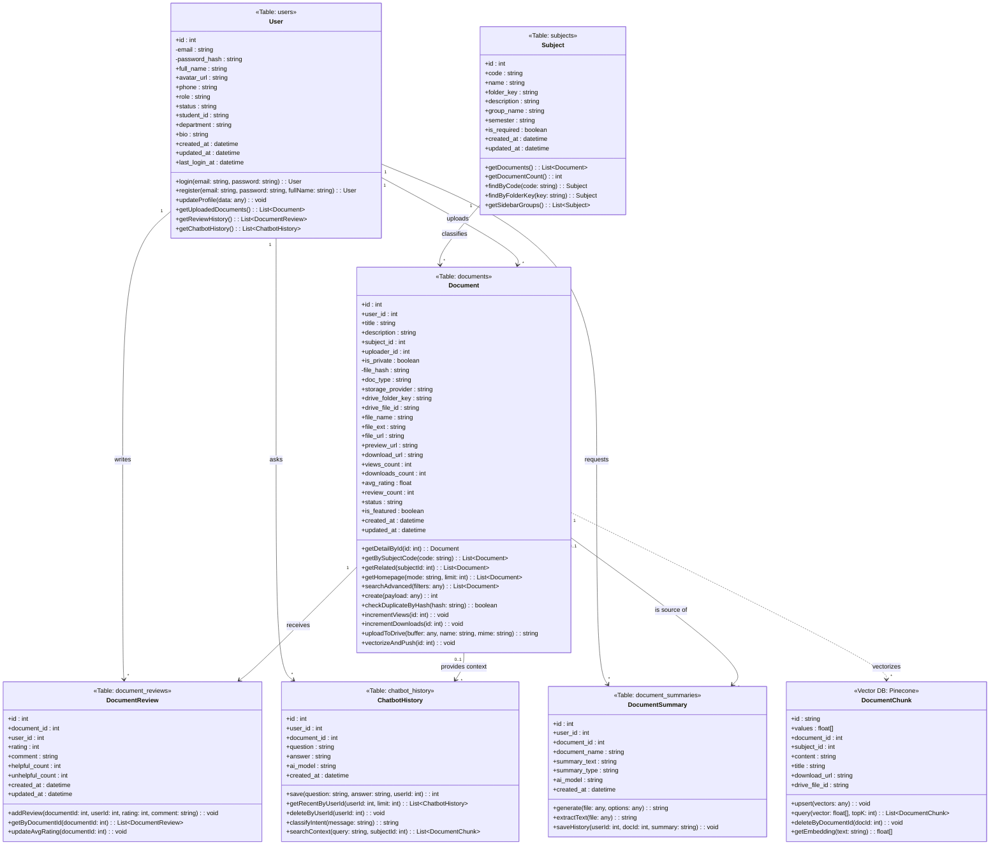

```mermaid
classDiagram
    direction TB

    class User {
        <<Table: users>>
        +id : int
        -email : string
        -password_hash : string
        +full_name : string
        +avatar_url : string
        +phone : string
        +role : string
        +status : string
        +student_id : string
        +department : string
        +bio : string
        +created_at : datetime
        +updated_at : datetime
        +last_login_at : datetime
        +login(email: string, password: string) : User
        +register(email: string, password: string, fullName: string) : User
        +updateProfile(data: any) : void
        +getUploadedDocuments() : List~Document~
        +getReviewHistory() : List~DocumentReview~
        +getChatbotHistory() : List~ChatbotHistory~
    }

    class Subject {
        <<Table: subjects>>
        +id : int
        +code : string
        +name : string
        +folder_key : string
        +description : string
        +group_name : string
        +semester : string
        +is_required : boolean
        +created_at : datetime
        +updated_at : datetime
        +getDocuments() : List~Document~
        +getDocumentCount() : int
        +findByCode(code: string) : Subject
        +findByFolderKey(key: string) : Subject
        +getSidebarGroups() : List~Subject~
    }

    class Document {
        <<Table: documents>>
        +id : int
        +user_id : int
        +title : string
        +description : string
        +subject_id : int
        +uploader_id : int
        +is_private : boolean
        -file_hash : string
        +doc_type : string
        +storage_provider : string
        +drive_folder_key : string
        +drive_file_id : string
        +file_name : string
        +file_ext : string
        +file_url : string
        +preview_url : string
        +download_url : string
        +views_count : int
        +downloads_count : int
        +avg_rating : float
        +review_count : int
        +status : string
        +is_featured : boolean
        +created_at : datetime
        +updated_at : datetime
        +getDetailById(id: int) : Document
        +getBySubjectCode(code: string) : List~Document~
        +getRelated(subjectId: int) : List~Document~
        +getHomepage(mode: string, limit: int) : List~Document~
        +searchAdvanced(filters: any) : List~Document~
        +create(payload: any) : int
        +checkDuplicateByHash(hash: string) : boolean
        +incrementViews(id: int) : void
        +incrementDownloads(id: int) : void
        +uploadToDrive(buffer: any, name: string, mime: string) : string
        +vectorizeAndPush(id: int) : void
    }

    class DocumentReview {
        <<Table: document_reviews>>
        +id : int
        +document_id : int
        +user_id : int
        +rating : int
        +comment : string
        +helpful_count : int
        +unhelpful_count : int
        +created_at : datetime
        +updated_at : datetime
        +addReview(documentId: int, userId: int, rating: int, comment: string) : void
        +getByDocumentId(documentId: int) : List~DocumentReview~
        +updateAvgRating(documentId: int) : void
    }

    class DocumentSummary {
        <<Table: document_summaries>>
        +id : int
        +user_id : int
        +document_id : int
        +document_name : string
        +summary_text : string
        +summary_type : string
        +ai_model : string
        +created_at : datetime
        +generate(file: any, options: any) : string
        +extractText(file: any) : string
        +saveHistory(userId: int, docId: int, summary: string) : void
    }

    class ChatbotHistory {
        <<Table: chatbot_history>>
        +id : int
        +user_id : int
        +document_id : int
        +question : string
        +answer : string
        +ai_model : string
        +created_at : datetime
        +save(question: string, answer: string, userId: int) : int
        +getRecentByUserId(userId: int, limit: int) : List~ChatbotHistory~
        +deleteByUserId(userId: int) : void
        +classifyIntent(message: string) : string
        +searchContext(query: string, subjectId: int) : List~DocumentChunk~
    }

    class DocumentChunk {
        <<Vector DB: Pinecone>>
        +id : string
        +values : float[]
        +document_id : int
        +subject_id : int
        +content : string
        +title : string
        +download_url : string
        +drive_file_id : string
        +upsert(vectors: any) : void
        +query(vector: float[], topK: int) : List~DocumentChunk~
        +deleteByDocumentId(docId: int) : void
        +getEmbedding(text: string) : float[]
    }

    %% Relationships
    Subject "1" --> "*" Document : classifies

    User "1" --> "*" Document : uploads
    User "1" --> "*" DocumentReview : writes
    User "1" --> "*" ChatbotHistory : asks
    User "1" --> "*" DocumentSummary : requests

    Document "1" --> "*" DocumentReview : receives
    Document "0..1" --> "*" ChatbotHistory : provides context
    Document "0..1" --> "*" DocumentSummary : is source of
    Document "1" ..> "*" DocumentChunk : vectorizes
```

