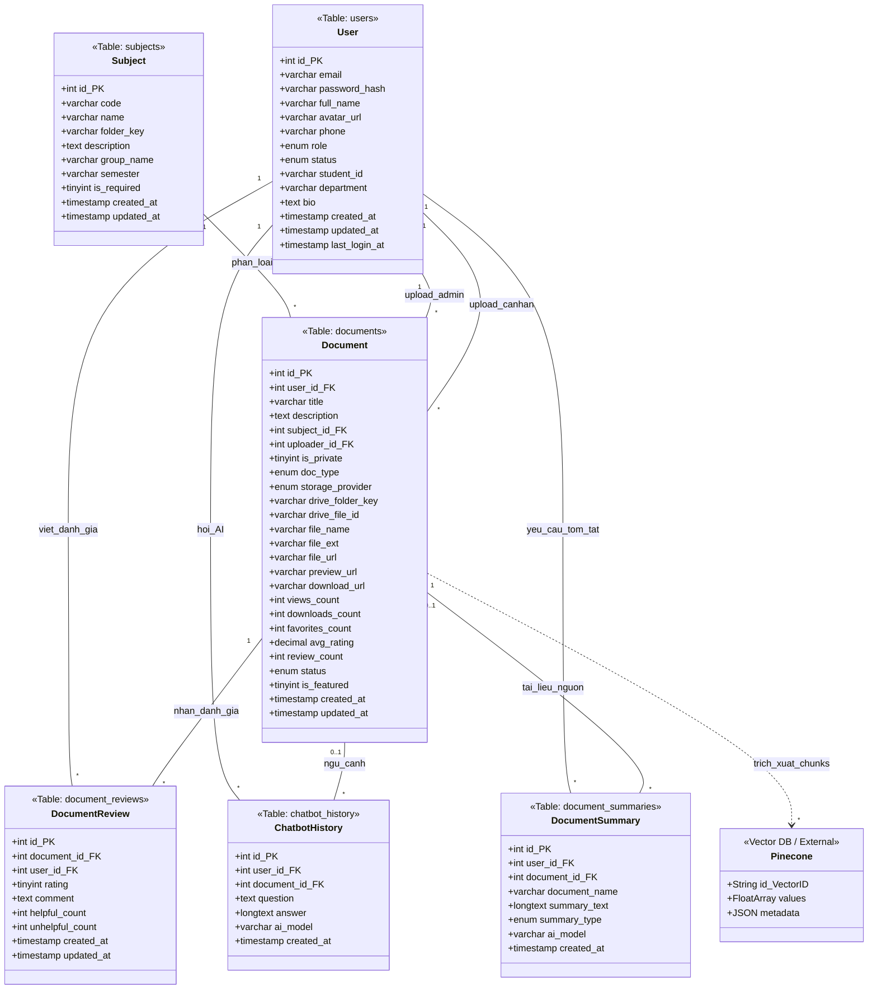

```mermaid
classDiagram
    direction TB

    class User {
        <<Table: users>>
        +int id_PK
        +varchar email
        +varchar password_hash
        +varchar full_name
        +varchar avatar_url
        +varchar phone
        +enum role
        +enum status
        +varchar student_id
        +varchar department
        +text bio
        +timestamp created_at
        +timestamp updated_at
        +timestamp last_login_at
    }

    class Subject {
        <<Table: subjects>>
        +int id_PK
        +varchar code
        +varchar name
        +varchar folder_key
        +text description
        +varchar group_name
        +varchar semester
        +tinyint is_required
        +timestamp created_at
        +timestamp updated_at
    }

    class Document {
        <<Table: documents>>
        +int id_PK
        +int user_id_FK
        +varchar title
        +text description
        +int subject_id_FK
        +int uploader_id_FK
        +tinyint is_private
        +enum doc_type
        +enum storage_provider
        +varchar drive_folder_key
        +varchar drive_file_id
        +varchar file_name
        +varchar file_ext
        +varchar file_url
        +varchar preview_url
        +varchar download_url
        +int views_count
        +int downloads_count
        +int favorites_count
        +decimal avg_rating
        +int review_count
        +enum status
        +tinyint is_featured
        +timestamp created_at
        +timestamp updated_at
    }

    class DocumentReview {
        <<Table: document_reviews>>
        +int id_PK
        +int document_id_FK
        +int user_id_FK
        +tinyint rating
        +text comment
        +int helpful_count
        +int unhelpful_count
        +timestamp created_at
        +timestamp updated_at
    }

    class DocumentSummary {
        <<Table: document_summaries>>
        +int id_PK
        +int user_id_FK
        +int document_id_FK
        +varchar document_name
        +longtext summary_text
        +enum summary_type
        +varchar ai_model
        +timestamp created_at
    }

    class ChatbotHistory {
        <<Table: chatbot_history>>
        +int id_PK
        +int user_id_FK
        +int document_id_FK
        +text question
        +longtext answer
        +varchar ai_model
        +timestamp created_at
    }

    class Pinecone {
        <<Vector DB / External>>
        +String id_VectorID
        +FloatArray values
        +JSON metadata
    }

    %% Relationships
    Subject "1" -- "*" Document : phan_loai
    User "1" -- "*" Document : upload_admin
    User "1" -- "*" Document : upload_canhan
    
    User "1" -- "*" DocumentReview : viet_danh_gia
    Document "1" -- "*" DocumentReview : nhan_danh_gia
    
    User "1" -- "*" ChatbotHistory : hoi_AI
    Document "0..1" -- "*" ChatbotHistory : ngu_canh
    
    User "1" -- "*" DocumentSummary : yeu_cau_tom_tat
    Document "0..1" -- "*" DocumentSummary : tai_lieu_nguon
    
    %% Logical relation
    Document "1" ..> "*" Pinecone : trich_xuat_chunks
```
