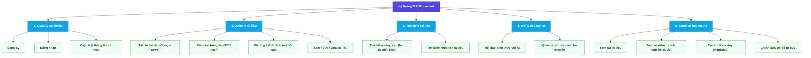

# Sơ đồ phân rã chức năng (Functional Decomposition Diagram - FDD) - Hệ thống TLU Document

```mermaid
graph TD
    %% Styling
    classDef root fill:#4F46E5,stroke:#3730A3,stroke-width:2px,color:#FFF,font-weight:bold;
    classDef module fill:#0EA5E9,stroke:#0369A1,stroke-width:2px,color:#FFF,font-weight:bold;
    classDef func fill:#F0FDF4,stroke:#16A34A,stroke-width:1px,color:#14532D;

    %% Nodes
    Root["Hệ thống TLU Document"]:::root

    %% Modules (Level 1)
    M1["1. Quản lý tài khoản"]:::module
    M2["2. Quản lý tài liệu"]:::module
    M3["3. Tìm kiếm tài liệu"]:::module
    M4["4. Trợ lý học tập AI"]:::module
    M5["5. Công cụ học tập AI"]:::module

    Root --> M1
    Root --> M2
    Root --> M3
    Root --> M4
    Root --> M5

    %% Sub-functions for M1
    F11["Đăng ký"]:::func
    F12["Đăng nhập"]:::func
    F13["Cập nhật thông tin cá nhân"]:::func
    M1 --> F11
    M1 --> F12
    M1 --> F13

    %% Sub-functions for M2
    F21["Tải lên tài liệu (Google Drive)"]:::func
    F22["Kiểm tra trùng lặp (MD5 hash)"]:::func
    F23["Đánh giá & Bình luận (1-5 sao)"]:::func
    F24["Xem / Sửa / Xóa tài liệu"]:::func
    M2 --> F21
    M2 --> F22
    M2 --> F23
    M2 --> F24

    %% Sub-functions for M3
    F31["Tìm kiếm nâng cao (lọc đa điều kiện)"]:::func
    F32["Tìm kiếm theo tên tài liệu"]:::func
    M3 --> F31
    M3 --> F32

    %% Sub-functions for M4
    F41["Hỏi đáp kiến thức với AI"]:::func
    F42["Quản lý lịch sử cuộc trò chuyện"]:::func
    M4 --> F41
    M4 --> F42

    %% Sub-functions for M5
    F51["Tóm tắt tài liệu"]:::func
    F52["Tạo bài kiểm tra trắc nghiệm (Quiz)"]:::func
    F53["Tạo sơ đồ tư duy (Mindmap)"]:::func
    F54["Chỉnh sửa sơ đồ tư duy"]:::func
    M5 --> F51
    M5 --> F52
    M5 --> F53
    M5 --> F54
```
