# CÁC SƠ ĐỒ TUẦN TỰ HỆ THỐNG TLU DOCUMENT (SEQUENCE DIAGRAMS - BCE MODEL)

Tài liệu này chứa mã nguồn Mermaid vẽ Sơ đồ tuần tự (Sequence Diagram) cho 13 Use Case của hệ thống **TLU Document** theo mô hình thiết kế nghiệp vụ **BCE (Boundary - Control - Entity)** với các ký hiệu hình dạng UML chuẩn hóa của Mermaid.

---

### Sơ đồ tuần tự 1: UC01 – Đăng ký tài khoản
Mô tả luồng người dùng đăng ký tài khoản mới trên hệ thống.

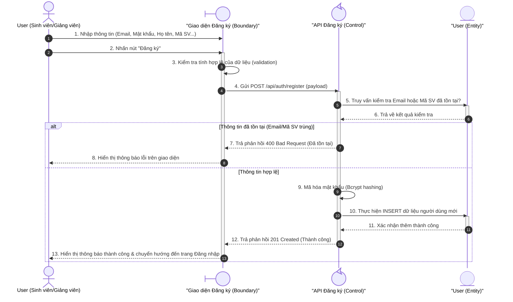

---

### Sơ đồ tuần tự 2: UC02 – Đăng nhập
Mô tả luồng xác thực thông tin đăng nhập của người dùng để cấp quyền truy cập hệ thống.

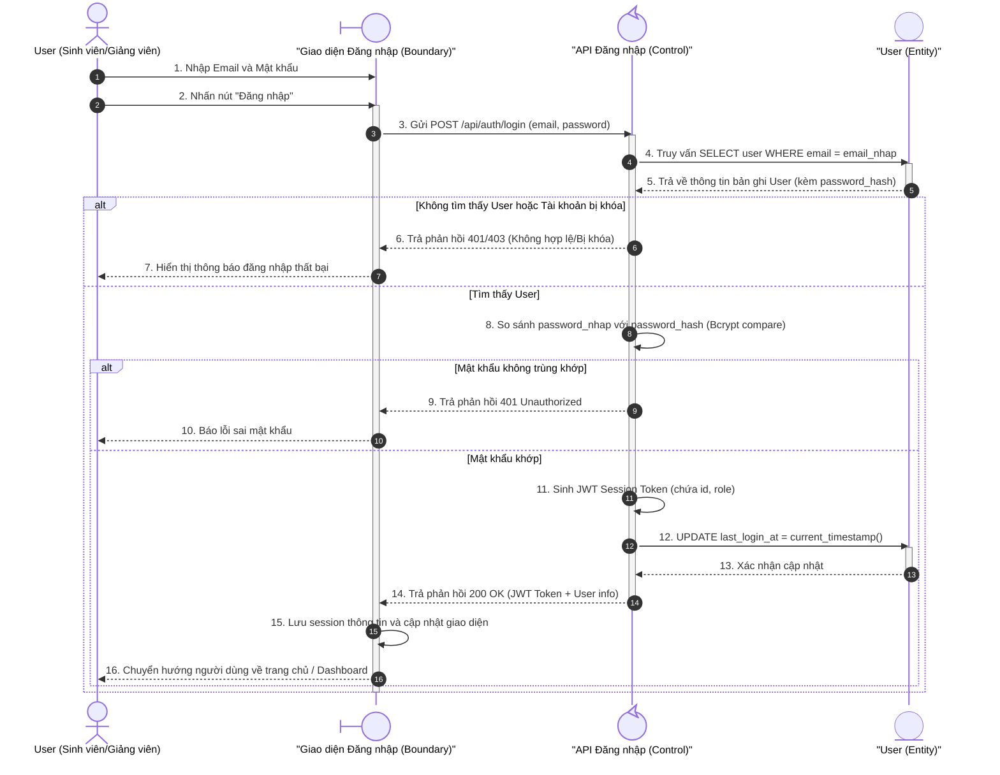

---

### Sơ đồ tuần tự 3: UC03 – Tìm kiếm tài liệu nâng cao
Mô tả luồng người dùng tìm kiếm tài liệu kết hợp giữa từ khóa ngữ nghĩa và các bộ lọc môn học, học phần.

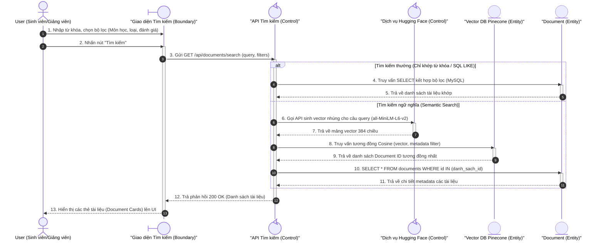

---

### Sơ đồ tuần tự 4: UC04 – Trợ lý học tập AI (Chatbot Tutor)
Mô tả luồng hỏi đáp ngữ cảnh dựa trên tài liệu sử dụng kỹ thuật RAG và stream phản hồi từ OpenAI LLM.

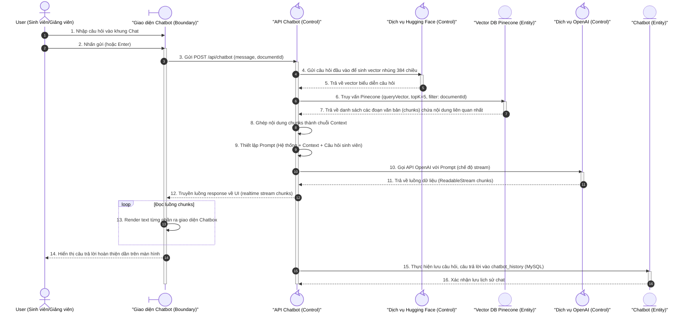

---

### Sơ đồ tuần tự 5: UC05 – Quản lý lịch sử trò chuyện AI
Mô tả luồng người dùng truy xuất, xem lại hoặc xóa các phiên hội thoại cũ với trợ lý AI.

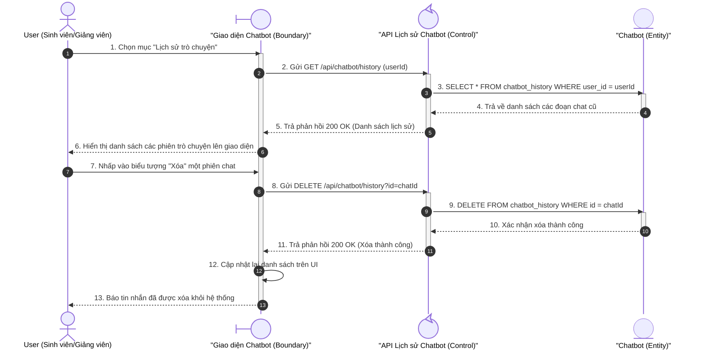

---

### Sơ đồ tuần tự 6: UC06 – Tóm tắt tài liệu bằng AI
Mô tả luồng hệ thống gọi mô hình AI tóm tắt tài liệu tự động theo cấu hình người dùng.

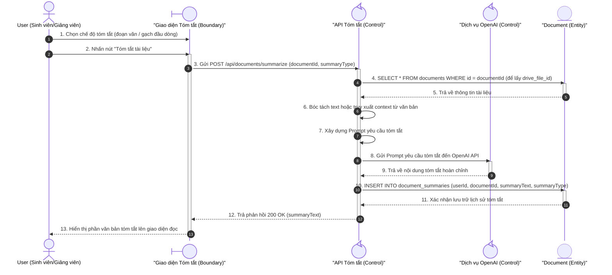

---

### Sơ đồ tuần tự 7: UC07 – Tạo bài kiểm tra trắc nghiệm (AI Quiz Generator)
Mô tả luồng hệ thống gọi AI phân tích văn bản để thiết kế câu hỏi trắc nghiệm tương tác cho sinh viên.

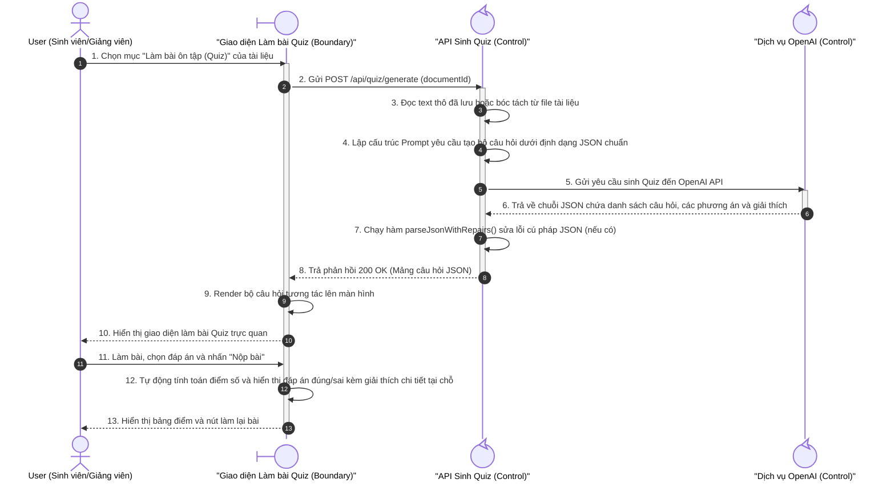

---

### Sơ đồ tuần tự 8: UC08 – Chuyển đổi tài liệu thành Sơ đồ tư duy (Mindmap Generator)
Mô tả luồng hệ thống gọi AI chuyển đổi dàn ý tài liệu thành cây sơ đồ tư duy phân cấp.

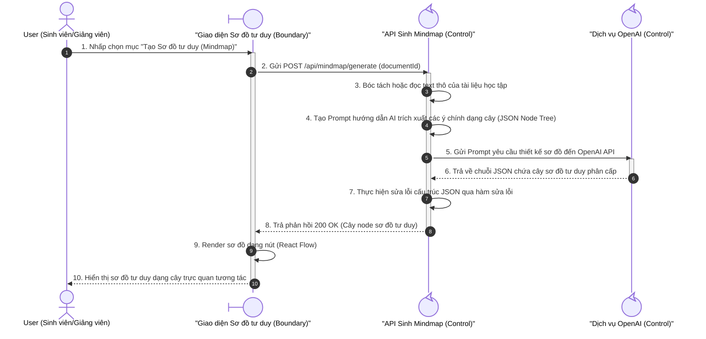

---

### Sơ đồ tuần tự 9: UC09 – Chỉnh sửa Sơ đồ tư duy (Edit Mindmap)
Mô tả luồng người dùng thao tác chỉnh sửa trực tiếp các node trên sơ đồ tư duy (tự động lưu trạng thái mới lên máy chủ).

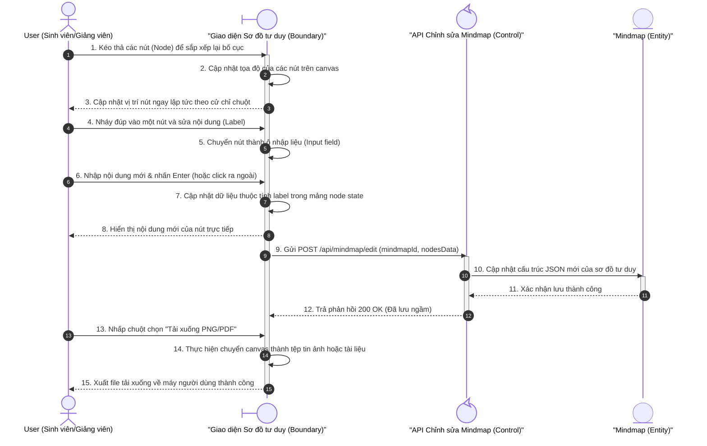

---

### Sơ đồ tuần tự 10: UC10 – Đánh giá tài liệu (Review Document)
Mô tả luồng người dùng chấm điểm sao và gửi nhận xét đánh giá chất lượng tài liệu học tập.

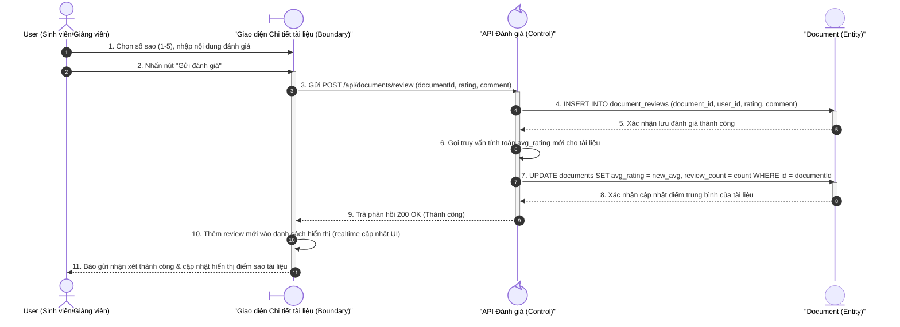

---

### Sơ đồ tuần tự 11: UC11 – Tải tài liệu lên (Upload Document)
Mô tả luồng tải tệp tin lên hệ thống, đồng bộ Google Drive và đưa vào hàng đợi xử lý Vector hóa.

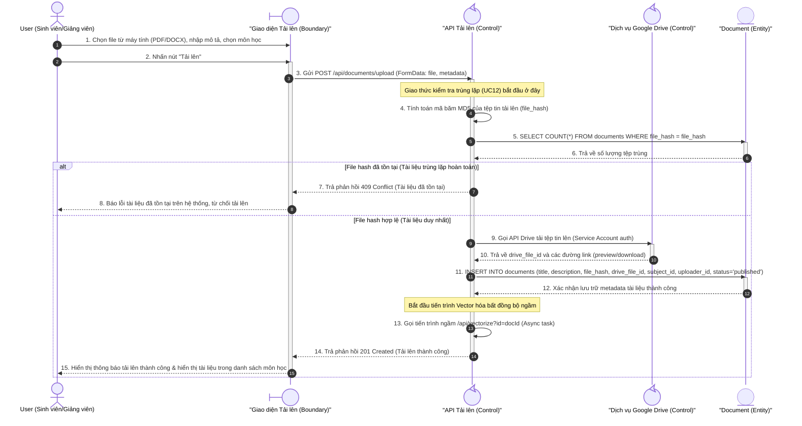

---

### Sơ đồ tuần tự 12: UC12 – Kiểm tra trùng lặp nội dung (Duplicate Check)
Mô tả quy trình kiểm tra trùng lặp độc lập ở phía backend phục vụ cho quá trình tải tài liệu lên.

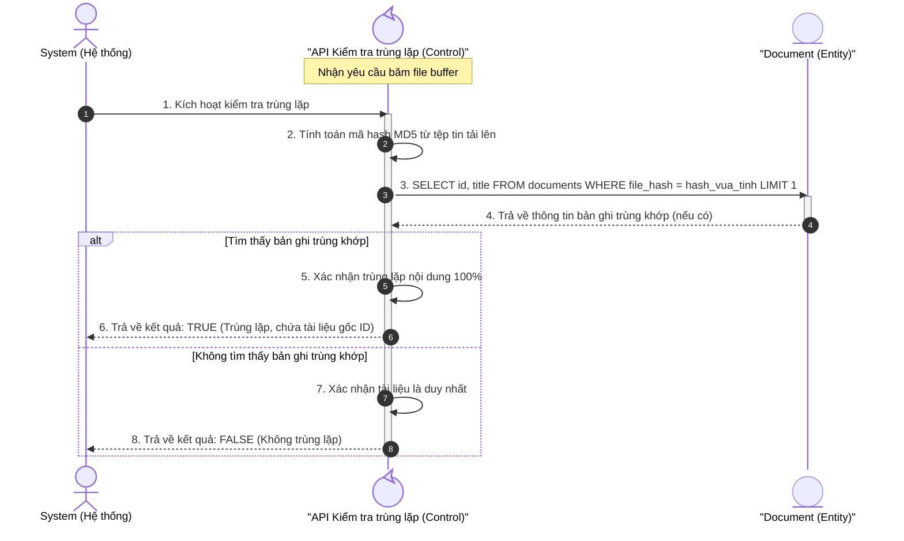

---

### Sơ đồ tuần tự 13: UC13 – Xem/Sửa/Xóa tài liệu (dành cho Admin)
Mô tả quy trình quản trị tài liệu học tập dành riêng cho Quản trị viên (Admin).

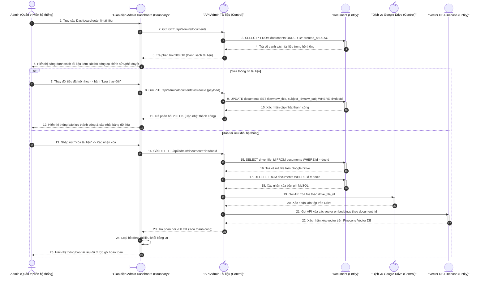
