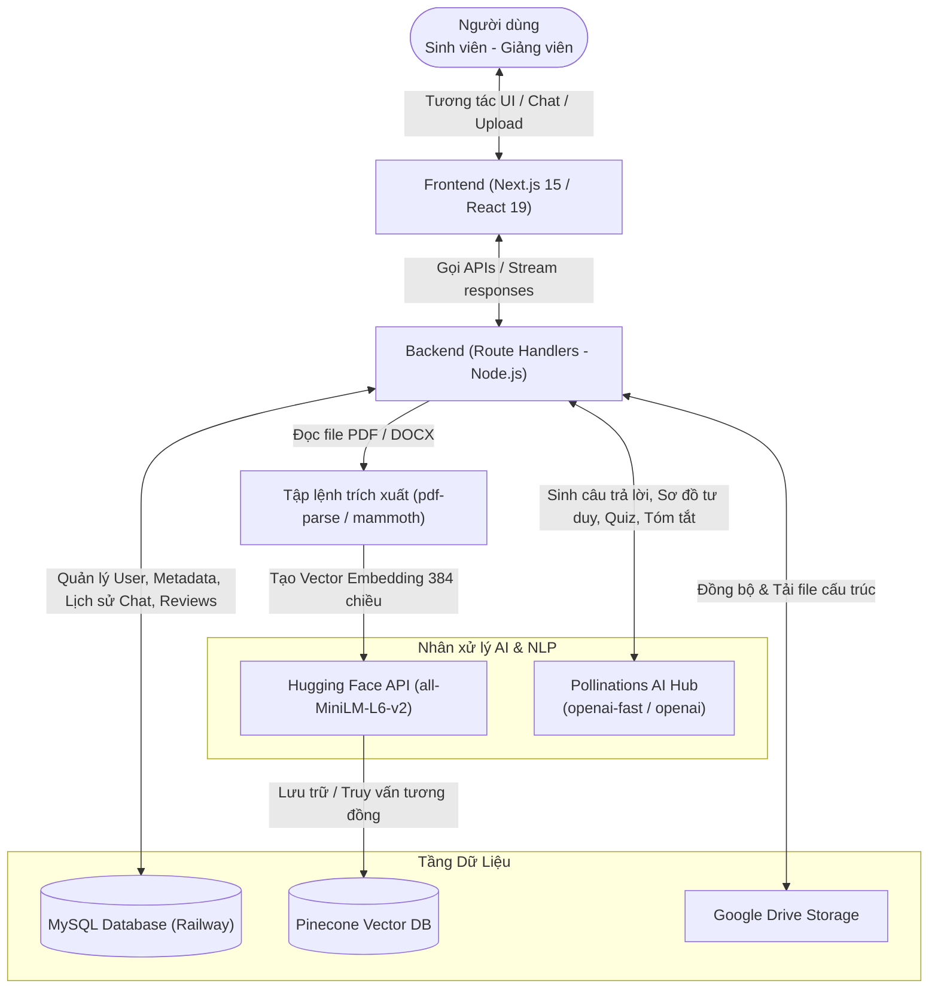

# TÀI LIỆU TỔNG HỢP CÔNG NGHỆ & KIẾN TRÚC HỆ THỐNG
## DỰ ÁN: HỆ THỐNG WEB TÀI LIỆU HỌC TẬP TÍCH HỢP AI (TLU DOCUMENT)

> [!NOTE]
> Tài liệu này tổng hợp toàn bộ giải pháp công nghệ, kiến trúc hệ thống, và các thuật toán xử lý dữ liệu thông minh trong dự án tốt nghiệp của sinh viên **Vương Việt Cường** (MSV: 2251061732, Lớp: 64CNTT3). Tài liệu được cấu trúc chuyên nghiệp nhằm phục vụ công tác báo cáo và bảo vệ trước Hội đồng tốt nghiệp.

---

## I. KIẾN TRÚC TỔNG THỂ HỆ THỐNG (SYSTEM ARCHITECTURE)

Hệ thống được thiết kế theo mô hình **Modern Web Application** kết hợp kỹ thuật **RAG (Retrieval-Augmented Generation)** để tích hợp trí tuệ nhân tạo một cách tối ưu.



### Mô hình Kiến trúc Phân lớp (Layered Architecture Pattern)

Hệ thống được tổ chức phát triển đồng bộ theo mô hình phân tách các tầng trách nhiệm rõ ràng nhằm tăng tính bảo mật, khả năng bảo trì và mở rộng sau này:

$$\text{UI (Frontend)} \longrightarrow \text{API Route (Backend)} \longrightarrow \text{Repository (Database Abstraction)} \longrightarrow \text{MySQL Database}$$

*   **Tầng UI (Frontend Layer):** Xây dựng bằng ngôn ngữ **TypeScript** (sử dụng định dạng tệp tin `.tsx` cho React components) kết hợp **React 19** và **Next.js App Router**. Thực hiện tiếp nhận tương tác người dùng, gửi các HTTP Request (fetch) tới tầng API và render kết quả phản hồi động.
*   **Tầng API Route (Backend Layer):** Sử dụng các **Next.js Route Handlers (chạy trên Node.js runtime)** viết bằng **TypeScript** (các tệp tin `route.ts` trong thư mục `app/api/...`). Thực hiện phân loại ý định người dùng, điều phối gọi API AI (Pollinations/HuggingFace), truy vấn dữ liệu từ Pinecone, và gọi lớp Repository để thao tác dữ liệu.
*   **Tầng Repository (Database Abstraction Layer):** Được triển khai thông qua các lớp/hàm trừu tượng hóa tại `lib/repositories.ts` sử dụng hàm kết nối cơ sở dữ liệu tại `lib/mysql.ts`. Lớp này đóng vai trò trung gian che giấu các câu lệnh SQL thuần túy (CRUD trên bảng `users`, `subjects`, `documents`, `document_reviews`), giúp bảo mật và cô lập hoàn toàn logic truy vấn.
*   **Tầng Database (Persistence Layer):** Hệ cơ sở dữ liệu quan hệ MySQL lưu trữ các thông tin có cấu trúc ổn định.

---

## II. DANH MỤC CÔNG NGHỆ SỬ DỤNG (TECHNOLOGY STACK)

| Thành phần | Công nghệ / Thư viện | Vai trò trong hệ thống |
| :--- | :--- | :--- |
| **Frontend (FE)** | **Next.js (React 19) & TypeScript (.tsx)** | Xây dựng giao diện ứng dụng phía client, quản lý định tuyến trang (App Router) và tối ưu hóa kết xuất giao diện (Server Components). |
| **Backend (BE)** | **Next.js Route Handlers (Node.js runtime) & TypeScript (.ts)** | Triển khai các API Endpoint độc lập, xử lý các logic nghiệp vụ từ phía client, điều phối truy vấn cơ sở dữ liệu và gọi API AI. |
| **Styling & UI** | **Tailwind CSS & Radix UI** | Xây dựng giao diện Responsive, hiệu ứng chuyển động mượt mà, hỗ trợ thiết kế Dark/Light mode chuẩn xác. |
| **Relational DB** | **MySQL (Railway)** | Cơ sở dữ liệu quan hệ quản lý người dùng, thông tin môn học, metadata tài liệu, bình luận đánh giá, và lịch sử hội thoại của Chatbot. |
| **Vector DB** | **Pinecone** | Cơ sở dữ liệu Vector lưu trữ các phân mảnh văn bản (chunks) và tọa độ vector nhúng để phục vụ tìm kiếm ngữ nghĩa cực nhanh. |
| **AI Orchestrator**| **Pollinations AI** | Cổng kết nối AI hợp nhất (Unified AI Hub) để điều hướng các yêu cầu sinh văn bản (Chatbot, Tóm tắt, Quiz, Sơ đồ tư duy) thông qua API bảo mật. |
| **Embeddings** | **Hugging Face Inference** | Sử dụng model chuyên dụng `sentence-transformers/all-MiniLM-L6-v2` để chuyển hóa văn bản thành vector 384 chiều. |
| **File Parsers** | **Mammoth & PDF-Parse** | Giải nén và trích xuất nội dung văn bản thuần túy (Text Extraction) từ các tệp tài liệu gốc dạng `.docx` và `.pdf`. |
| **Cloud Storage** | **Google Drive API** | Kho lưu trữ tài liệu gốc, hỗ trợ đồng bộ hóa tự động thư mục môn học thông qua API `googleapis`. |

---

## III. CHI TIẾT CÁC CÔNG NGHỆ SỬ DỤNG (DETAILED TECHNOLOGY EXPLANATION)

### 1. Frontend (FE) - Next.js (React 19) & TypeScript (.tsx)
*   **Khái niệm & Đặc tính kỹ thuật:** Lớp giao diện của ứng dụng được xây dựng trên nền tảng **React 19** và framework **Next.js** (App Router). Mã nguồn sử dụng ngôn ngữ **TypeScript** với định dạng tệp tin **`.tsx`** để kết hợp cú pháp HTML và logic lập trình một cách an toàn kiểu dữ liệu.
*   **Vai trò & Triển khai:**
    *   Sử dụng cơ chế **React Server Components (RSC)** để render trước các trang tĩnh (featured-docs, subjects...) trên server, giúp giảm dung lượng gói JavaScript tải về client và cải thiện điểm số SEO/Core Web Vitals.
    *   Sử dụng **Client Components** (`"use client"`) cho các trang có tính tương tác cao như Chatbot, Mindmap editor, Quiz practice.
    *   Tích hợp thư viện Radix UI và Tailwind CSS để xây dựng giao diện responsive và hỗ trợ chuyển đổi giao diện sáng/tối (Dark/Light mode).
*   **Lý do chọn lựa:** React 19 mang lại hiệu năng render xuất sắc, Next.js App Router quản lý định tuyến thư mục trực quan và TypeScript ngăn ngừa triệt để các lỗi logic giao diện trong quá trình biên dịch.

### 2. Backend (BE) - Next.js Route Handlers (Node.js runtime) & TypeScript (.ts)
*   **Khái niệm & Đặc tính kỹ thuật:** Lớp xử lý nghiệp vụ chạy phía máy chủ (Server-side) sử dụng **Next.js Route Handlers** chạy trên môi trường **Node.js runtime**. Toàn bộ logic backend được viết bằng **TypeScript** trong các tệp tin có định dạng **`.ts`** (thường đặt tên là `route.ts` nằm trong các thư mục API).
*   **Vai trò & Triển khai:**
    *   Triển khai hệ thống API endpoint tại `app/api/...` để xử lý các yêu cầu tương tác: `/api/chatbot`, `/api/quiz`, `/api/mindmap`, `/api/summarize`.
    *   Đọc và xử lý các biến môi trường bảo mật (như `GEMINI_API_KEY`, `PINECONE_API_KEY`) mà không để lộ ra phía client.
    *   Ứng dụng cơ chế **Stream API** (sử dụng `ReadableStream`) để stream kết quả trả lời của LLM từ API route về client theo dạng chunk-by-chunk realtime.
    *   Thực hiện các tác vụ nặng như trích xuất văn bản từ PDF/Docx, chuyển đổi text thành vector nhúng và giao tiếp trực tiếp với cơ sở dữ liệu quan hệ MySQL & cơ sở dữ liệu vector Pinecone.
*   **Lý do chọn lựa:** Node.js runtime cho phép thực hiện các thao tác xử lý file tĩnh và giao thức mạng nhanh chóng; việc gộp chung Backend API vào Next.js giúp loại bỏ sự phức tạp khi triển khai và vận hành một hệ thống server độc lập.

### 3. Tailwind CSS & Radix UI (Design System & Accessible Components)
*   **Khái niệm & Đặc tính kỹ thuật:** Tailwind CSS cung cấp phương pháp thiết kế hướng Utility-first giúp xây dựng UI nhanh mà không cần viết file CSS riêng lẻ. Radix UI cung cấp các headless components (un-styled), chuẩn hóa các tiêu chuẩn tiếp cận WAI-ARIA cho người khuyết tật.
*   **Vai trò & Triển khai:** 
    *   Radix UI được sử dụng để xây dựng các Dialog (hộp thoại), Dropdown Menu, Accordion (hộp thu gọn), Popover và Tooltip.
    *   Tailwind CSS định nghĩa hệ màu sắc thống nhất (Hệ màu HSL hiện đại), hỗ trợ đổi chủ đề (Dark/Light mode) và các hiệu ứng chuyển động (micro-animations) của nút bấm, thẻ thông tin.
*   **Lý do chọn lựa:** Cho phép tùy biến giao diện linh hoạt tuyệt đối mà vẫn đảm bảo tính thống nhất của Design System và tính dễ dùng (Accessibility).

### 4. MySQL Database (Relational Database Service)
*   **Khái niệm & Đặc tính kỹ thuật:** MySQL là hệ quản trị cơ sở dữ liệu quan hệ (RDBMS) sử dụng ngôn ngữ SQL để quản lý dữ liệu có cấu trúc, ràng buộc khóa ngoại chặt chẽ.
*   **Vai trò & Triển khai:** 
    *   Lưu trữ thông tin người dùng (`users`), danh sách các học phần môn học (`subjects`), và metadata tài liệu gốc (`documents`).
    *   Lưu trữ lịch sử chat (`chatbot_history`), các bình luận (`document_reviews`), và lịch sử tóm tắt tài liệu (`document_summaries`).
    *   Sử dụng thư viện `mysql2` hỗ trợ **Connection Pool** để tái sử dụng các kết nối cơ sở dữ liệu, tối ưu hóa bộ nhớ RAM và CPU trên máy chủ Railway.
*   **Lý do chọn lựa:** Dữ liệu người dùng và tài liệu học tập có tính liên kết chặt chẽ, cần các ràng buộc quan hệ chuẩn (ACID) để tránh sai lệch dữ liệu.

### 5. Pinecone Vector Database (AI-Native Search Platform)
*   **Khái niệm & Đặc tính kỹ thuật:** Cơ sở dữ liệu chuyên dụng để lưu trữ và truy vấn các Vector biểu diễn đặc trưng ngữ nghĩa của văn bản. Pinecone tối ưu hóa thuật toán **Approximate Nearest Neighbor (ANN)** để tìm các vector tương đồng.
*   **Vai trò & Triển khai:**
    *   Lưu trữ các đoạn văn bản (chunks) được cắt từ tài liệu gốc cùng vector đặc trưng 384 chiều.
    *   Thực hiện truy vấn tương đồng Cosine (Cosine Similarity) để trả về top các phân đoạn văn bản phù hợp nhất với câu hỏi của sinh viên trong vài mili-giây.
    *   Lưu trữ kèm theo thông tin **Metadata** bao gồm: `content`, `document_id`, `subject_id`, `title`, và `download_url` để lọc dữ liệu trực tiếp khi truy vấn.
*   **Lý do chọn lựa:** Tìm kiếm từ khóa thông thường (SQL LIKE) không thể hiểu được ngữ nghĩa câu hỏi. Pinecone giải quyết bài toán tìm kiếm ngữ nghĩa (Semantic Search) trong hệ thống RAG một cách mượt mà và tốc độ cao.

### 6. Pollinations AI (Unified AI Gateway)
*   **Khái niệm & Đặc tính kỹ thuật:** Pollinations AI hoạt động như một cổng kết nối (API Gateway) hợp nhất các mô hình AI. Khi hệ thống gửi yêu cầu với tham số `model: "openai"`, Pollinations sẽ tự động ánh xạ và định tuyến yêu cầu này tới mô hình **GPT-OSS 20B Reasoning LLM** để xử lý.
*   **Vai trò & Triển khai:**
    *   Đóng vai trò là "bộ não" xử lý ngôn ngữ tự nhiên để sinh câu trả lời cho Chatbot, tóm tắt tài liệu, tạo câu hỏi Quiz và Sơ đồ tư duy.
    *   Được cấu hình thông qua biến môi trường `POLLINATIONS_API_KEY` và biến `CHATBOT_MODEL=openai` trong tệp [.env.local](file:///d:/DATN_TLUDOCUMENT/.env.local).
*   **Mô tả mô hình đang sử dụng (GPT-OSS 20B Reasoning LLM):**
    *   Đây là mô hình ngôn ngữ lớn (LLM) mã nguồn mở với **20 tỷ tham số** (20 Billion Parameters), chạy trên hạ tầng đám mây OVH Cloud.
    *   Mô hình được tối ưu chuyên biệt cho các tác vụ suy luận logic phức tạp (Reasoning), có khả năng đọc hiểu tài liệu học tập, phân tích cấu trúc ý chính và xuất dữ liệu định dạng JSON chuẩn xác để phục vụ cho các tính năng Quiz và Sơ đồ tư duy (Mindmap).
*   **Lý do chọn lựa:** Vượt qua rào cản hạn chế địa lý của các API trực tiếp (như Claude hay OpenAI đôi khi chặn IP Việt Nam) và cho phép chuyển đổi linh hoạt giữa các dòng model khác nhau mà không cần sửa đổi kiến trúc mã nguồn.

### 7. Hugging Face Inference API (Text Embedding Generation)
*   **Khái niệm & Đặc tính kỹ thuật:** Cổng dịch vụ chạy mô hình học sâu của Hugging Face. Dự án sử dụng mô hình mã nguồn mở `sentence-transformers/all-MiniLM-L6-v2`.
*   **Vai trò & Triển khai:**
    *   Chuyển hóa các phân đoạn text tài liệu và câu hỏi đầu vào của sinh viên thành mảng số thực 384 chiều (Vector Embeddings).
    *   Hàm `getHuggingFaceEmbedding` trong `lib/hf-embedder.ts` làm nhiệm vụ tiền xử lý, chuẩn hóa khoảng trắng văn bản trước khi gửi request đến endpoint của Hugging Face để nhận về vector nhúng.
*   **Lý do chọn lựa:** Model `all-MiniLM-L6-v2` có hiệu năng cao, kích thước vector nhỏ (384 chiều so với 1536 chiều của OpenAI Ada) giúp tiết kiệm bộ nhớ lưu trữ trên Pinecone và tăng tốc độ tính toán khoảng cách Cosine.

### 8. Mammoth & PDF-Parse (Document Text Extractors)
*   **Khái niệm & Đặc tính kỹ thuật:** Mammoth là thư viện chuyển đổi tài liệu Word (.docx) sang HTML/Markdown hoặc Text thuần mà không chèn các style rác. PDF-parse là thư viện Node.js để bóc tách thông tin text thô từ các trang PDF.
*   **Vai trò & Triển khai:**
    *   Tác vụ tải tài liệu lên hệ thống sẽ chạy một bộ lọc định dạng file.
    *   Nếu là tệp tin PDF, hệ thống gọi `pdf-parse` để bóc text. Nếu là DOCX, hệ thống gọi `mammoth`. Text thô sau đó được đưa qua bộ làm sạch (loại bỏ ký tự điều khiển, chuẩn hóa dấu xuống dòng) trước khi tiến hành chia nhỏ (chunking).
*   **Lý do chọn lựa:** Thư viện chạy trực tiếp trên môi trường Node.js (Vercel serverless function), không phụ thuộc vào các công cụ cài đặt ngoài hệ điều hành (như Python hay Java) nên dễ triển khai và hoạt động rất ổn định.

### 9. Google Drive API (Cloud Asset Repository)
*   **Khái niệm & Đặc tính kỹ thuật:** Giao diện lập trình ứng dụng do Google cung cấp để quản lý, duyệt và tải tài nguyên trên dịch vụ Google Drive Cloud.
*   **Vai trò & Triển khai:**
    *   Đóng vai trò là hệ quản trị tệp tin chính. Khi quản trị viên thêm tài liệu, hệ thống tự động đẩy file lên Google Drive và lưu lại `drive_file_id` vào MySQL.
    *   Bộ script tự động sync (`import-drive-folder.mjs`) sử dụng Service Account Token để quét định kỳ thư mục gốc của trường và tải về các tài liệu học tập mới cập nhật.
*   **Lý do chọn lựa:** Giảm tải gánh nặng lưu trữ file tĩnh cho server chính, tận dụng khả năng hiển thị preview file xuất sắc của Google Drive (qua thẻ iframe nhúng) và băng thông tải xuống không giới hạn.

---

## IV. CƠ CHẾ DỰ PHÒNG & AN TOÀN HỆ THỐNG (RESILIENCE & SECURITY)

Để ứng phó với lỗi kết nối mạng, vượt giới hạn yêu cầu (rate limit) hoặc AI phản hồi sai định dạng, hệ thống triển khai các cơ chế phòng vệ tự động ở Backend:

```
[Request AI] ──> [Thử lần 1] ──(Lỗi)──> [Tăng Temp, đợi 1.5s] ──> [Thử lần 2] ──(Lỗi)──> [Kích hoạt Fallback]
```

### 1. Cơ chế thử lại tự động (Automatic Retry Logic)
*   Mỗi tác vụ AI được bọc trong vòng lặp thử lại tối đa **3 lần** khi xảy ra lỗi.
*   Qua mỗi lần thử, hệ thống tự động điều chỉnh tham số `temperature` (độ sáng tạo) và áp dụng khoảng trễ tăng dần để đảm bảo khả năng lấy được kết quả hợp lệ cao nhất.

### 2. Bộ sửa lỗi cú pháp JSON (JSON Repair Algorithm)
AI đôi khi trả về JSON kèm theo ký tự markdown hoặc văn bản giải thích thừa. Hàm `parseJsonWithRepairs` được thiết kế để:
*   Sử dụng biểu thức chính quy (Regex) để bóc tách khối JSON thô ra khỏi văn bản.
*   Ứng dụng thuật toán **Cân bằng ngoặc** (`{}`) để cắt bỏ phần ký tự lỗi ở cuối chuỗi.
*   Tự động phát hiện và loại bỏ dấu phẩy thừa (trailing commas) trước khi thực hiện `JSON.parse`.

### 3. Cơ chế dự phòng cứng (Deterministic Fallback)
*   Nếu AI hoàn toàn không phản hồi sau 3 lần thử, hệ thống sẽ tự động kích hoạt dữ liệu dự phòng (ví dụ: tạo cấu trúc sơ đồ tư duy mẫu dựa trên tên tệp tin) để đảm bảo trang web không bị lỗi giao diện và duy trì trải nghiệm người dùng liền mạch.

### 4. An toàn dữ liệu & Quản lý API Key
*   Toàn bộ API Key của Google AI Studio, Hugging Face, và Pinecone đều được cấu hình trong biến môi trường cấp Server (`.env.local` ở máy local và Environment Variables trên Vercel).
*   Không có bất kỳ thông tin nhạy cảm nào được truyền tải hay lưu vết ở phía Client (Frontend), ngăn chặn hoàn toàn nguy cơ bị lộ mã bảo mật hoặc bị tấn công giả mạo yêu cầu.

---
*Tài liệu tổng hợp công nghệ phục vụ hội đồng chấm và bảo vệ đồ án tốt nghiệp - Vương Việt Cường.*
