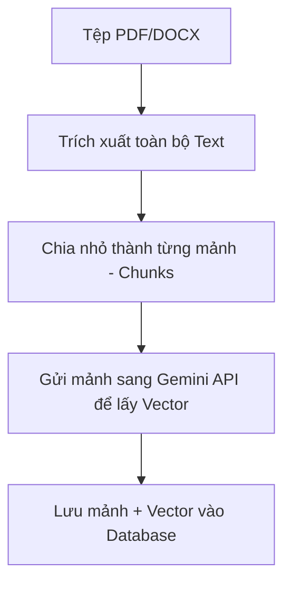

# 🚀 Lộ trình Nâng cấp Chatbot: Từ Phân loại Intent sang hệ thống RAG Chuyên nghiệp

Tài liệu này trình bày lộ trình chi tiết và thuật toán để nâng cấp Chatbot của bạn thành một trợ lý học tập có khả năng **"Đọc hiểu tài liệu"** (Retrieval-Augmented Generation - RAG).

---

## 🏗️ 1. Tổng quan Kiến trúc RAG
Mô hình RAG hoạt động theo nguyên lý: Thay vì bắt AI phải nhớ toàn bộ kiến thức đại học, ta cung cấp cho nó một "cuốn giáo trình mở" (Context) chứa các đoạn văn liên quan nhất đến câu hỏi của người dùng.

**Sơ đồ luồng:**
1. **User Hỏi** -> 2. **Tìm đoạn văn liên quan nhất trong PDF** -> 3. **AI đọc đoạn văn đó** -> 4. **AI trả lời dựa trên sự thật.**

---

## 📅 2. Lộ trình triển khai (4 Giai đoạn)

### Giai đoạn 1: Thiết lập hạ tầng Vector (Tuần 1) - ✅ HOÀN THÀNH
- **Công nghệ**: Sử dụng **Pinecone (Vector Database)** làm kho lưu trữ tri thức.
- **Kết quả**: Đã tạo Index `tlu-document-chatbot` (768 dims, Cosine).

### Giai đoạn 2: Xây dựng hệ thống Nạp liệu - ETL Pipeline (Tuần 2) - 🚀 ĐANG TRIỂN KHAI
Đây là bước biến các tệp PDF khô khan thành dữ liệu mà AI có thể hiểu được.
- **Xử lý PDF**: Sử dụng thư viện `pdf-parse` để trích xuất văn bản từ Google Drive.
- **Đồng bộ**: Đã tạo script `scripts/sync-to-pinecone.mjs` để tự động hóa việc chia nhỏ mảnh (chunking), tạo Embedding và đẩy lên Pinecone.

### Giai đoạn 3: Phân tích & Truy vấn (Tuần 3)
- **Tạo Vector câu hỏi**: Biến câu hỏi của User thành vector.
- **Tìm kiếm tương đồng (Semantic Search)**: Dùng thuật toán Cosine Similarity để tìm ra Top 3 - 5 đoạn văn trong DB giống với câu hỏi nhất.
- **Tích hợp Chat**: Gửi cả "Câu hỏi" + "Top 3 mảnh văn bản" cho Pollinations (AI) để nó trả lời.

### Giai đoạn 4: Tính năng nâng cao & UI (Tuần 4)
- **Trích dẫn nguồn**: Bot phải nói rõ "Thông tin này nằm ở trang X của tài liệu Y".
- **Điều hướng thông minh**: Nếu phát hiện user tìm môn học, tự động redirect sang `/subjects/[Code]`.

---

## 🧠 3. Thuật toán chi tiết (Step-by-Step)

### Thuật toán Nạp liệu (Indexing Algorithm)


### Thuật toán Hỏi đáp (RAG Algorithm)
1. **Tiếp nhận**: User hỏi: *"Đạo hàm là gì?"*
2. **Nhúng câu hỏi**: Gọi `get_embedding("Đạo hàm là gì")` -> Trả về `Vector_Q`.
3. **Truy vấn Vector**: 
   - `SELECT content FROM document_sections ORDER BY embedding <=> Vector_Q LIMIT 3`.
4. **Trộn ngữ cảnh (Prompt Augmentation)**:
   - Tạo Prompt: *"Dựa vào các đoạn văn sau: [Mảnh 1], [Mảnh 2]... Hãy giải thích đạo hàm cho người dùng."*
5. **Sinh nội dung**: AI trả lời dựa trên chính xác giáo trình đã tìm được.

---

## 🎯 4. Giải thuật Điều hướng môn học thông minh
Thay vì dùng Regex thủ công, ta dùng Embedding để tìm mã môn:

1. **Chuẩn bị**: Tạo bộ Vector cho tất cả tên môn học (Giải tích, CSDL, AI...).
2. **So sánh**: Khi user nói "tìm môn toán cao cấp", ta tìm môn học có Vector tương đồng nhất.
3. **Phản hồi**: 
   - AI trả về: `{ "redirect": "/subjects/MATH111" }`.
   - Giao diện Frontend tự động thực hiện: `router.push('/subjects/MATH111')`.

---

## 💰 5. Chi phí dự kiến
Hệ thống này tận dụng tối đa các gói **FREE TIER**:
- **Gemini Embedding**: Miễn phí 1,500 requests/phút (Google AI Studio).
- **Supabase (Vector Storage)**: Miễn phí 500MB (Thoải mái cho 175 file của bạn).
- **Pollinations Chat**: Miễn phí.
- **Tổng cộng**: **0 VNĐ / Tháng**.

---

> [!TIP]
> **Bước tiếp theo khuyên dùng**: Bạn hãy đăng ký một tài khoản **Supabase (miễn phí)** hoặc **Pinecone** và lấy URL/Key để chúng ta có thể bắt đầu xây dựng bảng lưu trữ Vector đầu tiên.

---

## 🛠️ 6. Hướng dẫn Setup Pinecone (Lựa chọn A - Dễ nhất cho Low-code)

Nếu bạn muốn giữ nguyên **MySQL trên Railway** mà không muốn thay đổi database, đây là cách dễ nhất. Bạn chỉ cần dùng chuột cấu hình trên web Pinecone.

### Bước 1: Đăng ký tài khoản
1. Truy cập [Pinecone.io](https://www.pinecone.io/).
2. Đăng ký nhanh bằng tài khoản **Google** của bạn.

### Bước 2: Tạo "Index" (Thư mục chứa tri thức)
1. Nhấn nút **"Create Index"**.
2. **Name**: Đặt tên (ví dụ: `chatbot-tlu`).
3. **Dimensions**: Nhập số **768** (Bắt buộc để khớp với Gemini AI).
4. **Metric**: Chọn **Cosine**.
5. **Capacity Mode**: Chọn **Serverless**.
6. **Cloud & Region**: Chọn **AWS** và vùng **us-east-1** (Bản miễn phí).
7. Nhấn **"Create Index"**.

### Bước 3: Lấy API Key
1. Vào mục **"API Keys"** ở menu bên trái.
2. Nhấn **"Create API Key"** -> Đặt tên -> Copy dãy ký tự này.

### Bước 4: Cấu hình vào file `.env.local`
Thêm 2 dòng sau vào file môi trường của dự án:
```env
PINECONE_API_KEY=dãy-key-bạn-vừa-copy
PINECONE_INDEX_NAME=tlu-document-chatbot
```

---

## 🔄 7. Cách kết nối MySQL & Pinecone (Thuật toán Hybrid)
1. **Dữ liệu truyền thống**: Lưu tên file, mô tả, ngày tạo trong **MySQL (Railway)**.
2. **Dữ liệu tri thức**: Lưu nội dung văn bản (Chunks) và Vector trong **Pinecone**.
3. **Mối liên kết**: Trong Pinecone, mỗi vector sẽ được gán `metadata` chứa `id` của tài liệu trong MySQL. Khi tìm thấy tri thức, Bot sẽ dùng `id` này để quay lại MySQL lấy link download hoặc tên file gốc.