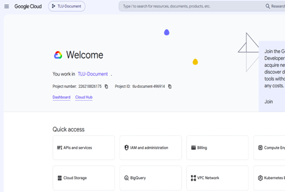
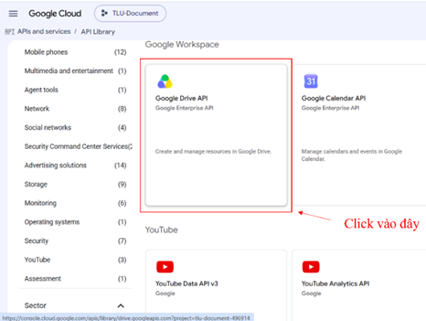
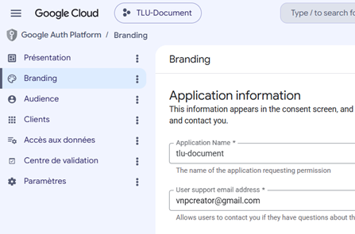
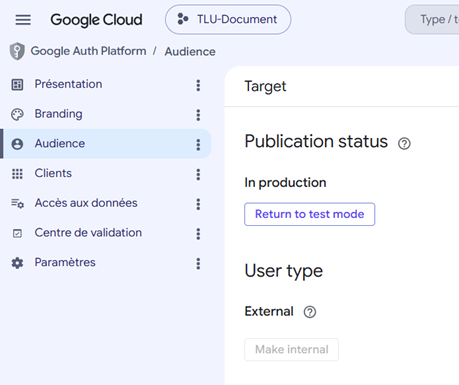
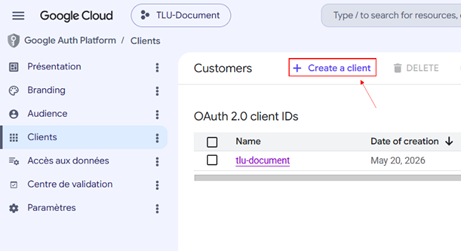
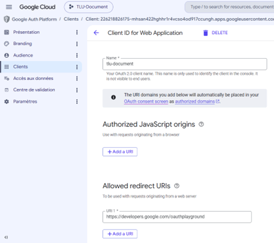
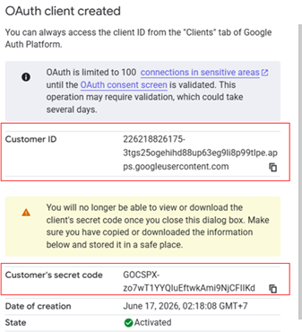
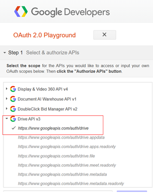
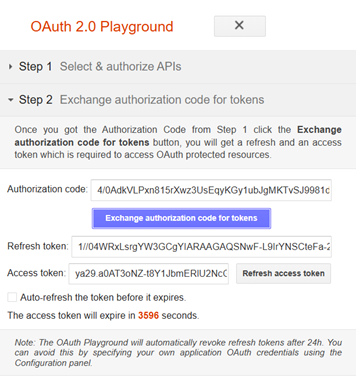
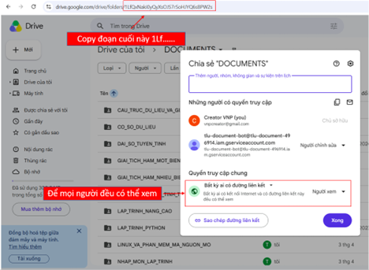

# Hướng Dẫn Setup Google Drive API Cho TLU Document

Tài liệu này hướng dẫn chi tiết cách cấu hình **Google Drive API** cho dự án TLU Document để hệ thống có thể:

- upload tài liệu học tập lên Google Drive
- lưu file trong một thư mục gốc riêng
- tạo link xem trước và tải xuống
- cấp quyền truy cập cho người dùng theo luồng OAuth2

Dựa trên code hiện tại, phần tích hợp Drive đang dùng các biến môi trường sau:

- `GOOGLE_CLIENT_ID`
- `GOOGLE_CLIENT_SECRET`
- `GOOGLE_REFRESH_TOKEN`
- `GOOGLE_DRIVE_ROOT_FOLDER_ID`

Ngoài ra, một số script/import có thể dùng thêm các biến khác tùy theo cấu hình hệ thống.

---

## 1. Mục tiêu của cấu hình

Sau khi hoàn tất setup, hệ thống sẽ có thể:

1. Xác thực với Google bằng OAuth2.
2. Upload file vào đúng thư mục gốc Drive của dự án.
3. Tự tạo quyền `reader` cho file để ai có link đều xem được.
4. Sinh sẵn các URL:
   - link xem trước
   - link xem file
   - link tải xuống

Trong code, logic upload đang được thực hiện trong [lib/drive.ts](../../lib/drive.ts).

---

## 2. Chuẩn bị trước khi cấu hình

Trước khi thao tác trên Google Cloud, bạn cần có:

- một tài khoản Google dùng để quản trị Drive
- quyền truy cập Google Cloud Console
- quyền tạo project và bật API
- quyền tạo OAuth Client ID

Khuyến nghị dùng một tài khoản Google riêng để làm tài khoản quản trị Drive cho dự án.

---

## 3. Tạo project trên Google Cloud Console

### Bước 1: Mở Google Cloud Console

Truy cập:

- https://console.cloud.google.com/

Đăng nhập bằng tài khoản Google mà bạn muốn dùng để quản lý Drive của dự án.

### Bước 2: Tạo project mới

1. Ở thanh trên cùng, chọn danh sách project.
2. Bấm **New Project**.
3. Đặt tên project, ví dụ:
   - `TLU Document`
4. Nhấn **Create**.

<div align="center">
   
</div>
Mục đích của project này là chứa toàn bộ cấu hình OAuth và Drive API cho hệ thống.

---

## 4. Bật Google Drive API

### Bước 1: Mở thư viện API

Trong menu bên trái của Google Cloud Console, đi đến:

- **APIs & Services**
- **Library**

### Bước 2: Tìm Drive API

1. Tại ô tìm kiếm, nhập:
   - `Google Drive API`
2. Chọn kết quả hiển thị.
3. Bấm **Enable**.

Sau khi bật xong, project của bạn mới có quyền gọi Google Drive API để upload file.
<div align="center">
   
</div>
---

## 5. Cấu hình OAuth Consent Screen

Đây là bước để Google cho phép ứng dụng của bạn dùng OAuth2.

### Bước 1: Mở Google Auth Platform

Trong menu bên trái, đi đến:

- **Google Auth Platform**

### Bước 2: Cấu hình Branding

Vào mục **Branding** và khai báo:

- **App name**: `TLU Document`
- **User support email**: email quản trị của bạn

<div align="center">
   
</div>
### Bước 3: Chọn Audience

Vào mục **Audience** và chọn:

- **User type**: `External`

Nếu đang ở chế độ production, bạn có thể chuyển sang testing để dễ kiểm tra trong giai đoạn phát triển.

<div align="center">
   
</div>
### Bước 4: Thêm Test Users

Ở phần **Test users**:

1. Bấm **Add users**.
2. Thêm email Google của tài khoản sẽ dùng để upload và quản lý file.

### Bước 5: Kiểm tra Data Access

Nếu cần, vào mục **Data access** để xác nhận scopes truy cập đã phù hợp.

---

## 6. Tạo OAuth Client ID

Đây là phần quan trọng nhất để lấy `GOOGLE_CLIENT_ID` và `GOOGLE_CLIENT_SECRET`.

### Bước 1: Mở tab Clients

Trong menu bên trái, chọn:

- **Clients**

### Bước 2: Tạo client mới

1. Bấm **Create client**.

<div align="center">
   
</div>

2. Chọn loại ứng dụng:
   - **Web application**
3. Đặt tên, ví dụ:
   - `TLU Document OAuth`

<div align="center">
   
</div>

### Bước 3: Khai báo Redirect URI

Ở mục **Authorized redirect URIs**, thêm:

- `https://developers.google.com/oauthplayground`

Đây là URI dùng để lấy refresh token bằng OAuth Playground.

### Bước 4: Lưu thông tin xác thực

Sau khi tạo xong, Google sẽ cung cấp:

- `Client ID`
- `Client Secret`

Hãy lưu lại hai giá trị này để đưa vào file `.env.local`.

<div align="center">
   
</div>
---

## 7. Lấy Refresh Token bằng OAuth Playground

Code hiện tại của dự án dùng OAuth2 với `refresh_token`, nên bạn cần lấy thêm token này.

### Bước 1: Mở OAuth Playground

Truy cập:

- https://developers.google.com/oauthplayground

### Bước 2: Bật chế độ dùng OAuth credentials riêng

1. Bấm biểu tượng bánh răng cài đặt.
2. Chọn **Use your own OAuth credentials**.
3. Nhập:
   - `Client ID`
   - `Client Secret`

### Bước 3: Chọn Drive scope

Tại danh sách API bên trái:

1. Tìm **Drive API v3**.
2. Chọn scope:
   - `https://www.googleapis.com/auth/drive`

Scope này cho phép hệ thống thao tác với Drive ở mức cần thiết để upload, đọc và quản lý file.

<div align="center">
   
</div>

### Bước 4: Authorize

1. Bấm **Authorize APIs**.
2. Đăng nhập bằng tài khoản Google đã được thêm ở Test Users.
3. Chấp nhận các cảnh báo bảo mật nếu có.
4. Bấm **Allow** để cấp quyền.

### Bước 5: Exchange token

Sau khi cấp quyền xong:

1. Bấm **Exchange authorization code for tokens**.
2. Sao chép giá trị **Refresh Token**.

<div align="center">
   
</div>

Token này sẽ được dùng để ứng dụng tự gia hạn quyền truy cập Drive mà không phải đăng nhập lại.

---

## 8. Tạo thư mục gốc trên Google Drive

Hệ thống đang lưu file vào một thư mục gốc riêng.

### Bước 1: Tạo folder mới

Trong Google Drive của tài khoản quản trị:

1. Tạo một folder mới, ví dụ:
   - `TLU Document Storage`
2. Đây sẽ là thư mục cha chứa toàn bộ tài liệu.

### Bước 2: Lấy ID của folder

Mở folder vừa tạo trên trình duyệt.

<div align="center">
   
</div>

URL thường có dạng:

```text
https://drive.google.com/drive/folders/1AbCdEfGhIjKlMnOpQrStUvWxYz
```

Phần sau cùng là ID của folder:

- `1AbCdEfGhIjKlMnOpQrStUvWxYz`

Giá trị này sẽ được gán cho:

- `GOOGLE_DRIVE_ROOT_FOLDER_ID`

Trong code, nếu không truyền `folderId` khi upload, hệ thống sẽ dùng biến môi trường này làm thư mục đích mặc định.

---

## 9. Cấu hình file `.env.local`

Tạo hoặc cập nhật file `.env.local` tại thư mục gốc dự án:

```env
GOOGLE_CLIENT_ID=your_google_client_id
GOOGLE_CLIENT_SECRET=your_google_client_secret
GOOGLE_REFRESH_TOKEN=your_google_refresh_token
GOOGLE_DRIVE_ROOT_FOLDER_ID=your_root_folder_id
```

Nếu hệ thống của bạn còn dùng các biến khác, hãy bổ sung theo cấu hình thực tế của dự án.

### Ví dụ đầy đủ hơn

```env
DB_HOST=localhost
DB_PORT=3306
DB_USER=root
DB_PASSWORD=
DB_NAME=tlu_document

GOOGLE_CLIENT_ID=xxxxxxxx.apps.googleusercontent.com
GOOGLE_CLIENT_SECRET=xxxxxxxxxxxxxxxxxx
GOOGLE_REFRESH_TOKEN=1//0xxxxxxxxxxxxxxxxxxxxxxxx
GOOGLE_DRIVE_ROOT_FOLDER_ID=1AbCdEfGhIjKlMnOpQrStUvWxYz
```

---

## 10. Cách Google Drive được dùng trong code

File [lib/drive.ts](../../lib/drive.ts) đang làm các việc sau:

1. Tạo OAuth2 client từ:
   - `GOOGLE_CLIENT_ID`
   - `GOOGLE_CLIENT_SECRET`
   - `GOOGLE_REFRESH_TOKEN`
2. Tạo Drive client bằng `googleapis`.
3. Upload file vào folder đích:
   - `folderId` truyền vào hàm, hoặc
   - `GOOGLE_DRIVE_ROOT_FOLDER_ID` nếu không truyền folder riêng
4. Sau khi upload xong, hệ thống tự set quyền:
   - `role: reader`
   - `type: anyone`

Nhờ đó file có thể xem được qua link công khai.

---

## 11. Kiểm tra cấu hình hoạt động

Sau khi cấu hình xong, bạn có thể kiểm tra như sau:

### Cách 1: Chạy ứng dụng

```bash
npm run dev
```

Sau đó vào trang upload tài liệu trên hệ thống và thử upload một file PDF hoặc DOCX.

### Cách 2: Kiểm tra file đã lên Drive chưa

Nếu cấu hình đúng:

- file sẽ xuất hiện trong thư mục gốc Drive
- hệ thống trả về link preview và download
- tài liệu có thể được mở bằng link công khai

### Cách 3: Kiểm tra log server

Nếu có lỗi, thường sẽ xuất hiện các thông báo như:

- thiếu `GOOGLE_CLIENT_ID`
- thiếu `GOOGLE_CLIENT_SECRET`
- thiếu `GOOGLE_REFRESH_TOKEN`
- token hết hạn hoặc sai scope

---

## 12. Lỗi thường gặp và cách xử lý

### 12.1 Thiếu biến môi trường

**Biểu hiện:**
- hệ thống báo thiếu cấu hình OAuth2

**Nguyên nhân:**
- chưa khai báo đủ 3 biến:
  - `GOOGLE_CLIENT_ID`
  - `GOOGLE_CLIENT_SECRET`
  - `GOOGLE_REFRESH_TOKEN`

**Cách xử lý:**
- kiểm tra lại file `.env.local`
- khởi động lại server sau khi sửa

---

### 12.2 Sai Redirect URI

**Biểu hiện:**
- OAuth Playground không trao token được
- Google báo redirect URI không hợp lệ

**Cách xử lý:**
- đảm bảo URI đã thêm đúng là:
  - `https://developers.google.com/oauthplayground`

---

### 12.3 Không vào được folder Drive

**Biểu hiện:**
- upload xong nhưng file không thấy trong thư mục mong muốn

**Nguyên nhân có thể:**
- sai `GOOGLE_DRIVE_ROOT_FOLDER_ID`
- tài khoản OAuth không có quyền với folder đó

**Cách xử lý:**
- kiểm tra lại ID folder
- đăng nhập đúng tài khoản quản trị
- dùng đúng project OAuth đã cấp quyền

---

### 12.4 Không upload được file

**Biểu hiện:**
- API trả lỗi khi upload
- file không được tạo trên Drive

**Nguyên nhân có thể:**
- OAuth consent screen chưa thêm test user
- Drive API chưa bật
- refresh token không hợp lệ
- file quá lớn hoặc file input không đúng định dạng

**Cách xử lý:**
- bật lại Drive API
- cấp lại refresh token
- kiểm tra file input là PDF hoặc DOCX

---

## 13. Tóm tắt nhanh các bước

Nếu muốn làm thật nhanh, bạn chỉ cần nhớ chuỗi sau:

1. Tạo project Google Cloud.
2. Bật Google Drive API.
3. Cấu hình OAuth consent screen.
4. Tạo OAuth client ID.
5. Lấy refresh token bằng OAuth Playground.
6. Tạo folder gốc trên Google Drive.
7. Điền các biến vào `.env.local`.
8. Chạy `npm run dev` và kiểm tra upload.

---

## 14. Kết luận

Sau khi hoàn tất các bước trên, TLU Document sẽ có thể:

- upload tài liệu lên Google Drive
- lưu file trong thư mục gốc riêng của dự án
- tạo link xem trước / tải xuống
- hỗ trợ các tính năng xử lý tài liệu và đồng bộ dữ liệu liên quan

Nếu bạn muốn, phần tiếp theo nên làm là đồng bộ cấu hình này với tài liệu setup CSDL hoặc file `.env.local` mẫu để bộ setup dự án hoàn chỉnh hơn.
