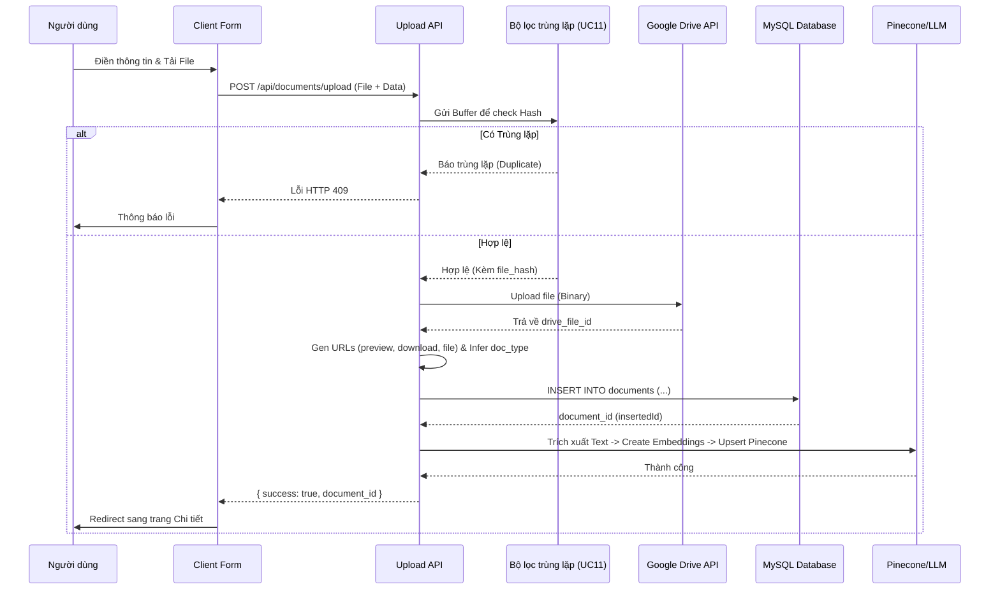

# UC10 - Hướng dẫn code tính năng Upload Tài Liệu

## 1) Mục tiêu tính năng

Cho phép người dùng tải lên tài liệu mới vào hệ thống một cách tối ưu và đồng bộ:
- **Phân loại rõ ràng**: Yêu cầu người dùng bắt buộc chọn môn học dựa trên danh mục chuẩn.
- **Quản lý thông tin**: Bắt buộc nhập đầy đủ tên tài liệu và mô tả cho tài liệu.
- **Bảo mật và chống rác**: Tích hợp luồng **UC11 (Kiểm tra trùng lặp)** để chặn các file đã tồn tại trên hệ thống trước khi bắt đầu tải lên.
- **Lưu trữ đồng bộ**: File vật lý được tải lên Google Drive, tạo ra `drive_file_id` mới. Thông tin chi tiết, đường dẫn chia sẻ, preview và tải xuống được tính toán và lưu vào bảng `documents` trong MySQL.
- **Tích hợp AI**: Tự động trích xuất nội dung, chunking, tạo vector nhúng và đẩy lên Pinecone với metadata chuẩn để làm nguồn tri thức cho Chatbot.

## 2) Các file chính tham gia tính năng

### Frontend & UI
- **Giao diện trang Upload:** `app/upload/page.tsx`
- **Component Form:** `components/UploadForm.tsx` (Chứa form nhập liệu: chọn môn học, tên, mô tả và chọn file).

### Backend & Logic
- **API xử lý Upload:** `app/api/documents/upload/route.ts` 
- **Google Drive Service:** `lib/drive.ts` (Hàm gửi Binary File lên Drive).
- **Pinecone & Vector Service:** `lib/vector.ts` (Hàm trích xuất text, tạo embedding và lưu vào Pinecone).
- **Repository:** `lib/repositories.ts` (Hàm `createDocument`).

## 3) Luồng hoạt động nâng cao (UX Flow)

1. Người dùng truy cập trang **Upload Tài Liệu**.
2. **Form nhập liệu xuất hiện**: 
   - Dropdown chọn môn học với 13 môn học bắt buộc.
   - Input chọn file. 
   - Dropdown chọn Thể loại (doc_type). (Có thể dùng AI hoặc logic Javascript để tự suy luận loại tài liệu từ đuôi file).
   - Textarea nhập mô tả (bắt buộc).
3. Khi nhấn **"Tải lên"**:
   - Giao diện chuyển sang trạng thái **Đang xử lý** (Loading state).
   - *Hệ thống kích hoạt ngầm quy trình của **UC11** (Tính toán mã MD5 và check trùng CSDL). Nếu trùng sẽ báo lỗi và dừng tại đây.*
   - Nếu **Hợp lệ (Không trùng lặp)**: Tiến hành gọi Google Drive API để đẩy file lên đám mây, nhận về `drive_file_id`.
   - Sinh ra các URL chuẩn, insert bản ghi vào MySQL.
   - Trích xuất Text và Vector hóa đẩy lên Pinecone.
4. **Sau khi thành công**:
   - Giao diện hiển thị thông báo "Thành công" (Toast xanh).
   - Chuyển hướng (Redirect) người dùng đến trang chi tiết của tài liệu vừa tải lên.

## 4) Hướng dẫn kỹ thuật trọng tâm

### 4.1 Cơ chế Upload Google Drive (Bypass Quota Limit)
Do Service Account mặc định bị giới hạn dung lượng 15GB (mà bot không thể nạp thẻ), hệ thống sử dụng **Google Drive API (OAuth2)** với `Refresh Token`. Tài liệu sẽ bay thẳng vào tài khoản Gmail cá nhân của Admin/Giáo viên, sử dụng dung lượng thực.
Sau khi upload thành công, API sinh ra 3 loại URL từ `drive_file_id` (trả về từ Google):
```typescript
const fileUrl = `https://drive.google.com/file/d/${driveResult.id}/view?usp=drive_link`;
const previewUrl = `https://drive.google.com/file/d/${driveResult.id}/preview`;
const downloadUrl = `https://drive.google.com/uc?export=download&id=${driveResult.id}`;
```

### 4.2 Thêm bản ghi vào MySQL
Câu lệnh Insert sẽ nhận vào `uploader_id` (từ phiên đăng nhập / LocalStorage) và `file_hash` (mã băm chống trùng lặp):
```sql
INSERT INTO documents (
  title, description, subject_id, uploader_id, doc_type, 
  storage_provider, drive_folder_key, drive_file_id, 
  file_name, file_ext, file_hash, file_url, preview_url, download_url, 
  status
)
VALUES (
  ?, ?, ?, ?, ?, 
  'gdrive', ?, ?, 
  ?, ?, ?, ?, ?, ?, 
  'published'
)
```

### 4.3 Kiến trúc Bất đồng bộ: Tích hợp Pinecone Vector
Việc trích xuất PDF và gọi HuggingFace Embedding rất nặng, có thể gây ra Timeout trên Server (Ví dụ: Vercel giới hạn 15 giây). Do đó, luồng RAG được tách thành **Background Processing**:
1. Giao diện báo `success` và trả về `document_id`.
2. Frontend ngầm gửi Request kích hoạt API `/api/documents/vectorize` với trạng thái UI là *"Đang trích xuất tri thức (Vector hóa AI)..."* (95%).
3. API Vectorize tiến hành: Tải PDF -> Bóc chữ (`pdf-parse`) -> Chia nhỏ -> Tạo Vector 384 chiều (`@huggingface/inference`) -> Push lên Pinecone Index.

Pinecone metadata được thiết kế chuẩn để phục vụ bộ lọc môn học của Chatbot:
- **id**: `doc_${documentId}_chunk_${index}`
- **metadata**:
```typescript
{
  content: chunkText,             // Đoạn chữ để đưa vào Prompt LLM
  document_id: documentId,        // ID vừa insert vào MySQL
  subject_id: subjectId,          // Dùng để filter theo môn học trong RAG (Thiết quân luật)
  title: title,                   // Hiển thị gợi ý nguồn
  download_url: downloadUrl,      // Link để RAG trỏ nguồn tải trực tiếp
  drive_file_id: driveFileId      // ID của file
}
```

## 5) Ghi chú cho lập trình viên
- **Xử lý State UI Mượt mà**: Flow Upload chia thành 4 State rõ ràng: `idle` -> `uploading` -> `vectorizing` -> `success`. Client chuyển trang không ảnh hưởng tới tiến trình AI chạy ngầm.
- **Phân loại doc_type tự động**: Cắt đuôi mở rộng (`file.name.split('.').pop()`) để lấy `file_ext`. Khuyến khích giới hạn chỉ chấp nhận `.pdf`, `.docx` để hệ thống RAG không bị nổ bộ nhớ.

---

## 6) Sơ đồ tuần tự và Luồng Code chi tiết


