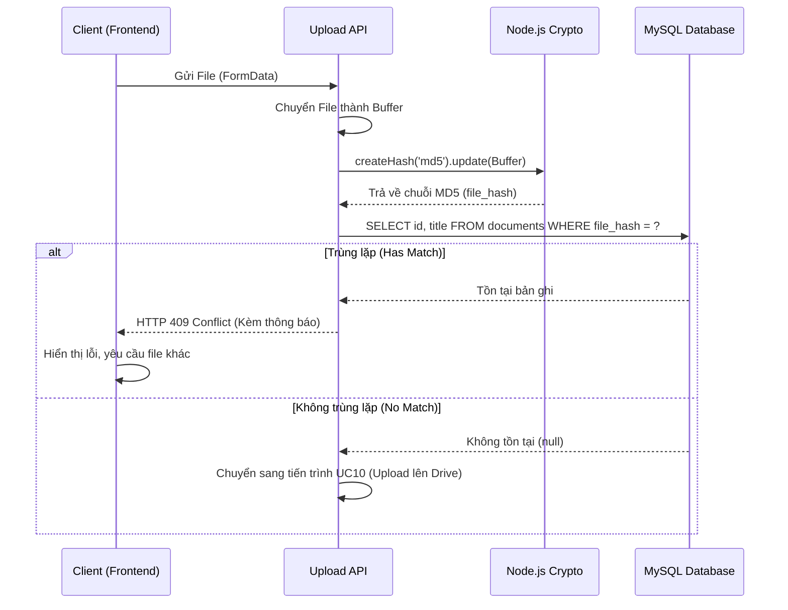

# UC11 - Hướng dẫn code tính năng Kiểm tra Trùng lặp Tài liệu (Duplicate Check)

## 1) Mục tiêu tính năng

Tính năng này hoạt động ngầm mỗi khi người dùng có thao tác Upload tài liệu. Mục tiêu là:
- **Đảm bảo tính duy nhất 100%**: Ngăn chặn hoàn toàn việc người dùng tải lên nhiều lần cùng một tài liệu (chống rác dữ liệu).
- **Phát hiện nội dung**: Nhận diện được file trùng lặp dù người dùng có cố tình đổi tên file đi chăng nữa.
- **Tối ưu băng thông**: Chặn đứng tiến trình ở ngay bước đầu (chưa cần đẩy lên Google Drive hay Pinecone), tiết kiệm dung lượng, băng thông và tiền API.

## 2) Các file chính tham gia tính năng

- **API xử lý Upload:** `app/api/documents/upload/route.ts` (Nơi gọi hàm check trùng trước khi thực sự upload).
- **Thư viện mã hóa:** Module `crypto` có sẵn của Node.js.
- **Repository:** `lib/repositories.ts` (Viết riêng hàm `checkDuplicateByHash(hash: string)`).

## 3) Luồng hoạt động nâng cao (UX Flow)

1. Người dùng chọn file trên giao diện (Frontend) và bấm **Tải lên**.
2. Khi Backend nhận được File Buffer (dữ liệu thô), hệ thống sẽ khởi động máy quét (hashing).
3. Đưa Buffer vào thuật toán băm (MD5 hoặc SHA-256) để tạo ra một chuỗi Hash (VD: `12b40240dcc6deceaaeffcd60ea881d8`).
4. Dùng mã Hash này dò tìm trong cơ sở dữ liệu (Bảng `documents`, cột `file_hash`).
5. Nếu **Tồn tại**: 
   - Ngừng ngay mọi quá trình upload tiếp theo.
   - Trả về mã lỗi HTTP 409 Conflict.
   - Frontend hiển thị thông báo lỗi màu đỏ: *"Nội dung tài liệu này đã tồn tại trong hệ thống. Vui lòng kiểm tra lại!"*
6. Nếu **Không tồn tại**: Cho phép tiếp tục luồng của UC10 (Upload lên Drive, lưu DB...).

## 4) Hướng dẫn kỹ thuật trọng tâm

### 4.1 Hàm tạo mã Hash (Node.js)
Sử dụng module `crypto` tích hợp sẵn, không cần cài thêm thư viện ngoài:
```typescript
import crypto from 'crypto';

// Tính toán MD5 Hash từ Buffer của File
export function calculateFileHash(buffer: Buffer): string {
  return crypto.createHash('md5').update(buffer).digest('hex');
}
```

### 4.2 Hàm truy vấn MySQL
Trong file `lib/repositories.ts`, viết hàm kiểm tra:
```typescript
import pool from './db';

export async function checkDuplicateByHash(fileHash: string) {
  const [rows]: any = await pool.query(
    'SELECT id, title FROM documents WHERE file_hash = ? LIMIT 1',
    [fileHash]
  );
  
  if (rows.length > 0) {
    return rows[0]; // Trả về thông tin tài liệu bị trùng
  }
  return null; // Không trùng lặp
}
```

### 4.3 Tích hợp vào API Route (Upload)
Tại `app/api/documents/upload/route.ts`:
```typescript
// 1. Nhận file từ FormData
const file = formData.get('file') as File;
const arrayBuffer = await file.arrayBuffer();
const buffer = Buffer.from(arrayBuffer);

// 2. Tính Hash
const fileHash = calculateFileHash(buffer);

// 3. Check trùng lặp (UC11)
const existingDoc = await checkDuplicateByHash(fileHash);
if (existingDoc) {
  return NextResponse.json(
    { error: `Tài liệu bị trùng nội dung với bài: "${existingDoc.title}"` },
    { status: 409 }
  );
}

// 4. Bắt đầu luồng upload (UC10) ...
```

---

## 5) Sơ đồ hoạt động chi tiết (Flow of Events)


