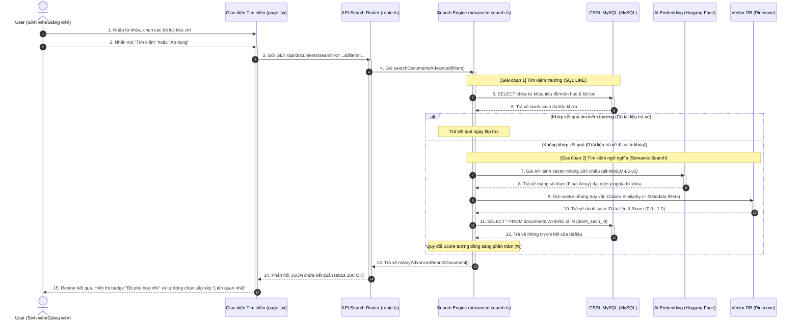

# UC1 - Hướng dẫn code tính năng Tìm kiếm nâng cao (Hybrid & Semantic Search)

## 1) Mục tiêu tính năng

Trang Tìm kiếm nâng cao cho phép người dùng:
- Tìm tài liệu học tập theo từ khóa chính xác hoặc ý nghĩa câu hỏi (tìm kiếm ngữ nghĩa bằng AI).
- Lọc chi tiết theo ngành học, môn học, loại tài liệu, đánh giá tối thiểu, thời gian cập nhật.
- Xem kết quả theo dạng thẻ và sắp xếp theo nhiều tiêu chí (Mới nhất, Cũ nhất, Tải nhiều nhất, Đánh giá tốt nhất, Tên A-Z, và **Liên quan nhất**).

---

## 2) Các file chính tham gia tính năng

- **Giao diện trang tìm kiếm:** [page.tsx](file:///d:/DATN_TLUDOCUMENT/app/advanced-search/page.tsx)
- **Hiển thị danh sách kết quả & dropdown sắp xếp:** [search-results.tsx](file:///d:/DATN_TLUDOCUMENT/components/search-results.tsx)
- **Thẻ hiển thị tài liệu:** [document-card.tsx](file:///d:/DATN_TLUDOCUMENT/components/document-card.tsx)
- **API route nhận request:** [route.ts](file:///d:/DATN_TLUDOCUMENT/app/api/documents/search/route.ts)
- **Bộ xử lý logic tìm kiếm Hybrid/Semantic:** [advanced-search.ts](file:///d:/DATN_TLUDOCUMENT/lib/advanced-search.ts)
- **Bộ sinh vector nhúng AI:** [hf-embedder.ts](file:///d:/DATN_TLUDOCUMENT/lib/hf-embedder.ts)
- **Kết nối Pinecone Vector DB:** [pinecone.ts](file:///d:/DATN_TLUDOCUMENT/lib/pinecone.ts)
- **API lấy danh mục ngành/môn học:** [route.ts](file:///d:/DATN_TLUDOCUMENT/app/api/subjects/groups/route.ts)

---

## 3) Sơ đồ luồng hoạt động chi tiết

---

## 4) Giải thích chi tiết luồng xử lý dữ liệu

### 4.1. Khởi tạo & nạp dữ liệu bộ lọc (Frontend)
- Khi người dùng tải trang lần đầu, `page.tsx` gọi `GET /api/subjects/groups` nạp dữ liệu phân ngành học $\rightarrow$ môn học vào bộ lọc dropdown.
- Khi người dùng chọn Ngành học cụ thể, hệ thống sẽ tự động cập nhật danh sách Môn học chỉ thuộc ngành đó để đảm bảo tính chính xác của dữ liệu.

### 4.2. Xử lý logic Tìm kiếm kết hợp (Backend - `searchDocumentsAdvanced`)
Khi nhận request chứa các tham số lọc và từ khóa, hệ thống thực hiện qua 2 giai đoạn:

#### Giai đoạn 1: Tìm kiếm thường (MySQL LIKE Query)
- Thực hiện câu lệnh SQL tìm kiếm gần đúng với toán tử `LIKE` trên các cột `d.title`, `d.description`, `s.name`, `s.code` kết hợp các điều kiện lọc loại tài liệu, ngành học, số sao đánh giá và mốc thời gian.
- Nếu MySQL tìm được kết quả, hệ thống sẽ bỏ qua bước gọi AI và trả kết quả về luôn cho phía client để tối ưu tốc độ và chi phí tài nguyên API.

#### Giai đoạn 2: Tìm kiếm ngữ nghĩa AI (Semantic Search)
Chạy tự động khi tìm kiếm thường trả về **0 kết quả** và người dùng **có nhập từ khóa**:
1. **Sinh Vector Nhúng (Embedding):** Dịch vụ Hugging Face xử lý chuỗi từ khóa của người dùng thông qua mô hình mã nguồn mở `all-MiniLM-L6-v2` để chuyển hóa thành vector 384 chiều lưu trữ ý nghĩa ngữ cảnh của câu.
2. **So khớp độ tương đồng trên Vector DB (Pinecone):** Gửi vector 384 chiều cùng các bộ lọc phụ (như loại tài liệu, ngành học...) lên Pinecone. Pinecone thực hiện so khớp độ tương đồng Cosine (Cosine Similarity) với các vector tài liệu đã được index sẵn và trả về danh sách ID tài liệu khớp nhất kèm điểm số (Score).
3. **Lấy thông tin chi tiết:** Dùng danh sách ID thu được từ Pinecone để truy vấn MySQL lấy thông tin chi tiết. Sử dụng lệnh `ORDER BY FIELD(d.id, ...)` để giữ nguyên thứ tự xếp hạng độ phù hợp mà Pinecone đã tính toán.
4. **Quy đổi chỉ số tương đồng:** Điểm số Cosine (từ 0.0 đến 1.0) được nhân với 100 và làm tròn để trả ra tỷ lệ phần trăm độ phù hợp (`similarity` dạng phần trăm `[0, 100]`).

---

## 5) Cấu trúc code của các file chính

### 5.1. [page.tsx](file:///d:/DATN_TLUDOCUMENT/app/advanced-search/page.tsx)
- Quản lý toàn bộ `state` bộ lọc (`selectedGroup`, `selectedSubjectCode`, `selectedDocTypes`, `selectedRating`, `updatedWithin`).
- Hỗ trợ giao diện Responsive chuyên biệt:
  - **Trên Desktop:** Bộ lọc nằm ở thanh bên trái đính cố định (sticky). Tiêu đề được loại bỏ và thay bằng bộ nút hành động **"Xóa"** (bên trái) và **"Áp dụng"** (bên phải) ngay trên đầu.
  - **Trên Mobile:**
    - Thanh tìm kiếm hiển thị dạng cột đứng với ô nhập từ khóa chiếm toàn bộ bề ngang, đi kèm là hàng nút **"Bộ lọc"** và **"Tìm kiếm"** nằm song song để tránh giật giao diện.
    - Bộ lọc thu gọn trong một ngăn kéo (Drawer/Modal) trượt từ dưới lên, áp dụng mô hình bố cục cố định chiều cao màn hình `fixed flex flex-col h-[100dvh]` với vùng nội dung cuộn độc lập `flex-1 overflow-y-auto` giúp phần tiêu đề/nút hành động đứng im tuyệt đối, xử lý triệt để lỗi rung/giật tiêu đề (jittering scroll) trên điện thoại di động.

### 5.2. [search-results.tsx](file:///d:/DATN_TLUDOCUMENT/components/search-results.tsx)
- Nhận mảng tài liệu từ component cha.
- Chứa tùy chọn sắp xếp mới: **"Liên quan nhất"** (`value="relevance"`). Lựa chọn này chỉ hiển thị khi có kết quả tìm kiếm từ AI ngữ nghĩa.
- **Cơ chế tự động sắp xếp thông minh:** Sử dụng `useEffect` kiểm tra nếu có trường `similarity` trong dữ liệu kết quả thì tự động chuyển sang chế độ sắp xếp `"relevance"`, ngược lại sẽ chuyển về `"newest"`.
- Sắp xếp `"relevance"` sẽ xếp tài liệu có tỷ lệ độ phù hợp giảm dần, nếu trùng điểm số sẽ tự động so sánh theo thời gian tạo mới nhất.

### 5.3. [document-card.tsx](file:///d:/DATN_TLUDOCUMENT/components/document-card.tsx)
- Đọc thuộc tính `document.similarity`.
- Nếu có giá trị này, card sẽ tự động hiển thị một nhãn **"Độ phù hợp x%"** nằm ở góc trên cùng bên phải vùng ảnh nền của card.
- Badge được định vị tuyệt đối `absolute top-3 right-3` với màu xanh lá sang trọng (`bg-emerald-600/90`), bo góc, viền nhẹ và hiệu ứng mờ nền (`backdrop-blur-sm`).

### 5.4. [advanced-search.ts](file:///d:/DATN_TLUDOCUMENT/lib/advanced-search.ts)
- Hàm trung tâm điều phối `searchDocumentsAdvanced`.
- Thực hiện gọi tuần tự `runRegularSearch` (MySQL LIKE) trước $\rightarrow$ kiểm tra độ dài $\rightarrow$ gọi tiếp `runSemanticSearch` (Hugging Face + Pinecone + MySQL SELECT) nếu cần.
- Chuyển đổi dữ liệu và bọc toàn bộ dữ liệu trả về theo đúng định dạng DTO mà frontend mong muốn.

---

## 6) Các điểm tối ưu trải nghiệm người dùng (UX) đã triển khai

1. **Khắc phục lỗi cuộn trang khi mở menu tài khoản:** Thiết lập cấu hình `modal={false}` cho `<DropdownMenu>` ở thanh điều hướng để ngăn trình duyệt khóa scroll thẻ `<body>`, triệt tiêu lỗi nhảy cuộn màn hình lên đầu trang khi click avatar.
2. **Thiết kế nút hành động tinh tế:** Nút "Xóa" được trang bị icon thùng rác (`Trash2`) với viền mềm nhẹ và hiệu ứng hover đỏ nhạt; nút "Áp dụng" sử dụng màu xanh chủ đạo (`bg-blue-600`) cùng biểu tượng tích chọn (`Check`).
3. **Màn hình bộ lọc mượt mà trên mobile:** Chia vùng cuộn độc lập cho nội dung bộ lọc để giữ thanh công cụ thao tác luôn đính cố định mà không bị rung màn hình do sai lệch vị trí sticky của CSS trên nền tảng di động.
