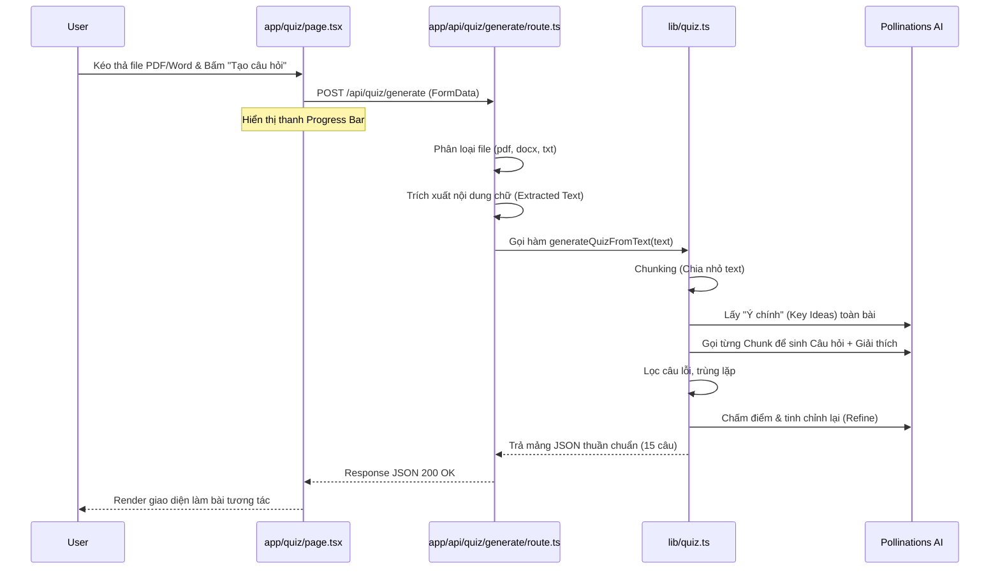

# 🚀 Hệ thống Tạo Bài Trắc Nghiệm Tự Động bằng AI (UC4 - Quiz)

Tài liệu này giải thích chi tiết luồng hoạt động, cấu trúc mã nguồn, và thuật toán cốt lõi đứng sau tính năng biến tài liệu bất kỳ thành bộ câu hỏi Trắc nghiệm (Quiz) của hệ thống.

---

## 🏗️ 1. Kiến trúc Tổng quan (Architecture)

Quy trình tạo câu hỏi được phân chia rõ ràng thành 3 lớp (3-tier) nhằm tách biệt giao diện, xử lý file và thuật toán AI:

1. **Frontend (UI/UX)** - `app/quiz/page.tsx`
2. **Backend API Route** - `app/api/quiz/generate/route.ts`
3. **Core AI Logic** - `lib/quiz.ts`

### Luồng tương tác (Workflow)



---

## 🛠️ 2. Chi tiết Thuật toán AI (The Brain) - `lib/quiz.ts`

Toàn bộ tinh hoa thuật toán AI được thiết kế tuân thủ Rule: **AI không bao giờ được phép hỏi chay trên Raw text.** Nó phải trải qua quá trình Hiểu -> Áp dụng -> Lọc -> Tối ưu. 

Cơ chế sinh câu hỏi hoạt động theo 3 bước chính như sau:

**Bước 1 (Chia nhỏ tài liệu - Chunking):** Hệ thống đọc tài liệu của bạn và cắt nó thành các đoạn nhỏ (mỗi đoạn dài tối đa 2500 ký tự). Để tránh bị AI quá tải hoặc tính phí quá cao, nó được cấu hình đọc tối đa 6 đoạn (tương đương khoảng 15.000 ký tự chữ - tức là khoảng 4 - 6 trang giấy A4 tài liệu chữ).

**Bước 2 (Sinh câu hỏi theo đoạn):** Với mỗi một đoạn, AI sẽ có nhiệm vụ bóc tách và tự nghĩ ra chính xác 3 câu hỏi trắc nghiệm.
- Nếu tài liệu ngắn (< 1 trang), nó là 1 đoạn 👉 Sinh ra 3 câu hỏi.
- Nếu tài liệu dài (VD 3 đoạn) 👉 3 x 3 = 9 câu hỏi.
- Nếu tài liệu kịch trần (6 đoạn) 👉 6 x 3 = 18 câu hỏi.

**Bước 3 (Thanh lọc và Tối ưu hoá):** Nếu số lượng câu hỏi thu được vóng lên quá mức cân thiết (ví dụ 18 câu), hệ thống sẽ:
1. Loại bỏ các câu hỏi sát nghĩa hoặc bị trùng lặp.
2. Đảo ngẫu nhiên và Cắt bỏ để giữ lại đúng bằng 15 câu hỏi (Max limit).
3. Đem 15 câu đó đi đưa qua một lượt "chấm điểm lại" (Refine) để đảm bảo ngữ pháp chuẩn y nguyên tiếng Việt rồi mới in ra màn hình cho bạn học.

**Tóm lại:**
- Sách/tài liệu vài chục trang hay vài ngàn trang thì nó cũng chỉ giới hạn rút ra khoảng **15 câu hỏi** cốt lõi nhất.
- Nếu bạn tải lên file nháp/ngắn (ví dụ khoảng vài trăm chữ) thì nó sẽ tạo ra khoảng **3 đến 6 câu hỏi**.

### 💡 Cơ chế sinh ra "Giải thích" cho từng câu hỏi
Phần "Giải thích" không phải lấy ngẫu nhiên mà được vận hành tự động bởi **Prompts Engineering** (Kỹ thuật ra lệnh). 

Khi hệ thống nhờ AI sinh nháp 3 câu hỏi ở một đoạn văn (Bước 2), nó gửi kèm một câu lệnh ép buộc:
> *"Hãy tạo 3 câu hỏi trắc nghiệm... Có giải thích đầy đủ tại sao đúng"* và ép AI phải nhét lời giải thích đó vào một trường dữ liệu tên là `"explanation": "..."` trong định dạng JSON.

Do AI có sẵn Reasoning capability (năng lực tư duy logic) kèm theo nội dung văn bản đang đọc trực tiếp, nó sẽ tự đối chiếu xem tại sao Đáp án A đúng mà Đáp án B sai, và tự động tổng hợp đoạn văn bản đó thành một lời giải thích mạch lạc bằng tiếng Việt. Cuối cùng ở hàm `validateQuestion()`, nếu câu hỏi nào AI làm trái lệnh (quên không sinh phần `explanation`), câu hỏi đó lập tức bị thủ tiêu (loại bỏ) để không hiện lên làm rác giao diện web.

---

## 🛠️ 3. Giải thích chi tiết theo từng File code

### 📌 File 1: Frontend - Giao diện người dùng (`app/quiz/page.tsx`)
**Công dụng:**
- Quản lý **State Máy trạng thái** của ứng dụng: `idle` -> `uploading` -> `generating` -> `playing` -> `result`.
- Thiết kế **Third Column (Cột thứ 3)** hiển thị dạng lưới các ô số câu hỏi (1-15) cho phép người chơi theo dõi tiến độ đúng/sai và click xem lại đáp án nhanh (Review Model).
- Render giao diện câu hỏi, đánh dấu hiển thị % thanh ProgressBar dựa trên hàm đếm giờ mô phỏng (`processingProgress`).
- Bắt sự kiện chọn đáp án và tự động **định dạng In Đậm (Bold)** bằng hàm Regex `renderTextWithBold()` cho các từ được AI đánh dấu `**text**` trong phần giải thích.

**Đoạn code đáng chú ý:**
```tsx
const startGeneration = async (selectedFile: File) => {
  setQuizState("generating")
  setProcessingProgress(5)

  // Thanh Tiến trình chạy nền mô phỏng trong khi đợi AI (đạt tối đa 90%)
  const progressTimer = window.setInterval(() => {
    setProcessingProgress((prev) => (prev >= 90 ? 90 : prev + 3))
  }, 800)

  // ... fetch to /api/quiz/generate ...
  
  if (data.questions) {
    setProcessingProgress(100)
    setQuestions(data.questions) // Map dữ liệu JSON hiển thị thành layout thi
  }
}
```

---

### 📌 File 2: API Mũi nhọn - Phân rã văn bản (`app/api/quiz/generate/route.ts`)
**Công dụng:**
- Nhận luồng File Upload (FormData) từ Fontend.
- Gỡ rào cản Runtime: Trích xuất Text từ file DOCX (dùng thư viện `mammoth`) và PDF (dùng `pdf-parse`).
- **Đặc biệt (Fix Bug PDF):** Sử dụng kỹ thuật `eval("require")("pdf-parse")` thay vì `import()`. Điều này giúp né lỗi Crash Webpack CJS/ESM (`TypeError: Object.defineProperty called on non-object`) khét tiếng của NextJS App Router khi parse file PDF bằng Server Components.

### 📌 File 3: Logic trung tâm AI (`lib/quiz.ts`)
**Công dụng:**
- **`smartChunk()`**: Chia nhỏ văn bản để AI không bị quá tải.
- **`callPollinationsChat()`**: Hàm giao tiếp với AI, có cơ chế **tự động thử lại (Retry)** tối đa 3 lần nếu AI trả về dữ liệu rỗng hoặc bị lỗi.
- **`safeParseQuiz()`**: Sử dụng Regex để "rửa" chuỗi JSON từ AI, loại bỏ các ký tự thừa như ```json để đảm bảo `JSON.parse` không bị lỗi.
- **`refineQuiz()`**: Giai đoạn tinh chỉnh cuối cùng để đảm bảo văn phong tiếng Việt chuẩn xác và logic các câu hỏi đồng nhất.

---

## 🔍 4. Hệ thống Logging (Terminal Debug)
Để hỗ trợ việc kiểm soát chất lượng nội dung từ AI, hệ thống đã được thiết kế các dòng log chi tiết trong Terminal tại server:

### 4.1. Giai đoạn gọi AI (AI RAW RESPONSE)
Mỗi khi hệ thống gửi yêu cầu sinh câu hỏi, Terminal sẽ in ra phản hồi thô của AI. Điều này giúp lập trình viên kiểm tra xem AI có tuân thủ đúng định dạng JSON hay không.
```bash
--- QUIZ: AI RAW RESPONSE ---
{
  "questions": [ ... ]
}
-----------------------------
```

### 4.2. Giai đoạn hoàn thiện (FINAL QUIZ QUESTIONS)
Sau khi đã qua các bước lọc trùng, chấm điểm và tinh chỉnh (Refine), danh sách 15 câu hỏi chính thức dùng để render lên giao diện người dùng sẽ được in ra.
```bash
--- FINAL QUIZ QUESTIONS FOR RENDERING ---
[
  { "question": "...", "options": [...], "correctIndex": 0, "explanation": "..." },
  ...
]
------------------------------------------
```

---

## 🎯 Tổng kết (Sự khác biệt của cấu trúc này)

Sự kết hợp giữa Flow AI ở `lib/quiz.ts` và Frontend Real-time `page.tsx` mang lại ưu điểm vượt trội:
- ✅ Hệ thống không bao giờ bị hỏi lan man do đã chia đoạn thông minh.
- ✅ Lời giải đáp luôn có căn cứ và được đánh dấu In Đậm rõ ràng qua Regex.
- ✅ Số lượng câu hỏi luôn được kiểm soát (Max 15), hạn chế chi phí gọi API.
- ✅ Vượt qua các lỗi Build-time nội địa của Vercel/NextJS khi parse file PDF tĩnh.
- ✅ **Khả năng Debug cao:** Dễ dàng theo dõi và tinh chỉnh Prompt qua hệ thống Logging Terminal.