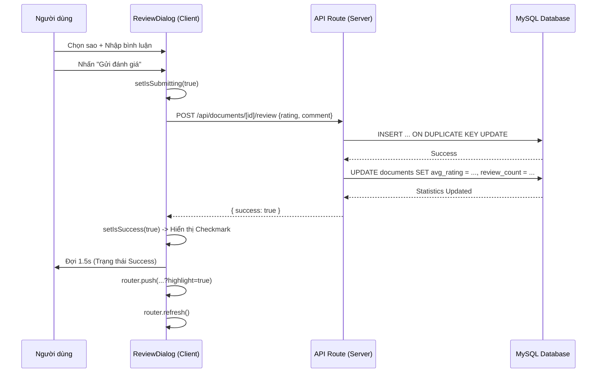

# UC6 - Hướng dẫn code tính năng Đánh giá tài liệu (Cập nhật mới nhất)

## 1) Mục tiêu tính năng

Cho phép người dùng gửi đánh giá tài liệu với trải nghiệm cao cấp:
- Gửi đánh giá kèm số sao (1-5) và nội dung bình luận.
- Hiển thị phản hồi cảm xúc tương ứng với số sao (ví dụ: "Cực kỳ xuất sắc! 🌟").
- **UX Redirection**: Sau khi gửi, hệ thống tự động đưa người dùng đến đúng vị trí đánh giá của mình.
- **Highlight**: Đánh giá mới nhất sẽ có hiệu ứng viền xanh, chấm xanh nhấp nháy và thẻ "VỪA GỬI" để nhận diện.

## 2) Các file chính tham gia tính năng

### Frontend & UI
- **Giao diện trang:** `app/document/[id]/page.tsx` (Xử lý `searchParams` để highlight và cuộn trang).
- **Component Dialog:** `components/ReviewDialog.tsx` (Chứa form nhập liệu, hiệu ứng sao và trạng thái Success).
- **Bộ dọn dẹp URL:** `components/ReviewHighlightHandler.tsx` (Tự động xóa tham số highlight khỏi URL sau 5 giây để làm sạch trình duyệt).
- **Component nút bấm:** `app/document/[id]/DocumentActions.tsx` (Mở modal đánh giá).

### Backend & Logic
- **API xử lý:** `app/api/documents/[id]/review/route.ts`.
- **Repository:** `lib/repositories.ts` (Hàm `addDocumentReview`, `getReviewsByDocumentId`).

## 3) Luồng hoạt động nâng cao (UX Flow)

1. Người dùng nhấn **"Viết đánh giá"**.
2. **Modal hiện đại xuất hiện**: 
   - Có hiệu ứng scale/ping khi hover và chọn sao.
   - Hiển thị thông điệp khích lệ: *5 sao -> "Cực kỳ xuất sắc! 🌟"*, *4 sao -> "Tài liệu rất tốt 👍"*, v.v.
3. Khi nhấn **"Gửi đánh giá ngay"**:
   - Giao diện chuyển sang trạng thái **Success** với icon CheckCircle và thông báo cảm ơn trong 1.5 giây.
   - Hệ thống thực hiện điều hướng kèm tham số: `/document/[id]?tab=reviews&highlight=true#reviews`.
4. **Tại trang chi tiết tài liệu**:
   - Nếu có `tab=reviews`, hệ thống tự mở tab Đánh giá.
   - Nếu có `#reviews`, trình duyệt tự cuộn đến phần đánh giá.
   - Nếu có `highlight=true`, bài đánh giá đầu tiên (mới nhất) sẽ được bao khuôn xanh và nhấp nháy chấm xanh.
5. **Dọn dẹp (Cleanup)**: Component `ReviewHighlightHandler` đếm ngược 5 giây, sau đó dùng `router.replace` để loại bỏ `highlight=true` khỏi thanh địa chỉ, giúp URL sạch sẽ khi người dùng Refresh trang.

## 4) Hướng dẫn kỹ thuật trọng tâm

### 4.1 Logic Highlight trong `page.tsx`
Sử dụng Tailwind CSS tổ hợp để tạo hiệu ứng:
```tsx
const isNewReview = searchParams?.highlight === 'true' && index === 0;

<div className={`relative p-4 rounded-xl transition-all duration-1000 ${
  isNewReview ? 'bg-blue-50/50 border-2 border-blue-200' : 'bg-white border border-slate-100'
}`}>
  {isNewReview && (
    <div className="absolute right-3 bottom-3 flex items-center gap-2">
      <span className="relative flex h-3 w-3">
        <span className="animate-ping absolute inline-flex h-full w-full rounded-full bg-green-400 opacity-75"></span>
        <span className="relative inline-flex rounded-full h-3 w-3 bg-green-500"></span>
      </span>
      <span className="text-[10px] font-bold text-green-600 bg-green-50 px-2 py-0.5 rounded-full border border-green-100">VỪA GỬI</span>
    </div>
  )}
</div>
```

### 4.2 Logic Xóa highlight tự động (`ReviewHighlightHandler.tsx`)
```tsx
useEffect(() => {
  if (searchParams.get("highlight") === "true") {
    const timer = setTimeout(() => {
      const params = new URLSearchParams(searchParams.toString());
      params.delete("highlight");
      router.replace(`${pathname}?${params.toString()}${window.location.hash}`, { scroll: false });
    }, 5000);
    return () => clearTimeout(timer);
  }
}, [searchParams]);
```

### 4.3 Cập nhật thống kê (SQL)
Luôn cập nhật đồng thời cả điểm trung bình và số lượng đánh giá để giữ tính toàn vẹn dữ liệu:
```sql
UPDATE documents
SET 
  avg_rating = (SELECT AVG(rating) FROM document_reviews WHERE document_id = ?),
  review_count = (SELECT COUNT(*) FROM document_reviews WHERE document_id = ?)
WHERE id = ?;
```

## 5) Ghi chú cho lập trình viên
- **Màu sắc thương hiệu**: Sử dụng mã màu `#0b3b8f` và `blue-50` để đồng bộ với bộ nhận diện TLU.
- **Trạng thái Login**: Hiện tại `user_id` đang giả lập = 1. Cần thay bằng `session.user.id` khi tích hợp Module Login.
- **Performance**: Việc dùng `router.replace` với `{ scroll: false }` là cực kỳ quan trọng để không làm nhảy màn hình khi đang đọc đánh giá.

---

## 6) Luồng hoạt động chi tiết (Flow of Events)

### 6.1 Luồng cơ bản (Main Success Scenario)
1. **Người dùng**: Nhấn nút "Viết đánh giá" tại trang chi tiết tài liệu.
2. **Hệ thống**: Hiển thị ReviewDialog với các tùy chọn số sao (1-5) và khung nhập nội dung.
3. **Người dùng**: Chọn số sao. Hệ thống hiển thị thông điệp phản hồi tương ứng ngay lập tức.
4. **Người dùng**: Nhập bình luận (không bắt buộc) và nhấn "Gửi đánh giá ngay".
5. **Hệ thống**:
   - Vô hiệu hóa nút gửi (disabled) và hiển thị trạng thái "Đang gửi...".
   - Gọi API để lưu dữ liệu vào MySQL.
   - Hiển thị màn hình "Đã gửi đánh giá!" thành công với hiệu ứng Checkmark.
6. **Hệ thống**: Sau 1.5 giây, tự động đóng Dialog và điều hướng về trang hiện tại kèm tham số highlight.
7. **Hệ thống**: Tự động mở tab "Đánh giá", cuộn đến bài đánh giá mới nhất và làm nổi bật (highlight).

### 6.2 Luồng thay thế (Alternative Flows)
- **A1. Cập nhật đánh giá**: Nếu người dùng đã đánh giá tài liệu này trước đó, hệ thống sẽ thực hiện `ON DUPLICATE KEY UPDATE` để ghi đè đánh giá cũ.
- **A2. Lỗi hệ thống**: Nếu API trả về lỗi (mất kết nối SQL, lỗi server), hệ thống hiển thị thông báo Toast lỗi màu đỏ và cho phép người dùng thử lại.

---

## 7) Sơ đồ tuần tự và Luồng Code chi tiết

### 7.1 Sơ đồ tuần tự (Sequence Diagram)



### 7.2 Xử lý Code tại Frontend (`ReviewDialog.tsx`)
Logic quan trọng nhất là việc điều phối các `setTimeout` để tạo trải nghiệm mượt mà:
```tsx
const handleSubmit = async () => {
  setIsSubmitting(true)
  const res = await fetch(...)
  if (res.ok) {
    setIsSuccess(true) // 1. Chuyển sang màn hình thành công
    setTimeout(() => {
       // 2. Điều hướng và highlight
       router.push(`${pathname}?tab=reviews&highlight=true#reviews`)
       router.refresh()
       
       setTimeout(() => {
          // 3. Đóng dialog sau khi trang đã bắt đầu cuộn
          onOpenChange(false)
          // 4. Reset state ngầm sau khi dialog đóng hoàn toàn
          setTimeout(() => setIsSuccess(false), 300)
       }, 200)
    }, 1500)
  }
}
```

### 7.3 Xử lý dọn dẹp URL (`ReviewHighlightHandler.tsx`)
Đây là bước làm sạch môi trường, đảm bảo khi người dùng Refresh trang thì dấu highlight sẽ biến mất:
1. **Kiểm tra**: Xem URL có chứa `highlight=true` không.
2. **Chờ đợi**: Đợi 5 giây (đủ để người dùng thấy chấm xanh nhấp nháy).
3. **Thực thi**: Sử dụng `router.replace` để ghi đè URL mới không chứa tham số `highlight`, giữ nguyên vị trí cuộn bằng `{ scroll: false }`.
