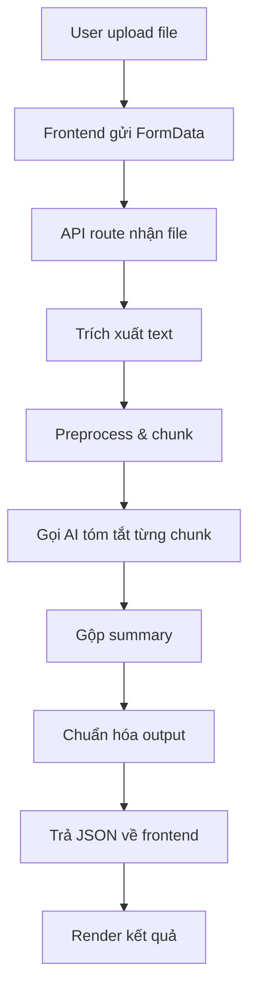

## 1. Luồng hoạt động tổng thể

### 1.1. Sơ đồ luồng

1. Người dùng mở trang `/summarize`.
2. Chọn file PDF/Word, chọn kiểu tóm tắt (đoạn văn/gạch đầu dòng), chọn độ dài.
3. Frontend gửi file và metadata lên API backend.
4. Backend kiểm tra file, trích xuất text (dùng pdf-parse hoặc mammoth).
5. Backend làm sạch text, chia chunk nếu dài.
6. Backend gọi AI (Pollinations/OpenAI) để tóm tắt từng chunk.
7. Gộp các summary chunk, sinh summary cuối cùng.
8. Chuẩn hóa output, trả về frontend.
9. Frontend hiển thị kết quả, cho phép copy.

### 1.2. Sơ đồ khối (pseudo-code)



---

## 2. Thuật toán từng bước

### 2.1. Trích xuất text (Extract Text)
- **PDF:** Sử dụng thư viện `pdf-parse` để đọc nội dung file PDF. Lý do: PDF lưu text không liên tục, cần parser chuyên dụng để lấy đúng thứ tự và loại bỏ metadata không cần thiết.
  - Code mẫu:
    ```ts
    import pdfParse from 'pdf-parse';
    const data = await pdfParse(Buffer.from(arrayBuffer));
    const text = data.text.trim();
    ```
- **Word (.docx):** Dùng `mammoth` để trích xuất text từ file Word. Lý do: Mammoth chuyển đổi XML nội bộ của Word thành plain text sạch, bỏ qua style và hình ảnh.
  - Code mẫu:
    ```ts
    import mammoth from 'mammoth';
    const result = await mammoth.extractRawText({ arrayBuffer: Buffer.from(arrayBuffer) });
    const text = result.value.trim();
    ```

### 2.2. Làm sạch & chia chunk (Preprocess & Chunking)
- **Làm sạch:**
  - Loại bỏ ký tự điều khiển, ký tự rác (\u0000-\u001F), normalize khoảng trắng về 1 dấu cách.
  - Mục đích: Giảm noise, tiết kiệm token khi gửi lên AI, tăng độ chính xác.
  - Code mẫu:
    ```ts
    function preprocessText(text: string): string {
      return text.replace(/[\u0001-\u001F]+/g, ' ').replace(/\s+/g, ' ').trim();
    }
    ```
- **Chia chunk:**
  - Nếu text > 3000 ký tự, chia thành các đoạn nhỏ (chunk) ~2500 ký tự, ưu tiên cắt ở dấu chấm hoặc xuống dòng để không vỡ ý.
  - Lý do: AI có giới hạn token, chia nhỏ giúp tóm tắt từng phần rồi gộp lại sẽ ổn định hơn.
  - Code mẫu:
    ```ts
    function smartChunk(text: string, targetSize = 2500) { /* ... */ }
    ```

### 2.3. Tóm tắt từng chunk (Summarize Each Chunk)
- Với mỗi chunk, gọi API AI (Pollinations/OpenAI) để sinh tóm tắt riêng biệt.
- Gửi prompt phù hợp kiểu tóm tắt (gạch đầu dòng/đoạn văn).
- Giới hạn tối đa 3 request song song để tránh bị rate limit hoặc nghẽn API.
- Nếu AI trả lỗi hoặc rỗng, tự động retry tối đa 3 lần, mỗi lần giảm temperature để tăng tính ổn định.
- Code mẫu:
  ```ts
  async function summarizeChunk(chunkText, summaryType, apiKey) { /* ... */ }
  ```

### 2.4. Gộp & sinh summary cuối (Merge & Final Summary)
- Sau khi có các summary nhỏ, gộp lại thành 1 đoạn lớn (có thể thêm tiêu đề cho từng phần nếu muốn).
- Nếu tổng summary vẫn quá dài hoặc chưa đủ cô đọng, có thể gửi lại toàn bộ summary chunk vào AI để sinh ra summary cuối cùng ngắn gọn hơn.
- Lý do: Đảm bảo output vừa đủ ngắn, không bị lặp ý, phù hợp yêu cầu người dùng.
- Code mẫu:
  ```ts
  function mergeSummaries(summaries: string[]): string { /* ... */ }
  // hoặc gọi lại AI với merged summary
  ```

### 2.5. Chuẩn hóa output (Normalize Output)
- Đảm bảo đúng format:
  - Nếu chọn gạch đầu dòng: mỗi ý là 1 dòng, thêm ký hiệu bullet nếu thiếu.
  - Nếu chọn đoạn văn: loại bỏ dòng trống thừa, giữ 1-2 đoạn rõ ràng.
- Loại bỏ ký tự thừa, xuống dòng không cần thiết, chuẩn hóa lại trước khi trả về frontend.
- Code mẫu:
  ```ts
  function normalizeSummary(text: string, summaryType: 'paragraph' | 'bullets') { /* ... */ }
  ```

---

## 3. Cách code từng phần

### 3.1. Frontend (app/summarize/page.tsx)

- Sử dụng React, upload file qua FormData.
- Gọi API `/api/summarize` bằng fetch.
- Hiển thị loading, kết quả, nút copy.

Ví dụ:

```ts
async function handleSummarize() {
  if (!selectedFile) return;
  setIsProcessing(true);
  const formData = new FormData();
  formData.append("file", selectedFile);
  formData.append("summaryType", summaryType);
  formData.append("summaryLength", String(summaryLength));
  formData.append("language", "vi");
  const response = await fetch("/api/summarize", { method: "POST", body: formData });
  const data = await response.json();
  setSummary(data.summary);
  setIsProcessing(false);
}
```

### 3.2. Backend API route (app/api/summarize/route.ts)

- Nhận FormData, validate file.
- Trích xuất text:
  - PDF: `pdf-parse`
  - Word: `mammoth`
- Làm sạch text, chia chunk nếu dài.
- Gọi AI tóm tắt từng chunk (giới hạn song song 3 request).
- Gộp summary, sinh summary cuối cùng.
- Chuẩn hóa output, trả JSON.

Ví dụ skeleton:

```ts
import { NextResponse } from "next/server";
import { z } from "zod";
// ...import các helper extract, preprocess, chunk, summarize...

export async function POST(request: Request) {
  // 1. Parse formData, validate file
  // 2. Trích xuất text
  // 3. Preprocess, chunk nếu dài
  // 4. Gọi AI tóm tắt từng chunk
  // 5. Gộp summary, sinh summary cuối
  // 6. Chuẩn hóa output, trả JSON
}
```

### 3.3. Helper backend (lib/summarize.ts)

- Hàm extract PDF/Word:

```ts
import pdfParse from "pdf-parse";
import mammoth from "mammoth";

export async function extractTextByType(type: string, arrayBuffer: ArrayBuffer): Promise<string> {
  if (type === "application/pdf") {
    const data = await pdfParse(Buffer.from(arrayBuffer));
    return data.text.trim();
  }
  if (type.includes("word")) {
    const result = await mammoth.extractRawText({ arrayBuffer: Buffer.from(arrayBuffer) });
    return result.value.trim();
  }
  throw new Error("File không hỗ trợ");
}
```

- Hàm preprocess, chunk, summarize, merge, normalize: xem chi tiết ở các đoạn code mẫu phía dưới.

---

## 4. Giải thích chi tiết từng bước code

### 4.1. Trích xuất text
- PDF: `pdf-parse` đọc text, trả về string.
- Word: `mammoth` đọc text, trả về string.

### 4.2. Làm sạch & chia chunk
- Dùng regex loại bỏ ký tự điều khiển, normalize khoảng trắng.
- Nếu text dài, chia chunk theo dấu câu, ưu tiên không cắt giữa ý.

### 4.3. Gọi AI tóm tắt từng chunk
- Gọi API Pollinations/OpenAI với prompt phù hợp kiểu tóm tắt.
- Nếu lỗi, retry tối đa 3 lần với temperature giảm dần.

### 4.4. Gộp summary & sinh summary cuối
- Gộp các summary chunk lại, nếu cần thì gửi lại vào AI để sinh summary tổng hợp.

### 4.5. Chuẩn hóa output
- Đảm bảo format đúng (gạch đầu dòng/đoạn văn), loại bỏ ký tự thừa, thêm bullet nếu thiếu.

---

## 5. Lưu ý khi code thực tế

- Validate kỹ input, reject file lạ.
- Luôn normalize output trước khi trả về frontend.
- Xử lý lỗi AI/fallback rõ ràng, không để frontend crash.
- Có thể tái sử dụng helper từ mindmap để đồng bộ codebase.

---

## 6. Tham khảo code mẫu (trích từ các file chính)

### 6.1. Trích xuất text
```ts
import pdfParse from "pdf-parse"
import mammoth from "mammoth"

async function extractPdf(arrayBuffer: ArrayBuffer): Promise<string> {
  const data = await pdfParse(Buffer.from(arrayBuffer))
  return data.text.trim()
}

async function extractDocx(arrayBuffer: ArrayBuffer): Promise<string> {
  const result = await mammoth.extractRawText({ arrayBuffer: Buffer.from(arrayBuffer) })
  return result.value.trim()
}
```

### 6.2. Preprocess text
```ts
function preprocessText(text: string): string {
  return text.replace(/[\u0001-\u001F]+/g, " ").replace(/\s+/g, " ").trim()
}
```

### 6.3. Chunking
```ts
function smartChunk(text: string, targetSize = 2500) { /* ...xem chi tiết ở codebase... */ }
```

### 6.4. Gọi AI tóm tắt chunk
```ts
async function summarizeChunk(chunkText: string, summaryType: string, apiKey: string) { /* ... */ }
```

### 6.5. Merge & normalize
```ts
function mergeSummaries(summaries: string[]): string { /* ... */ }
function normalizeSummary(text: string, summaryType: "paragraph" | "bullets") { /* ... */ }
```

---

## 7. Checklist kiểm thử

- [ ] Upload PDF/Word hợp lệ
- [ ] Upload file lỗi/không hỗ trợ
- [ ] Tóm tắt ngắn/dài, đoạn văn/gạch đầu dòng
- [ ] Tài liệu dài có chunking
- [ ] Loading, copy, lỗi hiển thị đúng

---

## 8. Kết luận

Luồng UC2 gồm: upload file → extract text → preprocess/chunk → AI summarize → merge/normalize → trả kết quả. Code nên tách rõ frontend/backend/helper, validate kỹ, chuẩn hóa output, và xử lý lỗi tốt để đảm bảo trải nghiệm người dùng và dễ mở rộng.
3. Backend tiền xử lý text và chia chunk nếu cần.
4. Backend gọi AI để tạo tóm tắt.
5. Backend trả JSON kết quả cho frontend.

Điểm quan trọng: repo đã có cách tổ chức AI helper rất rõ ở [lib/mindmap-gemini.ts](lib/mindmap-gemini.ts#L1) và API route chuẩn ở [app/api/mindmap/generate/route.ts](app/api/mindmap/generate/route.ts#L1). UC2 nên đi theo cùng style này để code đồng nhất.

---

## 3) Kiến trúc triển khai đề xuất

### Luồng tổng thể

1. Người dùng mở trang `/summarize`.
2. Người dùng chọn file từ máy.
3. Frontend gửi `FormData` lên `POST /api/summarize`.
4. Backend xác định loại file.
5. Backend trích xuất văn bản:
  - PDF dùng `pdf-parse`.
  - Word dùng `mammoth`.
6. Backend preprocess text để bỏ ký tự thừa và normalize khoảng trắng.
7. Nếu text ngắn thì gửi thẳng lên AI.
8. Nếu text dài thì chia chunk và tóm tắt theo batch.
9. AI trả nội dung tóm tắt.
10. Backend chuẩn hóa output và trả về frontend.

### Hai cách triển khai khả thi

1. Cách đơn giản cho đồ án: chỉ cần text extraction + call AI + render summary.
2. Cách tốt hơn: thêm chunking, merge summary, validate output, retry 2-3 lần.

Khuyến nghị chọn cách 2 vì phù hợp với tài liệu dài và an toàn hơn khi demo.

---

## 4) Thiết kế dữ liệu và API

### 4.1 Input từ frontend

Frontend nên gửi `FormData` với các field sau:

```ts
file: File
summaryType: "paragraph" | "bullets"
summaryLength: string
language: "vi" | "en"
```

### 4.2 Output từ backend

Backend nên trả về JSON dạng:

```json
{
  "summary": "Nội dung tóm tắt...",
  "meta": {
    "fileName": "tai-lieu.pdf",
    "fileType": "application/pdf",
    "wordCount": 1200,
    "chunkCount": 3,
    "summaryType": "bullets"
  }
}
```

### 4.3 Quy ước lỗi

1. `400` khi thiếu file hoặc file không hợp lệ.
2. `413` nếu file quá lớn.
3. `500` nếu AI hoặc parser lỗi.
4. Khi lỗi AI, trả message rõ ràng để frontend hiển thị thân thiện.

---

## 5) Các file nên có trong implementation

### Frontend

1. [app/summarize/page.tsx](app/summarize/page.tsx) - UI upload, chọn format, gọi API, hiển thị kết quả.

### Backend

1. [app/api/summarize/route.ts](app/api/summarize/route.ts) - API route xử lý toàn bộ luồng.
2. [lib/summarize.ts](lib/summarize.ts) - chứa helper extract, preprocess, chunking, summarize.

### Dependencies nên dùng

1. `pdf-parse` để đọc PDF.
2. `mammoth` để đọc Word (.doc/.docx).
3. `zod` để validate request/response.

Nếu muốn đồng bộ với pipeline mindmap đang có, có thể tái sử dụng pattern từ [lib/mindmap-gemini.ts](lib/mindmap-gemini.ts#L1): parse JSON an toàn, normalize text, gọi Pollinations/Gemini theo một helper chung.

---

## 6) Backend: triển khai từng bước

### 6.1 Trích xuất text từ file

#### PDF

```ts
import pdfParse from "pdf-parse"

async function extractPdf(arrayBuffer: ArrayBuffer): Promise<string> {
  const data = await pdfParse(Buffer.from(arrayBuffer))
  return data.text.trim()
}
```

#### Word

```ts
import mammoth from "mammoth"

async function extractDocx(arrayBuffer: ArrayBuffer): Promise<string> {
  const result = await mammoth.extractRawText({
    arrayBuffer: Buffer.from(arrayBuffer),
  })

  return result.value.trim()
}
```

Giải thích:

1. PDF cần parser chuyên dụng vì text trong PDF không phải lúc nào cũng nằm liên tục.
2. Word nên dùng `mammoth` vì nó trích xuất raw text sạch hơn tự đọc XML thủ công.

---

### 6.2 Preprocessing text

Sau khi trích xuất, nên làm sạch text trước khi gửi AI:

```ts
function preprocess(text: string): string {
  return text
    .replace(/\s+/g, " ")
    .replace(/\u0000/g, "")
    .trim()
}
```

Nếu muốn chặt hơn, có thể loại bỏ ký tự rác và ký tự điều khiển:

```ts
function preprocessText(text: string): string {
  return text
    .replace(/[\u0001-\u0008\u000B\u000C\u000E-\u001F]+/g, " ")
    .replace(/\s+/g, " ")
    .trim()
}
```

Mục tiêu của bước này là:

1. Giảm noise trong prompt.
2. Giảm token không cần thiết.
3. Tăng độ ổn định khi AI đọc input.

---

### 6.3 Chia chunk cho tài liệu dài

Nếu tài liệu dài hơn khoảng 3000 ký tự, không nên ném thẳng toàn bộ vào prompt. Nên chia thành chunk theo đoạn văn hoặc dấu câu gần nhất.

```ts
type TextChunk = {
  id: string
  text: string
  startIdx: number
  endIdx: number
}

function smartChunk(text: string, targetSize = 2500): TextChunk[] {
  const chunks: TextChunk[] = []
  let currentIdx = 0
  let chunkNumber = 0

  while (currentIdx < text.length) {
    let endIdx = Math.min(currentIdx + targetSize, text.length)

    if (endIdx < text.length) {
      const periodIdx = text.indexOf(".", endIdx)
      if (periodIdx !== -1 && periodIdx < endIdx + 200) {
        endIdx = periodIdx + 1
      } else {
        const spaceIdx = text.lastIndexOf(" ", endIdx)
        if (spaceIdx > currentIdx + targetSize / 2) {
          endIdx = spaceIdx
        }
      }
    }

    const chunkText = text.slice(currentIdx, endIdx).trim()
    if (chunkText.length > 100) {
      chunks.push({
        id: `chunk-${chunkNumber}`,
        text: chunkText,
        startIdx: currentIdx,
        endIdx,
      })
      chunkNumber += 1
    }

    currentIdx = endIdx
  }

  return chunks
}
```

Giải thích quyết định kỹ thuật:

1. Ưu tiên giữ ranh giới câu/đoạn để summary tự nhiên hơn.
2. Không cắt giữa một ý quan trọng nếu tránh được.
3. Bỏ chunk quá ngắn để tránh làm AI bị nhiễu.

---

### 6.4 Tóm tắt từng chunk theo batch

Nên giới hạn số request song song, ví dụ tối đa 3 chunk cùng lúc.

```ts
async function summarizeChunk(chunkText: string, summaryType: string, apiKey: string) {
  const response = await fetch("https://gen.pollinations.ai/v1/chat/completions", {
    method: "POST",
    headers: {
      "Content-Type": "application/json",
      Authorization: `Bearer ${apiKey}`,
    },
    body: JSON.stringify({
      model: "openai",
      temperature: 0.3,
      messages: [
        {
          role: "system",
          content:
            summaryType === "bullets"
              ? "Hãy tóm tắt nội dung thành các gạch đầu dòng ngắn gọn, tập trung ý chính."
              : "Hãy tóm tắt nội dung thành một đoạn văn ngắn gọn, rõ ý, dễ đọc.",
        },
        {
          role: "user",
          content: chunkText,
        },
      ],
    }),
  })

  if (!response.ok) {
    throw new Error(`AI error (${response.status})`)
  }

  const data = await response.json()
  return data.choices?.[0]?.message?.content?.trim() ?? ""
}
```

Batch processing:

```ts
async function summarizeAllChunks(chunks: TextChunk[], summaryType: string, apiKey: string) {
  const summaries: string[] = []

  for (let i = 0; i < chunks.length; i += 3) {
    const batch = chunks.slice(i, i + 3)
    const batchSummaries = await Promise.all(
      batch.map((chunk) => summarizeChunk(chunk.text, summaryType, apiKey)),
    )
    summaries.push(...batchSummaries)
  }

  return summaries
}
```

Lý do giới hạn 3 request:

1. Tránh quá tải API.
2. Giảm rủi ro rate limit.
3. Dễ kiểm soát thời gian xử lý.

---

### 6.5 Gộp summary trung gian

Sau khi tóm tắt từng chunk, cần gộp lại trước khi tạo summary cuối cùng.

```ts
function mergeSummaries(summaries: string[]): string {
  const merged = summaries
    .map((item, index) => `[Đoạn ${index + 1}]\n${item}`)
    .join("\n\n")

  const MAX_MERGED = 5000
  if (merged.length <= MAX_MERGED) {
    return merged
  }

  return `${merged.slice(0, MAX_MERGED)}\n[...còn nội dung khác...]`
}
```

Mục tiêu:

1. Giữ đủ ý chính.
2. Không đẩy prompt cuối cùng quá dài.
3. Có thể dùng làm input cho bước sinh summary cuối.

---

### 6.6 Sinh summary cuối cùng

Ở bước cuối, backend gửi toàn bộ ngữ cảnh đã chuẩn hóa vào AI để sinh kết quả cuối.

```ts
async function generateSummary(options: {
  text: string
  fileName: string
  summaryType: "paragraph" | "bullets"
  summaryLength: number
  language: "vi" | "en"
  apiKey: string
}) {
  const prompt = [
    "Bạn là trợ lý học tập chuyên tóm tắt tài liệu.",
    "Trả về đúng định dạng người dùng yêu cầu.",
    `Ngôn ngữ đầu ra: ${options.language === "vi" ? "Tiếng Việt" : "Tiếng Anh"}`,
    `Kiểu tóm tắt: ${options.summaryType}`,
    `Độ dài mong muốn: ${options.summaryLength}%`,
    "Yêu cầu: giữ ý chính, bỏ chi tiết phụ, không thêm thông tin ngoài tài liệu.",
    "Nếu là bullets thì mỗi bullet ngắn, rõ nghĩa.",
    "Nếu là paragraph thì viết thành 1-2 đoạn ngắn, mạch lạc.",
    "=== TÀI LIỆU ===",
    options.text,
  ].join("\n")

  const response = await fetch("https://gen.pollinations.ai/v1/chat/completions", {
    method: "POST",
    headers: {
      "Content-Type": "application/json",
      Authorization: `Bearer ${options.apiKey}`,
    },
    body: JSON.stringify({
      model: "openai",
      temperature: 0.25,
      max_tokens: 700,
      messages: [{ role: "user", content: prompt }],
    }),
  })

  if (!response.ok) {
    throw new Error(`AI error (${response.status})`)
  }

  const data = await response.json()
  const content = data.choices?.[0]?.message?.content?.trim() ?? ""

  if (!content) {
    throw new Error("AI returned empty summary")
  }

  return content
}
```

Gợi ý cấu hình môi trường:

```env
POLLINATIONS_API_KEY=your_key_here
SUMMARY_MODEL=openai
SUMMARY_MAX_CHUNK_CHARS=2500
SUMMARY_MAX_PARALLEL=3
```

Nếu muốn đồng bộ với các route hiện có, có thể dùng cùng biến môi trường như mindmap: `POLLINATIONS_API_KEY` và `CHATBOT_MODEL`, nhưng nên tách biến riêng cho rõ ràng.

---

## 7) Validate và normalize output

Không nên tin tuyệt đối vào output AI. Nên có một lớp normalize đơn giản.

```ts
function normalizeSummary(text: string, summaryType: "paragraph" | "bullets") {
  const cleaned = text.replace(/\r/g, "").trim()

  if (summaryType === "bullets") {
    const lines = cleaned
      .split("\n")
      .map((line) => line.trim())
      .filter(Boolean)

    return lines
      .map((line) => (line.startsWith("-") || line.startsWith("•") ? line : `• ${line}`))
      .join("\n")
  }

  return cleaned.replace(/\n{3,}/g, "\n\n")
}
```

Nếu muốn chặt hơn, có thể dùng `zod` cho request body:

```ts
import { z } from "zod"

const RequestSchema = z.object({
  summaryType: z.enum(["paragraph", "bullets"]),
  summaryLength: z.number().int().min(10).max(100).default(30),
  language: z.enum(["vi", "en"]).default("vi"),
})
```

---

## 8) API route `app/api/summarize/route.ts`

Đây là skeleton nên dùng cho backend.

```ts
import { NextResponse } from "next/server"
import { z } from "zod"

export const runtime = "nodejs"
export const maxDuration = 60

const RequestSchema = z.object({
  summaryType: z.enum(["paragraph", "bullets"]),
  summaryLength: z.number().int().min(10).max(100).default(30),
  language: z.enum(["vi", "en"]).default("vi"),
})

export async function POST(request: Request) {
  try {
    const formData = await request.formData()
    const file = formData.get("file")
    const summaryType = String(formData.get("summaryType") ?? "paragraph")
    const summaryLength = Number(formData.get("summaryLength") ?? 30)
    const language = String(formData.get("language") ?? "vi")

    const parsed = RequestSchema.parse({
      summaryType,
      summaryLength,
      language,
    })

    if (!(file instanceof File)) {
      return NextResponse.json({ error: "Vui long chon file" }, { status: 400 })
    }

    const allowedTypes = [
      "application/pdf",
      "text/plain",
      "application/vnd.openxmlformats-officedocument.wordprocessingml.document",
      "application/msword",
    ]

    if (!allowedTypes.includes(file.type)) {
      return NextResponse.json({ error: "File khong duoc ho tro" }, { status: 400 })
    }

    if (file.size > 50 * 1024 * 1024) {
      return NextResponse.json({ error: "File qua lon" }, { status: 413 })
    }

    const apiKey = process.env.POLLINATIONS_API_KEY
    if (!apiKey) {
      return NextResponse.json({ error: "Thieu POLLINATIONS_API_KEY" }, { status: 500 })
    }

    const arrayBuffer = await file.arrayBuffer()
    const rawText = await extractTextByType(file.type, arrayBuffer)
    const text = preprocessText(rawText)

    if (!text || text.length < 100) {
      return NextResponse.json({ error: "Tai lieu qua ngan hoac khong doc duoc" }, { status: 400 })
    }

    let summarySource = text
    let chunkCount = 0

    if (text.length > 3000) {
      const chunks = smartChunk(text, 2500)
      chunkCount = chunks.length
      const summaries = await summarizeAllChunks(chunks, parsed.summaryType, apiKey)
      summarySource = mergeSummaries(summaries)
    }

    const summary = await generateSummary({
      text: summarySource,
      fileName: file.name,
      summaryType: parsed.summaryType,
      summaryLength: parsed.summaryLength,
      language: parsed.language,
      apiKey,
    })

    const normalized = normalizeSummary(summary, parsed.summaryType)

    return NextResponse.json({
      summary: normalized,
      meta: {
        fileName: file.name,
        fileType: file.type,
        wordCount: text.split(/\s+/).filter(Boolean).length,
        chunkCount,
        summaryType: parsed.summaryType,
      },
    })
  } catch (error) {
    console.error("[summarize]", error)

    if (error instanceof z.ZodError) {
      return NextResponse.json({ error: "Payload khong hop le", details: error.flatten() }, { status: 400 })
    }

    const message = error instanceof Error ? error.message : "Khong the tao ban tom tat"
    return NextResponse.json({ error: message }, { status: 500 })
  }
}
```

---

## 9) Frontend: sửa [app/summarize/page.tsx](app/summarize/page.tsx)

Hiện tại page này chỉ sinh mock summary. Để chạy thật, nên đổi sang luồng sau:

1. Người dùng chọn file.
2. Khi bấm `Tóm tắt ngay`, tạo `FormData`.
3. Gửi `fetch('/api/summarize', { method: 'POST', body: formData })`.
4. Hiển thị loading/progress.
5. Nếu thành công thì render summary.
6. Nếu lỗi thì hiển thị thông báo rõ ràng.

### Mẫu hàm gọi API

```ts
async function handleSummarize() {
  if (!selectedFile) return

  setIsProcessing(true)
  setProcessingProgress(20)

  try {
    const formData = new FormData()
    formData.append("file", selectedFile)
    formData.append("summaryType", summaryType)
    formData.append("summaryLength", String(summaryLength))
    formData.append("language", "vi")

    const response = await fetch("/api/summarize", {
      method: "POST",
      body: formData,
    })

    if (!response.ok) {
      const payload = await response.json().catch(() => ({}))
      throw new Error(payload.error || "Khong the tom tat tai lieu")
    }

    const data = await response.json()
    setSummary(data.summary)
  } catch (error) {
    setSummary("")
    alert(error instanceof Error ? error.message : "Co loi khong xac dinh")
  } finally {
    setIsProcessing(false)
    setProcessingProgress(100)
  }
}
```

### Gợi ý UI nên giữ lại

1. Khung upload tài liệu.
2. Chọn kiểu tóm tắt.
3. Slider độ dài.
4. Khu vực preview kết quả.
5. Nút copy clipboard.

### Gợi ý cải tiến nhỏ

1. Hiển thị tên file và dung lượng.
2. Hiển thị progress giả lập hoặc progress theo các bước backend.
3. Thêm toast thay vì `alert()`.
4. Disable nút khi đang xử lý để tránh submit hai lần.

---

## 10) Xử lý lỗi và fallback

### Trường hợp thường gặp

1. File không phải PDF hoặc Word.
2. File bị lỗi đọc hoặc file scan không có text.
3. File quá dài làm prompt vượt giới hạn.
4. API AI timeout hoặc trả nội dung rỗng.

### Cách xử lý nên có

1. Trả message rõ ràng cho user.
2. Không trả stack trace ra frontend.
3. Với tài liệu dài, chỉ giảm chunk size thay vì fail ngay.
4. Nếu AI trả rỗng, retry tối đa 3 lần với temperature thấp hơn.

### Retry strategy

1. Lần 1: temperature 0.3.
2. Lần 2: temperature 0.2.
3. Lần 3: temperature 0.1.

Nếu vẫn lỗi, trả fallback:

```ts
return "Không thể tạo tóm tắt lúc này. Vui lòng thử lại sau."
```

---

## 11) Kiểm thử cần có

### Test dữ liệu vào

1. Upload file PDF hợp lệ.
2. Upload file Word hợp lệ.
3. Upload file sai định dạng.
4. Upload file rỗng hoặc quá ngắn.

### Test luồng AI

1. Summary ngắn.
2. Summary dài.
3. Format đoạn văn.
4. Format gạch đầu dòng.
5. Tài liệu dài có chunking.

### Test UX

1. Loading state hiển thị đúng.
2. Nút copy hoạt động.
3. Khi lỗi thì không mất trạng thái giao diện.

---

## 12) Kết luận triển khai

Để làm UC2 đúng hướng cho đồ án, nên coi đây là một pipeline gồm 3 lớp:

1. Lớp đọc file: PDF/Word.
2. Lớp AI: preprocess, chunking, summarize, retry.
3. Lớp UI: upload, chọn format, hiển thị kết quả.

So với trang mock hiện tại ở [app/summarize/page.tsx](app/summarize/page.tsx#L1), phần quan trọng nhất cần bổ sung là API route thật và helper xử lý file. Nếu làm theo cấu trúc ở trên, UC2 sẽ đủ rõ để code, đủ an toàn để demo, và đủ linh hoạt để mở rộng sau này.