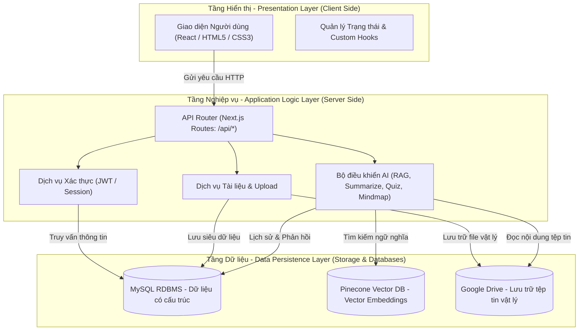

# 📚 TLU Document

> Nền tảng quản lý và khai thác tài liệu học tập tích hợp Trí tuệ nhân tạo dành cho sinh viên Đại học Thủy Lợi.

TLU Document là hệ thống web hỗ trợ lưu trữ, chia sẻ và khai thác tài liệu học tập, được xây dựng với mục tiêu tạo ra một không gian học tập số tập trung dành cho sinh viên Đại học Thủy Lợi. Bên cạnh các chức năng quản lý tài liệu truyền thống, hệ thống còn tích hợp các công cụ Trí tuệ nhân tạo (AI) nhằm hỗ trợ người học tiếp cận, tóm tắt và ôn tập kiến thức một cách hiệu quả hơn.

Dự án hướng tới việc kết hợp kho tài liệu học tập với các công cụ AI thông minh như Chatbot học tập theo kiến trúc RAG, sinh bản tóm tắt tự động, tạo câu hỏi trắc nghiệm và sinh sơ đồ tư duy từ nội dung tài liệu, giúp người học có thể tìm kiếm, tiếp thu và hệ thống hóa kiến thức ngay trên cùng một nền tảng.

---

## ✨ Tổng quan dự án

* 🌐 **Dự án đang chạy golive tại:**
  https://tlu-document.vercel.app/

* 📁 **Tài liệu quản lý tài nguyên dự án:**
  [QuanLyTaiNguyen.md](QuanLyTaiNguyen.md)

* 🎓 **Đối tượng sử dụng:** Sinh viên Đại học Thủy Lợi.

* 🤖 **Điểm nổi bật:** Tích hợp AI để hỗ trợ học tập thông qua các chức năng Chatbot RAG, Tóm tắt tài liệu, Sinh Quiz và Sinh Mindmap.


## 🧭 Giới thiệu

Hiện nay, tài liệu học tập thường tồn tại phân tán ở nhiều nguồn khác nhau, gây khó khăn trong quá trình tìm kiếm, quản lý và khai thác thông tin. Đồng thời, phần lớn các hệ thống chia sẻ tài liệu hiện nay chỉ dừng lại ở việc lưu trữ và tải xuống, chưa hỗ trợ người dùng xử lý sâu nội dung học tập.

TLU Document được xây dựng nhằm giải quyết các vấn đề trên bằng cách kết hợp giữa hệ thống quản lý tài liệu truyền thống và các công nghệ AI hiện đại. Hệ thống cho phép người dùng:

* Tìm kiếm tài liệu theo từ khóa, môn học và nhiều tiêu chí khác.
* Quản lý và chia sẻ tài liệu học tập tập trung.
* Phát hiện tài liệu trùng lặp thông qua cơ chế băm MD5.
* Tóm tắt nội dung tài liệu bằng AI.
* Sinh câu hỏi trắc nghiệm phục vụ ôn tập.
* Tạo sơ đồ tư duy trực quan từ nội dung tài liệu.
* Tương tác với Chatbot AI dựa trên ngữ cảnh tài liệu theo kiến trúc Retrieval-Augmented Generation (RAG).
* Quản lý lịch sử trò chuyện, đánh giá và bình luận tài liệu.

## ⭐ Các chức năng chính

### 📂 Quản lý tài liệu học tập

* Upload tài liệu PDF, DOCX,...
* Đồng bộ tệp vật lý lên Google Drive.
* Xem trước và tải xuống tài liệu.
* Tìm kiếm nâng cao theo nhiều tiêu chí.
* Phân loại tài liệu theo môn học.
* Hiển thị tài liệu mới nhất, nổi bật và phổ biến.
* Bình luận và đánh giá tài liệu.

### 🤖 Chatbot AI tích hợp RAG

* Trả lời câu hỏi dựa trên nội dung tài liệu.
* Tìm kiếm ngữ nghĩa bằng Pinecone Vector Database.
* Hỗ trợ phản hồi theo thời gian thực (Streaming Response).
* Gợi ý các tài liệu liên quan.

### 📝 Tóm tắt tài liệu bằng AI

* Trích xuất nội dung tài liệu.
* Sinh bản tóm tắt tự động.
* Hỗ trợ nhiều mức độ tóm tắt.
* Lưu lịch sử tóm tắt.

### 📋 Sinh câu hỏi trắc nghiệm

* Tạo câu hỏi từ nội dung tài liệu.
* Sinh đáp án và lời giải.
* Hỗ trợ ôn tập kiến thức nhanh chóng.

### 🧠 Sinh sơ đồ tư duy

* Tự động xây dựng Mindmap từ tài liệu.
* Hiển thị cấu trúc cây trực quan.
* Hỗ trợ tương tác và chỉnh sửa.


## 🏗 Kiến trúc tổng quan

Hệ thống TLU Document được xây dựng theo mô hình Kiến trúc 3 lớp (3-Tier/Layered Architecture) kết hợp mô hình tương tác Client-Server. Sự phân tách rõ ràng này giúp giảm thiểu sự phụ thuộc giữa các tầng, tăng độ tin cậy, tăng cường bảo mật và giúp hệ thống dễ dàng tích hợp các API trí tuệ nhân tạo (AI).



Trong đó:

* Frontend chịu trách nhiệm hiển thị giao diện và tiếp nhận thao tác từ người dùng.
* Backend xử lý nghiệp vụ và điều phối dữ liệu.
* MySQL lưu trữ dữ liệu quan hệ.
* Pinecone hỗ trợ tìm kiếm ngữ nghĩa.
* Google Drive lưu trữ tài liệu vật lý.
* Các dịch vụ AI cung cấp khả năng sinh nội dung thông minh.


## 🛠 Công nghệ sử dụng

| Thành phần            | Công nghệ                        |
| --------------------- | -------------------------------- |
| Frontend              | Next.js 15, React 19, TypeScript |
| Backend               | Next.js Route Handlers, Node.js  |
| Giao diện             | Tailwind CSS, Radix UI           |
| Cơ sở dữ liệu quan hệ | MySQL                            |
| Vector Database       | Pinecone                         |
| Dịch vụ AI            | Pollinations AI, Gemini API      |
| Embedding Model       | Hugging Face Inference           |
| Xử lý tài liệu        | PDF.js, PDF-Parse, Mammoth       |
| Lưu trữ tệp           | Google Drive API                 |
| Triển khai hệ thống   | Vercel                           |


## ⚙️ Cài đặt và chạy dự án

### 1. Cài đặt thư viện

```bash
npm install
```

### 2. Tạo file môi trường

Tạo file `.env.local` tại thư mục gốc:

```env
DB_HOST=
DB_PORT=3306
DB_USER=
DB_PASSWORD=
DB_NAME=

PINECONE_API_KEY=
PINECONE_INDEX_NAME=

HUGGINGFACE_TOKEN=
POLLINATIONS_API_KEY=
GEMINI_API_KEY=

GOOGLE_CLIENT_EMAIL=
GOOGLE_PRIVATE_KEY=
GOOGLE_DRIVE_FOLDER_ID=
```

### 3. Chạy môi trường phát triển

```bash
npm run dev
```

Truy cập:

```text
http://localhost:3000
```

### 4. Build production

```bash
npm run build
npm start
```


## 🔧 Các script hỗ trợ

* `npm run dev`: Chạy môi trường phát triển.
* `npm run build`: Build ứng dụng.
* `npm start`: Chạy bản production.
* `npm run lint`: Kiểm tra mã nguồn.
* `npm run import:drive`: Đồng bộ tài liệu từ Google Drive.
* `npm run import:drive:dry`: Chạy thử quá trình đồng bộ.
* `npm run sync:pinecone`: Đồng bộ dữ liệu vector lên Pinecone.
* `npm run db:backup`: Sao lưu cơ sở dữ liệu.


## 📂 Cấu trúc thư mục dự án

```text
DATN_TLUDOCUMENT/
├── app/                        # Thư mục trang giao diện và API Routes (Next.js App Router)
│   ├── api/                    # Chứa các API Endpoint xử lý logic phía Server
│   │   ├── auth/               # API xử lý Đăng ký, Đăng nhập và phiên người dùng
│   │   ├── chatbot/            # API Chatbot AI vấn đáp tài liệu và lịch sử chat
│   │   ├── documents/          # API CRUD tài liệu, quản lý đánh giá, lượt xem, lượt tải
│   │   ├── mindmap/            # API tự động tạo và lưu trữ Sơ đồ tư duy bằng AI
│   │   ├── quiz/               # API tự động tạo câu hỏi trắc nghiệm ôn tập
│   │   ├── search/             # API tìm kiếm lai kết hợp (Hybrid Search)
│   │   ├── subjects/           # API quản lý danh mục môn học, học phần giảng dạy
│   │   ├── summarize/          # API tự động tóm tắt văn bản tài liệu bằng AI
│   │   └── upload/             # API upload file lên Google Drive và kiểm tra trùng lặp
│   ├── auth/                   # Trang giao diện Đăng nhập, Đăng ký thành viên
│   ├── chatbot/                # Giao diện tương tác với Trợ lý học tập AI (Chatbot Tutor)
│   ├── document/               # Trang hiển thị chi tiết tài liệu và Iframe xem trực tuyến
│   ├── mindmap/                # Giao diện hiển thị và chỉnh sửa Sơ đồ tư duy dạng Graph
│   ├── quiz/                   # Giao diện làm bài tập trắc nghiệm và xem đáp án giải thích
│   ├── upload/                 # Giao diện kéo thả tải tài liệu lên hệ thống
│   ├── layout.tsx              # Bố cục giao diện toàn cục (Header, Sidebar, Navigation)
│   └── page.tsx                # Trang chủ cổng thông tin (Dashboard) tài liệu nổi bật
├── components/                 # Các React Component tái sử dụng (Button, Card, Modal, Input...)
├── hooks/                      # Các Custom React Hooks phục vụ quản lý trạng thái tại client
├── lib/                        # Thư viện dùng chung, dịch vụ database và tích hợp bên ngoài
│   ├── advanced-search.ts      # Giải thuật tìm kiếm nâng cao (kết hợp MySQL & Pinecone)
│   ├── chatbot-db-services.ts  # Các hàm CRUD cơ sở dữ liệu cho lịch sử hội thoại
│   ├── chatbot-intent.ts       # Logic phân tích ý định câu hỏi và thiết lập Prompt RAG
│   ├── client-pdf-parser.ts    # Hỗ trợ đọc nội dung văn bản PDF từ client
│   ├── drive.ts                # Dịch vụ kết nối và thao tác với Google Drive API
│   ├── hf-embedder.ts          # Dịch vụ sinh Vector Embeddings từ Hugging Face API
│   ├── mindmap.ts              # Xử lý sinh prompt, định cấu trúc JSON cho Sơ đồ tư duy
│   ├── mysql.ts                # Khởi tạo kết nối và quản lý Connection Pool MySQL
│   ├── pinecone.ts             # Khởi tạo kết nối cơ sở dữ liệu Vector Pinecone
│   ├── quiz.ts                 # Cấu trúc hóa prompt sinh trắc nghiệm và chuẩn hóa đáp án
│   ├── repositories.ts         # Triển khai Repository Pattern tối ưu hóa truy vấn MySQL
│   └── summarize.ts            # Tách nhỏ văn bản và gọi AI tóm tắt (Map-Reduce/Refine)
├── public/                     # Thư mục chứa tài nguyên tĩnh (Hình ảnh, Logo, Icons)
├── package.json                # Định nghĩa các thư viện phụ thuộc và kịch bản khởi chạy dự án
└── tsconfig.json               # Cấu hình dự án TypeScript
```

## 💡 Điểm nổi bật
* Phát hiện tài liệu trùng lặp bằng MD5.
* Tìm kiếm ngữ nghĩa bằng Pinecone Vector Database.
* Chatbot AI theo kiến trúc Retrieval-Augmented Generation (RAG).
* Sinh bản tóm tắt, câu hỏi trắc nghiệm và sơ đồ tư duy tự động.
* Lưu trữ tài liệu vật lý trên Google Drive.
* Giao diện Responsive tương thích với cả Desktop và Mobile.
* Hệ thống đã được triển khai thực tế và có thể truy cập công khai.


## 👨‍💻 Người phát triển
> **Vương Việt Cường**  
> MSV: 2251061732  
> Lớp 64CNTT3  
> Khoa Công nghệ Thông tin  
> Trường Đại học Thủy Lợi